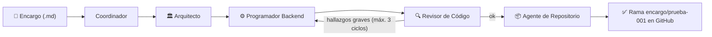

# Guía paso a paso — Fase 1: Grafo mínimo (Fábrica de Desarrollo con Agentes IA)

Categoría: Proyectos
Fecha: 4 de agosto de 2026
Etiquetas: Código, Importante, Proyecto
ítem principal: Plan de Implementación — Fábrica de Desarrollo con Agentes IA (local / validación de grafo) (https://app.notion.com/p/Plan-de-Implementaci-n-F-brica-de-Desarrollo-con-Agentes-IA-local-validaci-n-de-grafo-3878229d6b0d48c28e5590c8f65c6c56?pvs=21)

<aside>
🧩

**Qué es este documento.** Guía de ejecución paso a paso, pensada para principiantes, de la **Fase 1 — Grafo mínimo** del plan [Plan de Implementación — Fábrica de Desarrollo con Agentes IA (local / validación de grafo)](https://app.notion.com/p/Plan-de-Implementaci-n-F-brica-de-Desarrollo-con-Agentes-IA-local-validaci-n-de-grafo-3878229d6b0d48c28e5590c8f65c6c56?pvs=21). Es la continuación directa de [Guía paso a paso — Fase 0: Fundaciones locales (Fábrica de Desarrollo con Agentes IA)](https://app.notion.com/p/Gu-a-paso-a-paso-Fase-0-Fundaciones-locales-F-brica-de-Desarrollo-con-Agentes-IA-83960acbbec7409bb12e720981a3b3ce?pvs=21) y asume que su checklist final está 100% completo. Incluye todos los comandos y todo el código, en el orden exacto en que se ejecutan.

</aside>

<aside>
⚠️

**Nota sobre copiar y pegar código.** En la Fase 0 descubrimos que la terminal usada daña la indentación al pegar código de varias líneas (y a veces mete caracteres invisibles). Para crear cada archivo de esta guía tienes dos opciones seguras: (1) escribirlo con `nano` cuidando la indentación de 4 espacios, o (2) **pedirle a Notion AI el comando en Base64** para ese archivo (el método `echo '...' | base64 -d > archivo` que usamos en la Fase 0), que es inmune a ese problema. El código mostrado en esta guía es la referencia oficial de lo que debe quedar en cada archivo.

</aside>

## Qué se construye en esta fase

El **grafo mínimo** definido en §12 del plan: un encargo pequeño recorre el flujo completo hasta terminar en una rama de GitHub con código.



Qué queda **fuera** de esta fase, a propósito (principio rector del plan: lo más simple que valide el grafo end-to-end):

- **Sin checkpoints humanos**: el plan del Arquitecto se aprueba automáticamente (`plan_aprobado = True`). Los checkpoints por terminal llegan en la Fase 4.
- **Sin Frontend ni Integrador**: llegan en la Fase 2.
- **Sin RAG ni lint/pruebas reales**: el Revisor de esta fase es solo una revisión del modelo contra el plan. El lint y las pruebas en el sandbox llegan en las Fases 2–3.

<aside>
💰

**Esta fase ya consume créditos de OpenRouter.** Cada corrida completa hace entre 4 y 8 llamadas al LLM (más si el Revisor devuelve el trabajo al Backend). Por eso en el paso 3 cambiamos el contenedor para que **ya no ejecute `main.py` automáticamente** en cada reinicio: ahora solo corre cuando tú lo pidas.

</aside>

## 0. Antes de empezar

- [x]  Checklist final de la Fase 0 completo (los 4 contenedores levantan, `main.py` corría el grafo placeholder, Postgres muestra las tablas `checkpoint*`, Qdrant responde).
- [x]  `.env` con el `OPENROUTER_API_KEY` real y con `GITHUB_TOKEN` (permiso `repo`) ya probado clonando un repo de la organización.
- [x]  Acceso confirmado a la organización **ADN Fábrica Lab** en GitHub.
- [x]  `graph.py` y `main.py` en su **versión corregida al cierre de la Fase 0** (la que separa `obtener_db_uri()` y abre el checkpointer con `with PostgresSaver.from_conn_string(...) as checkpointer:` en `main.py`). En esta fase ambos archivos se reemplazan por completo, así que no importa memorizarla — solo confirma que la Fase 0 terminó funcionando.

Estructura de archivos al terminar esta fase (lo nuevo está marcado):

```jsx
fabrica-desarrollo-ia/
├── docker-compose.yml
├── .env                        ← se agrega GITHUB_USER
├── .gitignore
├── orquestador/
│   ├── Dockerfile              ← se actualiza (git + sleep infinity)
│   ├── requirements.txt
│   └── src/
│       ├── state.py            (sin cambios)
│       ├── models.py           ← NUEVO: capa de modelos OpenRouter
│       ├── agentes.py          ← NUEVO: los 5 nodos del grafo
│       ├── graph.py            ← se reemplaza
│       ├── main.py             ← se reemplaza
│       └── encargos/
│           └── prueba-001.md   ← NUEVO: encargo de prueba
└── sandbox/
    └── Dockerfile
```

## 1. Crear el repositorio de prueba en GitHub

El Agente de Repositorio necesita un repo destino que ya exista (recuerda: según el plan, el repositorio siempre llega indicado en el encargo, nunca se infiere).

1. Entra a la organización **ADN Fábrica Lab** en GitHub y haz clic en **New repository**.
2. Configúralo así:
    - **Owner**: `adn-fabrica-lab`
    - **Name**: `fabrica-prueba-001`
    - Visibilidad: **Private** está bien.
    - ✅ Marca **Add a README file** — esto es importante: crea la rama `main`, sin la cual el clone inicial falla.
3. Clic en **Create repository**.

## 2. Agregar tu usuario de GitHub al `.env`

El agente necesita tu usuario para autenticar el `git push` con el token. Abre el archivo:

```bash
cd ~/Documentos/fabrica-desarrollo-ia
nano .env
```

Y agrega esta línea en la sección de GitHub (reemplaza por tu usuario real de GitHub, el que aparece en tu perfil):

```jsx
GITHUB_USER=tu_usuario_de_github
```

Guarda con `Ctrl + O`, `Enter`, y sal con `Ctrl + X`. La sección de GitHub de tu `.env` debe quedar así (con tus valores reales):

```jsx
# --- GitHub ---
GITHUB_TOKEN=ghp_xxxxxxxxxxxxxxxx
GITHUB_ORG=adn-fabrica-lab
GITHUB_USER=tu_usuario_de_github
```

## 3. Actualizar el `Dockerfile` del orquestador

Reemplaza el contenido de `orquestador/Dockerfile` por esto:

```docker
FROM python:3.11-slim

RUN apt-get update \
    && apt-get install -y --no-install-recommends git \
    && rm -rf /var/lib/apt/lists/*

WORKDIR /app

COPY requirements.txt .
RUN pip install --no-cache-dir -r requirements.txt

COPY src ./src

CMD ["sleep", "infinity"]
```

Dos cambios respecto a la Fase 0, y por qué:

- **Se instala** `git`**:** el Agente de Repositorio clona el repo, hace commit y push desde dentro del contenedor.
- `CMD ["sleep", "infinity"]` **en vez de ejecutar** `main.py`**:** en la Fase 0 vimos que, como `main.py` termina al instante y el contenedor tiene `restart: unless-stopped`, Docker lo volvía a ejecutar en bucle. Con agentes reales eso significaría **gastar créditos de OpenRouter en cada reinicio**. Ahora el contenedor queda "vivo pero en espera" (igual que el sandbox) y `main.py` solo corre cuando tú ejecutes `docker compose exec`.

## 4. Crear el encargo de prueba

Crea la carpeta de encargos:

```bash
mkdir -p orquestador/src/encargos
```

Crea `orquestador/src/encargos/prueba-001.md` con este contenido (es texto plano sin indentación crítica, así que puedes usar `nano` sin riesgo):

```markdown
# Encargo prueba-001

- encargo_id: prueba-001
- repositorio: fabrica-prueba-001

## Descripcion

Crear una API NestJS minima con un unico endpoint GET /salud que responda
el JSON {"estado": "ok", "servicio": "fabrica-prueba-001"}.

## Criterios de aceptacion

- El proyecto es NestJS con TypeScript.
- GET /salud responde codigo 200 con el JSON indicado.
- El proyecto incluye los archivos necesarios para instalarlo y correrlo
  (package.json, tsconfig.json, src/...).
- No se necesita base de datos ni autenticacion.
```

Este formato imita el `encargo.md` que en producción entrega la Fábrica de Encargos: identifica el encargo, indica el repositorio destino (§9 del plan) y define criterios verificables.

## 5. Crear `models.py` — capa de modelos OpenRouter

Crea `orquestador/src/models.py`:

```python
# orquestador/src/models.py
import os

from langchain_openai import ChatOpenAI

# Modelo asignado por agente (S5 y S11 del plan). Se puede cambiar sin tocar
# codigo definiendo una variable de entorno en .env, por ejemplo:
#   MODELO_ARQUITECTO=openai/gpt-4o
MODELOS_POR_ROL = {
    "coordinador": "anthropic/claude-3.5-haiku",
    "arquitecto": "anthropic/claude-sonnet-4",
    "backend": "anthropic/claude-sonnet-4",
    "revisor": "anthropic/claude-sonnet-4",
}

def obtener_modelo(rol: str) -> ChatOpenAI:
    nombre = os.environ.get("MODELO_" + rol.upper()) or MODELOS_POR_ROL[rol]
    return ChatOpenAI(
        model=nombre,
        api_key=os.environ["OPENROUTER_API_KEY"],
        base_url="https://openrouter.ai/api/v1",
        temperature=0,
    )
```

**Cómo funciona.** OpenRouter expone una API compatible con la de OpenAI, así que `ChatOpenAI` (de `langchain-openai`, ya instalado en la Fase 0) sirve para hablar con cualquier modelo del catálogo — solo cambia `base_url` y el nombre del modelo. Esta es la capa de abstracción del plan (§11): si Claude alcanza su límite, cambias el modelo de un rol agregando una línea al `.env` (por ejemplo `MODELO_BACKEND=openai/gpt-4o` o `MODELO_BACKEND=google/gemini-2.5-pro`) **sin tocar el código de los agentes**. El Agente de Repositorio no aparece en la tabla porque su tarea es mecánica (git) y no usa ningún modelo: cuesta $0.

## 6. Crear `agentes.py` — los nodos del grafo

Este es el archivo más largo de la fase. Crea `orquestador/src/agentes.py`:

```python
# orquestador/src/agentes.py
import json
import os
import shutil
import subprocess

from models import obtener_modelo
from state import EstadoFabricaDesarrollo

RUTA_TRABAJO = "/app/workspace"

def _limpiar_json(texto: str) -> str:
    # El modelo a veces envuelve el JSON en texto o en un bloque de codigo.
    # Nos quedamos con lo que hay entre la primera llave y la ultima.
    inicio = texto.find("{")
    fin = texto.rfind("}")
    if inicio == -1 or fin == -1:
        raise ValueError("El modelo no devolvio JSON. Respuesta: " + texto[:300])
    return texto[inicio : fin + 1]

def _pedir_json(rol: str, instrucciones: str, contenido: str) -> dict:
    modelo = obtener_modelo(rol)
    respuesta = modelo.invoke([
        (
            "system",
            instrucciones
            + " Responde UNICAMENTE con un objeto JSON valido, sin explicaciones.",
        ),
        ("user", contenido),
    ])
    return json.loads(_limpiar_json(respuesta.content))

def nodo_coordinador(estado: EstadoFabricaDesarrollo) -> dict:
    print("1. Coordinador: interpretando el encargo...")
    datos = _pedir_json(
        "coordinador",
        "Eres el Coordinador de una fabrica de desarrollo de software. "
        "Extrae del encargo un JSON con esta forma exacta: "
        '{"encargo_id": "...", "repositorio": "...", "titulo": "...", '
        '"descripcion": "...", "criterios": ["..."]}. '
        "El repositorio viene indicado en el encargo; nunca lo inventes.",
        estado["encargo"]["texto_original"],
    )
    encargo = dict(estado["encargo"])
    encargo.update(datos)
    return {"encargo": encargo, "encargo_id": datos["encargo_id"]}

def nodo_arquitecto(estado: EstadoFabricaDesarrollo) -> dict:
    print("2. Arquitecto: disenando el plan tecnico...")
    plan = _pedir_json(
        "arquitecto",
        "Eres el Arquitecto de Software de una fabrica de desarrollo. "
        "El proyecto es una API NestJS (TypeScript). A partir del encargo, "
        "produce un plan tecnico JSON con esta forma exacta: "
        '{"resumen": "...", "archivos": [{"ruta": "...", "accion": "crear", '
        '"descripcion": "..."}]}. '
        "Incluye TODOS los archivos necesarios para que el proyecto sea completo "
        "(package.json, tsconfig.json, src/main.ts, src/app.module.ts, etc.). "
        "Manten el plan lo mas pequeno posible cumpliendo el encargo.",
        json.dumps(estado["encargo"], ensure_ascii=False),
    )
    # En la Fase 1 no hay checkpoint humano (llega en la Fase 4):
    # el plan se aprueba automaticamente.
    return {"plan_tecnico": plan, "plan_aprobado": True}

def nodo_programador_backend(estado: EstadoFabricaDesarrollo) -> dict:
    ciclo = estado.get("ciclo", 0) + 1
    print("3. Programador Backend: escribiendo codigo (ciclo " + str(ciclo) + ")...")
    contexto = {
        "encargo": estado["encargo"],
        "plan_tecnico": estado["plan_tecnico"],
        "hallazgos_a_corregir": estado.get("hallazgos_revision") or [],
        "archivos_actuales": estado.get("archivos_backend") or [],
    }
    datos = _pedir_json(
        "backend",
        "Eres el Programador Backend (NestJS + TypeScript). Escribe el contenido "
        "COMPLETO de cada archivo del plan tecnico. Responde JSON con esta forma "
        'exacta: {"archivos": [{"ruta": "...", "contenido": "..."}]}. '
        "Si hallazgos_a_corregir tiene elementos, corrige esos problemas "
        "partiendo de archivos_actuales.",
        json.dumps(contexto, ensure_ascii=False),
    )
    return {"archivos_backend": datos["archivos"], "ciclo": ciclo}

def nodo_revisor(estado: EstadoFabricaDesarrollo) -> dict:
    print("4. Revisor: comparando el codigo contra el plan y el encargo...")
    contexto = {
        "encargo": estado["encargo"],
        "plan_tecnico": estado["plan_tecnico"],
        "archivos": estado["archivos_backend"],
    }
    datos = _pedir_json(
        "revisor",
        "Eres el Revisor de Codigo. Revisa que los archivos cumplan el encargo y "
        "el plan tecnico. Responde JSON con esta forma exacta: "
        '{"hallazgos": [{"ruta": "...", "detalle": "...", "severidad": "alta"}]}. '
        'La severidad es "alta", "media" o "baja". Usa una lista vacia si el '
        "codigo esta bien. Reporta solo problemas reales que impidan cumplir el "
        "encargo; no reportes mejoras opcionales.",
        json.dumps(contexto, ensure_ascii=False),
    )
    return {"hallazgos_revision": datos["hallazgos"]}

def decidir_despues_de_revision(estado: EstadoFabricaDesarrollo) -> str:
    graves = [
        h for h in (estado.get("hallazgos_revision") or [])
        if h.get("severidad") == "alta"
    ]
    if graves and estado.get("ciclo", 0) < 3:
        print("   Revisor: " + str(len(graves)) + " hallazgos graves. Vuelve al Backend.")
        return "backend"
    if graves:
        print("   Revisor: aun hay hallazgos, pero se alcanzo el tope de ciclos.")
    return "repositorio"

def nodo_repositorio(estado: EstadoFabricaDesarrollo) -> dict:
    print("5. Agente de Repositorio: publicando el codigo en una rama...")
    org = os.environ["GITHUB_ORG"]
    usuario = os.environ["GITHUB_USER"]
    token = os.environ["GITHUB_TOKEN"]
    repo = estado["encargo"]["repositorio"]
    rama = "encargo/" + estado["encargo_id"]
    url = "https://" + usuario + ":" + token + "@github.com/" + org + "/" + repo + ".git"
    destino = os.path.join(RUTA_TRABAJO, repo)

    if os.path.exists(destino):
        shutil.rmtree(destino)
    os.makedirs(RUTA_TRABAJO, exist_ok=True)
    subprocess.run(["git", "clone", url, destino], check=True)
    subprocess.run(["git", "checkout", "-b", rama], cwd=destino, check=True)

    for archivo in estado["archivos_backend"]:
        ruta = os.path.join(destino, archivo["ruta"])
        os.makedirs(os.path.dirname(ruta), exist_ok=True)
        with open(ruta, "w", encoding="utf-8") as f:
            f.write(archivo["contenido"])

    mensaje = "Encargo " + estado["encargo_id"] + ": " + estado["encargo"].get("titulo", "")
    subprocess.run(["git", "add", "."], cwd=destino, check=True)
    subprocess.run(
        [
            "git",
            "-c", "user.name=Fabrica de Desarrollo",
            "-c", "user.email=fabrica@adn.local",
            "commit", "-m", mensaje,
        ],
        cwd=destino,
        check=True,
    )
    subprocess.run(["git", "push", "-u", "origin", rama], cwd=destino, check=True)
    print("   Rama publicada: " + rama)
    return {"rama_git": rama}
```

Qué hace cada pieza:

| Pieza | Qué hace | Modelo |
| --- | --- | --- |
| `_pedir_json` / `_limpiar_json` | Helper común: llama al modelo del rol y convierte su respuesta en un diccionario Python, tolerando que el modelo envuelva el JSON en texto extra | — |
| `nodo_coordinador` | Lee el texto del encargo y extrae los campos estructurados (id, repositorio, título, criterios). Nunca inventa el repositorio | Económico |
| `nodo_arquitecto` | Produce el `plan_tecnico`: la lista de archivos a crear y qué va en cada uno. En esta fase lo aprueba automáticamente | Razonamiento alto |
| `nodo_programador_backend` | Escribe el contenido completo de cada archivo del plan; si el Revisor devolvió hallazgos, corrige partiendo de la versión anterior. Incrementa `ciclo` | Razonamiento alto |
| `nodo_revisor` | Compara el código contra el plan y el encargo y devuelve `hallazgos_revision` con severidad | Razonamiento medio-alto |
| `decidir_despues_de_revision` | Arista condicional: si hay hallazgos de severidad alta y `ciclo < 3`, vuelve al Backend; si no, sigue al repositorio. El tope de 3 ciclos evita bucles infinitos (campo `ciclo` de §4.1) | — |
| `nodo_repositorio` | Mecánico, sin LLM: clona el repo en `/app/workspace`, crea la rama `encargo/<id>`, escribe los archivos, hace commit y push | Ninguno ($0) |

<aside>
🔐

El token de GitHub viaja dentro de la URL del clone y queda guardado en la configuración git del working copy **dentro del contenedor**. Para este piloto local con la organización de pruebas es aceptable; en producción se usaría un mecanismo de credenciales apropiado.

</aside>

## 7. Reemplazar `graph.py`

Reemplaza todo el contenido de `orquestador/src/graph.py`:

```python
# orquestador/src/graph.py
import os

from langgraph.graph import StateGraph, END

from state import EstadoFabricaDesarrollo
from agentes import (
    nodo_coordinador,
    nodo_arquitecto,
    nodo_programador_backend,
    nodo_revisor,
    nodo_repositorio,
    decidir_despues_de_revision,
)

def obtener_db_uri():
    pg_user = os.environ["POSTGRES_USER"]
    pg_password = os.environ["POSTGRES_PASSWORD"]
    pg_host = os.environ["POSTGRES_HOST"]
    pg_port = os.environ["POSTGRES_PORT"]
    pg_db = os.environ["POSTGRES_DB"]
    return f"postgresql://{pg_user}:{pg_password}@{pg_host}:{pg_port}/{pg_db}"

def construir_grafo(checkpointer):
    # checkpointer debe venir ya abierto (ver main.py): su conexion a Postgres
    # debe seguir viva mientras el grafo se ejecuta.
    builder = StateGraph(EstadoFabricaDesarrollo)

    builder.add_node("coordinador", nodo_coordinador)
    builder.add_node("arquitecto", nodo_arquitecto)
    builder.add_node("backend", nodo_programador_backend)
    builder.add_node("revisor", nodo_revisor)
    builder.add_node("repositorio", nodo_repositorio)

    builder.set_entry_point("coordinador")
    builder.add_edge("coordinador", "arquitecto")
    builder.add_edge("arquitecto", "backend")
    builder.add_edge("backend", "revisor")
    builder.add_conditional_edges(
        "revisor",
        decidir_despues_de_revision,
        {"backend": "backend", "repositorio": "repositorio"},
    )
    builder.add_edge("repositorio", END)

    return builder.compile(checkpointer=checkpointer)
```

La novedad respecto a la Fase 0 es `add_conditional_edges`: después del nodo `revisor`, LangGraph llama a `decidir_despues_de_revision(estado)` y, según el string que devuelva (`"backend"` o `"repositorio"`), sigue por una arista u otra. Así se implementa el ciclo de corrección del diagrama del plan (§4).

## 8. Reemplazar `main.py`

Reemplaza todo el contenido de `orquestador/src/main.py`:

```python
# orquestador/src/main.py
import sys
from datetime import datetime

from dotenv import load_dotenv
from langgraph.checkpoint.postgres import PostgresSaver

from graph import construir_grafo, obtener_db_uri

load_dotenv()

if __name__ == "__main__":
    ruta_encargo = sys.argv[1] if len(sys.argv) > 1 else "src/encargos/prueba-001.md"
    with open(ruta_encargo, "r", encoding="utf-8") as f:
        texto = f.read()

    # Un thread_id nuevo por corrida: si se reutiliza uno viejo, LangGraph
    # reanuda desde el checkpoint anterior en vez de empezar de cero.
    thread_id = "fase1-" + datetime.now().strftime("%Y%m%d-%H%M%S")
    print("Thread:", thread_id)

    db_uri = obtener_db_uri()

    # El "with" mantiene la conexion a Postgres abierta durante toda la
    # ejecucion del grafo (leccion de la Fase 0).
    with PostgresSaver.from_conn_string(db_uri) as checkpointer:
        checkpointer.setup()
        grafo = construir_grafo(checkpointer)
        resultado = grafo.invoke(
            {"encargo": {"texto_original": texto}, "ciclo": 0},
            config={
                "configurable": {"thread_id": thread_id},
                "recursion_limit": 25,
            },
        )

    print()
    print("=== Resultado final ===")
    print("Encargo:          ", resultado.get("encargo_id"))
    print("Rama publicada:   ", resultado.get("rama_git"))
    print("Ciclos usados:    ", resultado.get("ciclo"))
    print("Hallazgos finales:", len(resultado.get("hallazgos_revision") or []))
```

Detalles que importan:

- **`thread_id` único por corrida.** El checkpointer de Postgres guarda el estado de cada *thread*. Si reutilizas un `thread_id` viejo (como `prueba-001` de la Fase 0), LangGraph intenta continuar desde donde ese thread quedó, en vez de arrancar de cero. Por eso generamos uno nuevo con la fecha y hora.
- **Se puede pasar otro encargo por argumento:** `python src/main.py src/encargos/otro-encargo.md`.
- `recursion_limit: 25` da espacio de sobra para los ciclos de corrección sin permitir un bucle infinito (además del tope `ciclo < 3` propio del grafo).

## 9. Reconstruir el contenedor

El `Dockerfile` cambió, así que hay que reconstruir la imagen (los `.py` no lo necesitan porque `src/` está montado como volumen, pero `git` y el nuevo `CMD` sí):

```bash
cd ~/Documentos/fabrica-desarrollo-ia
docker compose up -d --build orquestador
docker compose ps
```

Los 4 contenedores deben quedar en `Up`. A diferencia de antes, `fabrica_orquestador` ahora queda estable en `Up` sin reiniciarse (está en `sleep infinity`).

## 10. Ejecutar el encargo de punta a punta

Este es el momento de la verdad de la Fase 1:

```bash
docker compose exec orquestador python src/main.py
```

La corrida tarda entre 1 y 4 minutos (varias llamadas al LLM). Deberías ver algo como:

```jsx
Thread: fase1-20260804-170500
1. Coordinador: interpretando el encargo...
2. Arquitecto: disenando el plan tecnico...
3. Programador Backend: escribiendo codigo (ciclo 1)...
4. Revisor: comparando el codigo contra el plan y el encargo...
5. Agente de Repositorio: publicando el codigo en una rama...
   Rama publicada: encargo/prueba-001

=== Resultado final ===
Encargo:           prueba-001
Rama publicada:    encargo/prueba-001
Ciclos usados:     1
Hallazgos finales: 0
```

Si el Revisor encuentra hallazgos graves, verás que el paso 3 y 4 se repiten (ciclo 2, ciclo 3) antes de llegar al paso 5 — ese es exactamente el ciclo de corrección del grafo funcionando.

## 11. Verificar la rama en GitHub

1. Entra al repo `fabrica-prueba-001` en la organización ADN Fábrica Lab.
2. En el selector de ramas (donde dice `main`), elige **`encargo/prueba-001`**.
3. Revisa que estén los archivos generados (`package.json`, `tsconfig.json`, `src/main.ts`, `src/app.module.ts`, etc.).
4. Opcional: crea un **Pull Request** de `encargo/prueba-001` hacia `main` para ver el diff completo como lo vería un revisor humano. **No es necesario mergear** — el criterio del plan es que el código llegue a una rama y el merge sea siempre decisión humana.

Recuerda que en esta fase el código **no se compila ni se prueba** todavía (eso llega con el sandbox en Fases 2–3): el criterio de éxito es que el grafo completo funcione de encargo a rama.

## 12. Problemas comunes

| Síntoma | Causa probable | Solución |
| --- | --- | --- |
| `401 Unauthorized` al llamar al modelo | `OPENROUTER_API_KEY` vacío o mal copiado en `.env` | Revisa la línea en `.env` (sin espacios ni comillas) y vuelve a correr |
| `402` o `429` de OpenRouter | Créditos agotados o límite del modelo (riesgo previsto en §11 del plan) | Agrega en `.env` por ejemplo `MODELO_BACKEND=openai/gpt-4o` (y/o para los otros roles) y reintenta — sin tocar código |
| `ValueError: El modelo no devolvio JSON` | El modelo respondió prosa en vez de JSON | Vuelve a correr (suele ser intermitente); si persiste en un rol, asigna un modelo más capaz a ese rol |
| `git push` falla con `403` | Token sin permiso `repo`, o `GITHUB_USER` incorrecto | Regenera el token con permiso `repo` y verifica tu usuario en `.env` |
| `repository not found` al clonar | El repo `fabrica-prueba-001` no existe o el nombre no coincide con el del encargo | Crea el repo (paso 1) o corrige el campo `repositorio` del encargo |
| `the connection is closed` de psycopg | `main.py` no envuelve la ejecución en el bloque `with` (lección de la Fase 0) | Verifica que `main.py` sea exactamente el del paso 8 |
| La indentación se dañó al pegar un archivo | Problema conocido de la terminal (Fase 0) | Pídele a Notion AI el comando Base64 para ese archivo |

## 13. Checklist final de la Fase 1

- [x]  Repositorio `fabrica-prueba-001` creado en ADN Fábrica Lab con README (rama `main`)
- [x]  `.env` con `GITHUB_USER` agregado
- [x]  `orquestador/Dockerfile` actualizado (git instalado, `CMD sleep infinity`) y contenedor reconstruido
- [x]  `models.py`, `agentes.py` creados; `graph.py` y `main.py` reemplazados; encargo `prueba-001.md` creado
- [x]  `docker compose exec orquestador python src/main.py` recorre el grafo completo sin errores
- [x]  La rama `encargo/prueba-001` existe en GitHub con los archivos del proyecto NestJS
- [x]  El resultado final muestra el `encargo_id`, la rama publicada y los ciclos usados

<aside>
✅

Cuando completes esta checklist, la **Fase 1 está lista**: el grafo mínimo del plan quedó validado de punta a punta (encargo → plan → código → rama). El siguiente paso es la **Fase 2 — Agregar Frontend y afinar el grafo**: pide que se detalle con este mismo nivel de paso a paso cuando estés lista para empezarla.

</aside>

## 14. Qué sigue — Fase 2 (resumen)

- Sumar el **Programador Frontend** (Next.js) como nodo paralelo al Backend, y el **Integrador** que verifica los contratos entre ambos (confirmado como necesario en el plan).
- Afinar el **Revisor de Código**: correr lint y pruebas mínimas reales dentro del **sandbox** (el contenedor Node que está esperando desde la Fase 0), en vez de solo revisión por LLM.
- Ajustar el estado y las aristas del grafo según lo aprendido en esta fase.