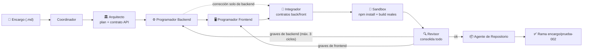

# Guía paso a paso — Fase 2: Frontend, Integrador y sandbox real (Fábrica de Desarrollo con Agentes IA)

Categoría: Proyectos
Fecha: 5 de agosto de 2026
Etiquetas: Código, Importante, Proyecto
ítem principal: Plan de Implementación — Fábrica de Desarrollo con Agentes IA (local / validación de grafo) (https://app.notion.com/p/Plan-de-Implementaci-n-F-brica-de-Desarrollo-con-Agentes-IA-local-validaci-n-de-grafo-3878229d6b0d48c28e5590c8f65c6c56?pvs=21)

<aside>
🧩

**Qué es este documento.** Guía de ejecución paso a paso, pensada para principiantes, de la **Fase 2 — Agregar Frontend y afinar el grafo** del plan [Plan de Implementación — Fábrica de Desarrollo con Agentes IA (local / validación de grafo)](https://app.notion.com/p/Plan-de-Implementaci-n-F-brica-de-Desarrollo-con-Agentes-IA-local-validaci-n-de-grafo-3878229d6b0d48c28e5590c8f65c6c56?pvs=21). Es la continuación directa de [Guía paso a paso — Fase 1: Grafo mínimo (Fábrica de Desarrollo con Agentes IA)](https://app.notion.com/p/Gu-a-paso-a-paso-Fase-1-Grafo-m-nimo-F-brica-de-Desarrollo-con-Agentes-IA-f249c894a9304302b89c170b295c3d4d?pvs=21) y asume que su checklist final está 100% completo. Incluye todos los comandos y todo el código, en el orden exacto en que se ejecutan.

</aside>

<aside>
⚠️

**Nota sobre copiar y pegar código.** Sigue vigente la lección de las Fases 0–1: la terminal usada daña la indentación al pegar código de varias líneas (y en la Fase 1 un pegado defectuoso dejó texto viejo pegado al final del `Dockerfile`, causando un bucle de reinicios difícil de diagnosticar). Para crear o reemplazar cada archivo de esta guía tienes dos opciones seguras: (1) escribirlo con `nano` cuidando la indentación de 4 espacios **y verificando después con** `cat` **que el archivo termina exactamente donde debe**, o (2) **pedirle a Notion AI el comando en Base64** para ese archivo (`echo '...' | base64 -d > archivo`), que es inmune a ambos problemas. El código mostrado en esta guía es la referencia oficial de lo que debe quedar en cada archivo.

</aside>

<aside>
🎓

**Lecciones de la Fase 1 ya incorporadas en esta guía.** Durante la ejecución de la Fase 1 se resolvieron cuatro problemas que esta guía ya da por corregidos: (1) el `Dockerfile` corrupto por un pegado defectuoso; (2) la `OPENROUTER_API_KEY` con el prefijo `apikey`  pegado en el `.env` (causaba `401 Missing Authentication header`); (3) el slug `anthropic/claude-3.5-haiku` sin proveedores disponibles en OpenRouter (causaba `404 No endpoints found` — el Coordinador ahora usa `anthropic/claude-3-haiku` por defecto); y (4) la falta de tope de `max_tokens` (Claude Sonnet 4 pedía hasta 64.000 tokens de salida por defecto y OpenRouter rechazaba con `402` si el saldo no cubría ese máximo teórico). El `models.py` del paso 6 consolida las correcciones 3 y 4. Recuerda además la regla operativa que aprendimos: **los cambios en `.env` solo se aplican recreando el contenedor** (`docker compose up -d --force-recreate orquestador`), no con un simple restart.

</aside>

## Qué se construye en esta fase

La Fase 2 del plan (§12): se suma el **Programador Frontend** (Next.js), se incorpora el **Integrador** (confirmado como necesario, §5 y §15 del plan), y el **Revisor** deja de ser solo una opinión del LLM — ahora un nodo mecánico ejecuta **`npm install` + `npm run build` reales dentro del sandbox** (el contenedor Node que espera desde la Fase 0) y el Revisor consolida esos resultados.



Las novedades conceptuales respecto a la Fase 1:

- **Contrato API explícito.** El Arquitecto ahora produce, además del plan de archivos, un `contrato_api` (métodos, rutas, forma del JSON). Es la única fuente de verdad para ambos programadores, y lo que el Integrador verifica. Este es el patrón de contratos del plan (§4, §5).
- **Ejecución secuencial por dependencia**, no paralelismo real: Backend → Frontend → Integrador, como recomienda §6 del plan para el piloto. Si más adelante se observa que chocan, se evalúa el modelo de artefactos en memoria — no se construye esa complejidad por adelantado.
- **Correcciones dirigidas.** Cada hallazgo ahora lleva un campo `area` (`backend` o `frontend`), y el grafo devuelve el trabajo **solo al programador que debe corregir**. Una corrección que solo toca backend no re-ejecuta (ni re-paga) el nodo Frontend: pasa directo al Integrador por la arista condicional nueva.
- **Verificación real, no opinada.** `resultado_sandbox` guarda el resultado verdadero de compilar cada proyecto. Si el build falla, el Revisor está obligado a convertirlo en hallazgo de severidad alta.

Qué queda **fuera** de esta fase, a propósito:

- **Sin checkpoints humanos**: el plan del Arquitecto se sigue aprobando automáticamente. Llegan en la Fase 4.
- **Sin RAG**: Qdrant sigue en espera. Se carga en la Fase 3.
- **Sin pruebas unitarias ni lint de estilo**: la validación real de esta fase es la **compilación** (`npm run build`, que ejecuta `tsc`/`next build`) — la señal más fuerte disponible sin escribir pruebas. Las pruebas y el lint estricto se agregan en la Fase 3 junto con el RAG.

<aside>
💰

**Esta fase consume más créditos que la Fase 1.** Cada corrida completa hace mínimo 6 llamadas al LLM (Coordinador, Arquitecto, Backend, Frontend, Integrador, Revisor) y 3–4 más por cada ciclo de corrección, con respuestas más grandes (dos proyectos completos). Al cierre de la Fase 1 quedaban **~$0.75 de saldo** en la key de OpenRouter: **recarga créditos antes de empezar** (`openrouter.ai/settings/credits`) o configura modelos económicos por rol en el `.env` (p. ej. `MODELO_BACKEND=openai/gpt-4o-mini`). Además, la primera corrida del sandbox descarga cientos de MB de dependencias npm — cuenta con 10–20 minutos para la primera corrida completa.

</aside>

## 0. Antes de empezar

- [x]  Checklist final de la Fase 1 completo (la rama `encargo/prueba-001` existe en GitHub y la corrida completa funciona).
- [x]  Créditos de OpenRouter recargados, o modelos económicos configurados por rol en `.env`.
- [x]  `models.py` en su versión corregida al cierre de la Fase 1 (la que agrega `MAX_TOKENS_SALIDA`). En esta fase el archivo se reemplaza por completo, así que solo confirma que la Fase 1 terminó funcionando.
- [x]  Si agregaste `MODELO_COORDINADOR=anthropic/claude-3-haiku` al `.env` en la Fase 1, ya puedes borrar esa línea si quieres: el `models.py` nuevo trae ese modelo por defecto (dejarla tampoco hace daño).

Estructura de archivos al terminar esta fase (lo que cambia está marcado):

```jsx
fabrica-desarrollo-ia/
├── docker-compose.yml          ← se actualiza (socket Docker + volumen compartido)
├── .env                        ← opcional: MAX_TOKENS_SALIDA
├── .gitignore
├── orquestador/
│   ├── Dockerfile              ← se actualiza (cliente Docker)
│   ├── requirements.txt        (sin cambios)
│   └── src/
│       ├── state.py            ← se actualiza (2 campos nuevos)
│       ├── models.py           ← se reemplaza (roles frontend/integrador + lecciones Fase 1)
│       ├── agentes.py          ← se reemplaza (2 nodos nuevos + nodo sandbox)
│       ├── graph.py            ← se reemplaza (nuevas aristas condicionales)
│       ├── main.py             ← se reemplaza
│       └── encargos/
│           ├── prueba-001.md
│           └── prueba-002.md   ← NUEVO: encargo full-stack de prueba
└── sandbox/
    └── Dockerfile              (sin cambios)
```

## 1. Crear el repositorio de prueba en GitHub

Igual que en la Fase 1: el repo destino debe existir antes (siempre llega indicado en el encargo, nunca se infiere).

1. Entra a la organización **ADN Fábrica Lab** en GitHub y haz clic en **New repository**.
2. Configúralo así:
    - **Owner**: `adn-fabrica-lab`
    - **Name**: `fabrica-prueba-002`
    - Visibilidad: **Private** está bien.
    - ✅ Marca **Add a README file** (crea la rama `main`, sin la cual el clone inicial falla).
3. Clic en **Create repository**.

## 2. Actualizar `docker-compose.yml`

El orquestador necesita dos cosas nuevas para poder usar el sandbox: **ver el mismo volumen** donde el sandbox tiene su `/workspace`, y **poder ejecutar comandos dentro del contenedor sandbox** (vía el socket de Docker del host). Reemplaza todo el contenido de `docker-compose.yml`:

```yaml
services:
  postgres:
    image: postgres:16
    container_name: fabrica_postgres
    restart: unless-stopped
    env_file: .env
    environment:
      POSTGRES_USER: ${POSTGRES_USER}
      POSTGRES_PASSWORD: ${POSTGRES_PASSWORD}
      POSTGRES_DB: ${POSTGRES_DB}
    ports:
      - "5432:5432"
    volumes:
      - postgres_data:/var/lib/postgresql/data

  qdrant:
    image: qdrant/qdrant:latest
    container_name: fabrica_qdrant
    restart: unless-stopped
    ports:
      - "6333:6333"
    volumes:
      - qdrant_data:/qdrant/storage

  orquestador:
    build: ./orquestador
    container_name: fabrica_orquestador
    restart: unless-stopped
    env_file: .env
    depends_on:
      - postgres
      - qdrant
    volumes:
      - ./orquestador/src:/app/src
      - sandbox_workspace:/sandbox-workspace
      - /var/run/docker.sock:/var/run/docker.sock
    stdin_open: true   # necesario para los checkpoints humanos por terminal (§10 del plan)
    tty: true

  sandbox:
    build: ./sandbox
    container_name: fabrica_sandbox
    restart: unless-stopped
    volumes:
      - sandbox_workspace:/workspace

volumes:
  postgres_data:
  qdrant_data:
  sandbox_workspace:
```

Solo cambian **dos líneas**, ambas en los `volumes` del orquestador:

- `sandbox_workspace:/sandbox-workspace` — el mismo volumen que el sandbox monta en `/workspace`. Así, cuando el orquestador escribe un archivo en `/sandbox-workspace/prueba-002/...`, el sandbox lo ve al instante en `/workspace/prueba-002/...`.
- `/var/run/docker.sock:/var/run/docker.sock` — le da al orquestador acceso al Docker del host, para poder ejecutar `docker exec fabrica_sandbox ...` desde dentro del grafo (así el nodo sandbox lanza los builds).

<aside>
🔐

**Sobre el socket de Docker.** Montar `docker.sock` le da al contenedor orquestador control del Docker del host — para este piloto local es el camino más simple y estándar, pero es una decisión consciente de piloto, **no** de producción (equivale a acceso root al host). En producción, la ejecución en sandbox se haría con un mecanismo apropiado (runner dedicado, API del sandbox, o colas de trabajo). Mismo espíritu que la nota sobre el token de GitHub en la URL del clone de la Fase 1.

</aside>

## 3. Actualizar el `Dockerfile` del orquestador

El orquestador necesita el **cliente** de Docker (solo el CLI — el daemon sigue siendo el del host, vía el socket). Reemplaza el contenido de `orquestador/Dockerfile`:

```docker
FROM python:3.11-slim

RUN apt-get update \
    && apt-get install -y --no-install-recommends git curl ca-certificates \
    && install -m 0755 -d /etc/apt/keyrings \
    && curl -fsSL https://download.docker.com/linux/debian/gpg -o /etc/apt/keyrings/docker.asc \
    && echo "deb [signed-by=/etc/apt/keyrings/docker.asc] https://download.docker.com/linux/debian bookworm stable" > /etc/apt/sources.list.d/docker.list \
    && apt-get update \
    && apt-get install -y --no-install-recommends docker-ce-cli \
    && rm -rf /var/lib/apt/lists/*

WORKDIR /app

COPY requirements.txt .
RUN pip install --no-cache-dir -r requirements.txt

COPY src ./src

CMD ["sleep", "infinity"]
```

Qué cambia respecto a la Fase 1: el bloque `RUN` ahora también agrega el repositorio oficial de Docker e instala `docker-ce-cli` (solo el cliente, ~50 MB; **no** instala el daemon). Se mantienen `git` y el `CMD ["sleep", "infinity"]`.

<aside>
⚠️

**Verifica el archivo después de guardarlo** (lección de la Fase 1): `cat orquestador/Dockerfile` debe terminar exactamente en `CMD ["sleep", "infinity"]`, sin ningún texto pegado después. Un `FROM` sobrante al final de esa línea fue lo que causó el bucle de reinicios de la Fase 1.

</aside>

## 4. Crear el encargo de prueba

Crea `orquestador/src/encargos/prueba-002.md` (texto plano sin indentación crítica; `nano` es seguro aquí):

```markdown
# Encargo prueba-002

- encargo_id: prueba-002
- repositorio: fabrica-prueba-002

## Descripcion

Construir una mini aplicacion de "estado del sistema" con dos partes:

1. Backend NestJS (carpeta backend/) con un endpoint GET /estado que
   responda el JSON {"servicio": "fabrica-prueba-002", "estado": "ok",
   "hora": "<hora actual en formato ISO 8601>"}.
2. Frontend Next.js (carpeta frontend/) con una unica pagina que consulte
   GET /estado del backend y muestre el servicio, el estado y la hora.

## Criterios de aceptacion

- El backend es NestJS con TypeScript y corre en el puerto 3001.
- El backend habilita CORS para que el frontend pueda consultarlo.
- El frontend es Next.js (App Router) con TypeScript y usa la variable de
  entorno NEXT_PUBLIC_API_URL (con default http://localhost:3001) para
  llamar al backend.
- backend/ y frontend/ son proyectos npm independientes: cada uno tiene su
  package.json con script "build" y compila sin errores.
- No se necesita base de datos ni autenticacion.
```

Fíjate en dos cosas nuevas respecto a `prueba-001`: el encargo pide **dos carpetas** (`backend/` y `frontend/` en el mismo repo, la estructura que el Arquitecto va a planificar), y los criterios incluyen **"compila sin errores"** — que ahora se verifica de verdad en el sandbox.

## 5. Actualizar `state.py`

El estado del grafo gana dos campos (§4.1 del plan ya preveía `archivos_frontend`; los nuevos son los resultados del Integrador y del sandbox). Reemplaza el contenido de `orquestador/src/state.py`:

```python
# orquestador/src/state.py
from typing import TypedDict

class EstadoFabricaDesarrollo(TypedDict):
    encargo_id: str
    encargo: dict
    plan_tecnico: dict
    plan_aprobado: bool
    archivos_backend: list[dict]
    archivos_frontend: list[dict]
    hallazgos_revision: list[dict]
    hallazgos_integracion: list[dict]  # NUEVO Fase 2: salida del Integrador
    resultado_sandbox: dict            # NUEVO Fase 2: npm install + build reales
    rama_git: str
    aprobacion_final: bool
    ciclo: int
    trazas: list[str]
```

## 6. Reemplazar `models.py`

Reemplaza el contenido de `orquestador/src/models.py`. Este archivo consolida las lecciones de la Fase 1 y agrega los dos roles nuevos:

```python
# orquestador/src/models.py
import os

from langchain_openai import ChatOpenAI

# Modelo asignado por agente (S5 y S11 del plan). Se puede cambiar sin tocar
# codigo definiendo una variable de entorno en .env, por ejemplo:
#   MODELO_ARQUITECTO=openai/gpt-4o
# Leccion de la Fase 1: "anthropic/claude-3.5-haiku" quedo sin proveedores
# disponibles en OpenRouter (404 "No endpoints found"), por eso los roles
# economicos usan claude-3-haiku.
MODELOS_POR_ROL = {
    "coordinador": "anthropic/claude-3-haiku",
    "arquitecto": "anthropic/claude-sonnet-4",
    "backend": "anthropic/claude-sonnet-4",
    "frontend": "anthropic/claude-sonnet-4",
    "integrador": "anthropic/claude-3-haiku",
    "revisor": "anthropic/claude-sonnet-4",
}

# Leccion de la Fase 1: sin este limite, algunos modelos piden hasta 64000
# tokens de salida por defecto y OpenRouter rechaza la peticion con 402 si el
# saldo de la key no alcanza a cubrir ese maximo teorico, aunque la respuesta
# real sea corta. En la Fase 2 el default sube a 8000 porque cada programador
# devuelve un proyecto completo en una sola respuesta JSON. Ajustable sin
# tocar codigo definiendo MAX_TOKENS_SALIDA en .env.
MAX_TOKENS_SALIDA = int(os.environ.get("MAX_TOKENS_SALIDA", "8000"))

def obtener_modelo(rol: str) -> ChatOpenAI:
    nombre = os.environ.get("MODELO_" + rol.upper()) or MODELOS_POR_ROL[rol]
    return ChatOpenAI(
        model=nombre,
        api_key=os.environ["OPENROUTER_API_KEY"],
        base_url="https://openrouter.ai/api/v1",
        temperature=0,
        max_tokens=MAX_TOKENS_SALIDA,
    )
```

Notas:

- **`frontend`** usa el mismo nivel de razonamiento que `backend` (razonamiento alto, §5 del plan). **`integrador`** usa un modelo económico: comparar contratos es más simple que escribir código; si notas que se le escapan incompatibilidades, súbelo con `MODELO_INTEGRADOR=anthropic/claude-sonnet-4` en `.env`.
- Si tu saldo es muy justo, puedes bajar el tope con `MAX_TOKENS_SALIDA=4096` en `.env` — pero ojo: si la respuesta de un programador se trunca por el tope, el JSON queda incompleto y verás `ValueError: El modelo no devolvio JSON`. Es la contracara del límite (ver tabla de problemas comunes).
- El Agente de Repositorio y el nodo Sandbox no aparecen en la tabla: son mecánicos y cuestan $0.

## 7. Reemplazar `agentes.py`

El archivo más largo de la fase, otra vez. Reemplaza todo el contenido de `orquestador/src/agentes.py`:

```python
# orquestador/src/agentes.py
import json
import os
import shutil
import subprocess

from models import obtener_modelo
from state import EstadoFabricaDesarrollo

RUTA_TRABAJO = "/app/workspace"
RUTA_SANDBOX = "/sandbox-workspace"  # mismo volumen que /workspace del sandbox
CONTENEDOR_SANDBOX = "fabrica_sandbox"
TOPE_CICLOS = 3

def _limpiar_json(texto: str) -> str:
    # El modelo a veces envuelve el JSON en texto o en un bloque de codigo.
    inicio = texto.find("{")
    fin = texto.rfind("}")
    if inicio == -1 or fin == -1:
        raise ValueError("El modelo no devolvio JSON. Respuesta: " + texto[:300])
    return texto[inicio : fin + 1]

def _pedir_json(rol: str, instrucciones: str, contenido: str) -> dict:
    modelo = obtener_modelo(rol)
    respuesta = modelo.invoke([
        (
            "system",
            instrucciones
            + " Responde UNICAMENTE con un objeto JSON valido, sin explicaciones.",
        ),
        ("user", contenido),
    ])
    return json.loads(_limpiar_json(respuesta.content))

def _graves(hallazgos, area=None):
    # Filtra hallazgos de severidad alta, opcionalmente por area.
    resultado = []
    for h in hallazgos or []:
        if h.get("severidad") != "alta":
            continue
        if area is None or h.get("area") == area:
            resultado.append(h)
    return resultado

def nodo_coordinador(estado: EstadoFabricaDesarrollo) -> dict:
    print("1. Coordinador: interpretando el encargo...")
    datos = _pedir_json(
        "coordinador",
        "Eres el Coordinador de una fabrica de desarrollo de software. "
        "Extrae del encargo un JSON con esta forma exacta: "
        '{"encargo_id": "...", "repositorio": "...", "titulo": "...", '
        '"descripcion": "...", "criterios": ["..."]}. '
        "El repositorio viene indicado en el encargo; nunca lo inventes.",
        estado["encargo"]["texto_original"],
    )
    encargo = dict(estado["encargo"])
    encargo.update(datos)
    return {"encargo": encargo, "encargo_id": datos["encargo_id"]}

def nodo_arquitecto(estado: EstadoFabricaDesarrollo) -> dict:
    print("2. Arquitecto: disenando el plan tecnico (backend + frontend)...")
    plan = _pedir_json(
        "arquitecto",
        "Eres el Arquitecto de Software de una fabrica de desarrollo. "
        "El proyecto tiene un backend NestJS (TypeScript) en la carpeta "
        "backend/ y un frontend Next.js (TypeScript, App Router) en la "
        "carpeta frontend/. A partir del encargo, produce un plan tecnico "
        "JSON con esta forma exacta: "
        '{"resumen": "...", '
        '"contrato_api": [{"metodo": "GET", "ruta": "/...", '
        '"respuesta_ejemplo": {}}], '
        '"archivos_backend": [{"ruta": "backend/...", "accion": "crear", '
        '"descripcion": "..."}], '
        '"archivos_frontend": [{"ruta": "frontend/...", "accion": "crear", '
        '"descripcion": "..."}]}. '
        "El contrato_api es la unica fuente de verdad de los endpoints: "
        "backend y frontend deben implementarlo tal cual. Incluye TODOS los "
        "archivos necesarios para que cada proyecto sea completo e instalable "
        "(package.json con script build, tsconfig.json, src/..., app/...). "
        "Manten el plan lo mas pequeno posible cumpliendo el encargo.",
        json.dumps(estado["encargo"], ensure_ascii=False),
    )
    # Igual que en la Fase 1: sin checkpoint humano (llega en la Fase 4).
    return {"plan_tecnico": plan, "plan_aprobado": True}

def nodo_programador_backend(estado: EstadoFabricaDesarrollo) -> dict:
    print("3. Programador Backend: escribiendo codigo NestJS...")
    contexto = {
        "encargo": estado["encargo"],
        "resumen_plan": estado["plan_tecnico"].get("resumen"),
        "contrato_api": estado["plan_tecnico"].get("contrato_api"),
        "archivos_del_plan": estado["plan_tecnico"].get("archivos_backend"),
        "hallazgos_a_corregir": _graves(estado.get("hallazgos_revision"), "backend"),
        "archivos_actuales": estado.get("archivos_backend") or [],
    }
    datos = _pedir_json(
        "backend",
        "Eres el Programador Backend (NestJS + TypeScript). Escribe el "
        "contenido COMPLETO de cada archivo del plan (todas las rutas "
        "empiezan con backend/). Implementa el contrato_api exactamente como "
        "esta definido. Responde JSON con esta forma exacta: "
        '{"archivos": [{"ruta": "backend/...", "contenido": "..."}]}. '
        "Si hallazgos_a_corregir tiene elementos, corrige esos problemas "
        "partiendo de archivos_actuales y devuelve el proyecto completo ya "
        "corregido.",
        json.dumps(contexto, ensure_ascii=False),
    )
    return {"archivos_backend": datos["archivos"]}

def decidir_despues_de_backend(estado: EstadoFabricaDesarrollo) -> str:
    if not (estado.get("archivos_frontend") or []):
        # Primera pasada: el frontend aun no existe.
        return "frontend"
    if _graves(estado.get("hallazgos_revision"), "frontend"):
        # Tambien hay correcciones de frontend pendientes en este ciclo.
        return "frontend"
    # Correccion solo de backend: pasar directo a re-verificar contratos,
    # sin re-ejecutar (ni re-pagar) el nodo Frontend.
    return "integrador"

def nodo_programador_frontend(estado: EstadoFabricaDesarrollo) -> dict:
    print("4. Programador Frontend: escribiendo codigo Next.js...")
    contexto = {
        "encargo": estado["encargo"],
        "resumen_plan": estado["plan_tecnico"].get("resumen"),
        "contrato_api": estado["plan_tecnico"].get("contrato_api"),
        "archivos_del_plan": estado["plan_tecnico"].get("archivos_frontend"),
        "hallazgos_a_corregir": _graves(estado.get("hallazgos_revision"), "frontend"),
        "archivos_actuales": estado.get("archivos_frontend") or [],
    }
    datos = _pedir_json(
        "frontend",
        "Eres el Programador Frontend (Next.js + TypeScript, App Router). "
        "Escribe el contenido COMPLETO de cada archivo del plan (todas las "
        "rutas empiezan con frontend/). Consume la API exactamente como la "
        "define contrato_api. Responde JSON con esta forma exacta: "
        '{"archivos": [{"ruta": "frontend/...", "contenido": "..."}]}. '
        "Si hallazgos_a_corregir tiene elementos, corrige esos problemas "
        "partiendo de archivos_actuales y devuelve el proyecto completo ya "
        "corregido.",
        json.dumps(contexto, ensure_ascii=False),
    )
    return {"archivos_frontend": datos["archivos"]}

def nodo_integrador(estado: EstadoFabricaDesarrollo) -> dict:
    print("5. Integrador: verificando contratos entre backend y frontend...")
    contexto = {
        "contrato_api": estado["plan_tecnico"].get("contrato_api"),
        "archivos_backend": estado["archivos_backend"],
        "archivos_frontend": estado["archivos_frontend"],
    }
    datos = _pedir_json(
        "integrador",
        "Eres el Integrador. Verifica que el backend implemente el "
        "contrato_api tal cual (metodos, rutas, forma del JSON, puerto) y que "
        "el frontend consuma exactamente esos mismos endpoints y formas. "
        "Responde JSON con esta forma exacta: "
        '{"hallazgos": [{"area": "backend", "ruta": "...", "detalle": "...", '
        '"severidad": "alta"}]}. '
        'area es "backend" o "frontend" segun donde deba corregirse. Usa una '
        "lista vacia si los contratos coinciden. Reporta solo "
        "incompatibilidades reales, no mejoras opcionales.",
        json.dumps(contexto, ensure_ascii=False),
    )
    return {"hallazgos_integracion": datos["hallazgos"]}

def _correr_en_sandbox(carpeta: str) -> dict:
    comando = (
        "cd /workspace/" + carpeta
        + " && npm install --no-audit --no-fund --silent && npm run build"
    )
    try:
        proceso = subprocess.run(
            ["docker", "exec", CONTENEDOR_SANDBOX, "sh", "-lc", comando],
            capture_output=True,
            text=True,
            timeout=900,
        )
    except subprocess.TimeoutExpired:
        return {
            "ok": False,
            "salida_final": "Timeout: npm install + build supero los 15 minutos.",
        }
    salida = (proceso.stdout + "\n" + proceso.stderr).strip()
    # Solo se conserva el final de la salida: ahi esta el error si lo hay, y
    # evita inflar el estado (y el contexto del Revisor) con logs de npm.
    return {"ok": proceso.returncode == 0, "salida_final": salida[-2000:]}

def nodo_sandbox(estado: EstadoFabricaDesarrollo) -> dict:
    print("6. Sandbox: npm install + build reales (puede tardar varios minutos)...")
    raiz = os.path.join(RUTA_SANDBOX, estado["encargo_id"])
    # A proposito NO se borra la carpeta: conservar node_modules entre ciclos
    # y corridas hace mucho mas rapidas las siguientes. Los archivos fuente
    # se sobreescriben siempre con la version mas reciente.
    for archivo in (estado["archivos_backend"] or []) + (
        estado.get("archivos_frontend") or []
    ):
        ruta = os.path.join(raiz, archivo["ruta"])
        os.makedirs(os.path.dirname(ruta), exist_ok=True)
        with open(ruta, "w", encoding="utf-8") as f:
            f.write(archivo["contenido"])

    resultado = {}
    for area in ("backend", "frontend"):
        if os.path.isdir(os.path.join(raiz, area)):
            print("   Compilando " + area + "...")
            resultado[area] = _correr_en_sandbox(estado["encargo_id"] + "/" + area)
            print("   " + area + ": " + ("OK" if resultado[area]["ok"] else "FALLO"))
    return {"resultado_sandbox": resultado}

def nodo_revisor(estado: EstadoFabricaDesarrollo) -> dict:
    ciclo = estado.get("ciclo", 0) + 1
    print("7. Revisor: consolidando la revision (ciclo " + str(ciclo) + ")...")
    contexto = {
        "encargo": estado["encargo"],
        "plan_tecnico": estado["plan_tecnico"],
        "archivos_backend": estado["archivos_backend"],
        "archivos_frontend": estado.get("archivos_frontend") or [],
        "hallazgos_integracion": estado.get("hallazgos_integracion") or [],
        "resultado_sandbox": estado.get("resultado_sandbox") or {},
    }
    datos = _pedir_json(
        "revisor",
        "Eres el Revisor de Codigo. Consolida la revision final con tres "
        "insumos: (1) el codigo debe cumplir el encargo y el plan tecnico; "
        "(2) hallazgos_integracion trae incompatibilidades de contrato ya "
        "detectadas por el Integrador; (3) resultado_sandbox trae el "
        "resultado REAL de npm install + npm run build de cada proyecto: si "
        "ok es false, ese error de compilacion es obligatoriamente un "
        "hallazgo de severidad alta (usa salida_final para diagnosticar la "
        "causa e indicar el archivo a corregir). Responde JSON con esta "
        'forma exacta: {"hallazgos": [{"area": "backend", "ruta": "...", '
        '"detalle": "...", "severidad": "alta"}]}. area es "backend" o '
        '"frontend". La severidad es "alta", "media" o "baja". Usa una lista '
        "vacia si todo esta bien. Reporta solo problemas reales que impidan "
        "cumplir el encargo.",
        json.dumps(contexto, ensure_ascii=False),
    )
    return {"hallazgos_revision": datos["hallazgos"], "ciclo": ciclo}

def decidir_despues_de_revision(estado: EstadoFabricaDesarrollo) -> str:
    graves_back = _graves(estado.get("hallazgos_revision"), "backend")
    graves_front = _graves(estado.get("hallazgos_revision"), "frontend")
    if (graves_back or graves_front) and estado.get("ciclo", 0) < TOPE_CICLOS:
        if graves_back:
            print(
                "   Revisor: "
                + str(len(graves_back))
                + " hallazgos graves de backend. Vuelve al Backend."
            )
            return "backend"
        print(
            "   Revisor: "
            + str(len(graves_front))
            + " hallazgos graves de frontend. Vuelve al Frontend."
        )
        return "frontend"
    if graves_back or graves_front:
        print("   Revisor: aun hay hallazgos, pero se alcanzo el tope de ciclos.")
    return "repositorio"

def nodo_repositorio(estado: EstadoFabricaDesarrollo) -> dict:
    print("8. Agente de Repositorio: publicando el codigo en una rama...")
    org = os.environ["GITHUB_ORG"]
    usuario = os.environ["GITHUB_USER"]
    token = os.environ["GITHUB_TOKEN"]
    repo = estado["encargo"]["repositorio"]
    rama = "encargo/" + estado["encargo_id"]
    url = "https://" + usuario + ":" + token + "@github.com/" + org + "/" + repo + ".git"
    destino = os.path.join(RUTA_TRABAJO, repo)

    if os.path.exists(destino):
        shutil.rmtree(destino)
    os.makedirs(RUTA_TRABAJO, exist_ok=True)
    subprocess.run(["git", "clone", url, destino], check=True)
    subprocess.run(["git", "checkout", "-b", rama], cwd=destino, check=True)

    archivos = (estado["archivos_backend"] or []) + (
        estado.get("archivos_frontend") or []
    )
    for archivo in archivos:
        ruta = os.path.join(destino, archivo["ruta"])
        os.makedirs(os.path.dirname(ruta), exist_ok=True)
        with open(ruta, "w", encoding="utf-8") as f:
            f.write(archivo["contenido"])

    mensaje = "Encargo " + estado["encargo_id"] + ": " + estado["encargo"].get("titulo", "")
    subprocess.run(["git", "add", "."], cwd=destino, check=True)
    subprocess.run(
        [
            "git",
            "-c", "user.name=Fabrica de Desarrollo",
            "-c", "user.email=fabrica@adn.local",
            "commit", "-m", mensaje,
        ],
        cwd=destino,
        check=True,
    )
    subprocess.run(["git", "push", "-u", "origin", rama], cwd=destino, check=True)
    print("   Rama publicada: " + rama)
    return {"rama_git": rama}
```

Qué hace cada pieza **nueva o cambiada** (las demás mantienen el patrón de la Fase 1):

| Pieza | Qué hace | Modelo |
| --- | --- | --- |
| `_graves` | Helper nuevo: filtra hallazgos de severidad alta, opcionalmente por `area`. Lo usan los dos programadores (para recibir solo sus correcciones) y las dos aristas condicionales | — |
| `nodo_programador_frontend` | **Nuevo.** Mismo patrón que el Backend pero para Next.js: escribe los archivos `frontend/` del plan implementando el `contrato_api`; en correcciones parte de la versión anterior | Razonamiento alto |
| `decidir_despues_de_backend` | **Nueva arista condicional.** Primera pasada → Frontend; corrección con graves de frontend pendientes → Frontend; corrección solo de backend → directo al Integrador (ahorra una llamada cara al modelo) | — |
| `nodo_integrador` | **Nuevo.** Verifica que backend y frontend implementen/consuman el `contrato_api` exactamente igual (métodos, rutas, formas, puerto); devuelve `hallazgos_integracion` con `area` | Económico |
| `_correr_en_sandbox` / `nodo_sandbox` | **Nuevo, mecánico, sin LLM.** Escribe los archivos en el volumen compartido y ejecuta `npm install`  • `npm run build` **reales** dentro de `fabrica_sandbox` vía `docker exec`; guarda `ok` y el final de la salida por proyecto en `resultado_sandbox` | Ninguno ($0) |
| `nodo_revisor` | **Actualizado.** Consolida tres insumos: encargo/plan, hallazgos del Integrador y el resultado real del sandbox; un build fallido es hallazgo de severidad alta obligatorio. Ahora es quien incrementa `ciclo` (antes lo hacía el Backend; con dos programadores se contaría doble) | Razonamiento medio-alto |
| `decidir_despues_de_revision` | **Actualizada.** Dirige la corrección al programador correcto según el `area` de los hallazgos graves (backend primero si hay de ambos), con el mismo tope de 3 ciclos | — |
| `nodo_repositorio` | **Actualizado.** Publica ahora los archivos de backend **y** frontend en la rama `encargo/<id>` (mismo mecanismo git de la Fase 1) | Ninguno ($0) |

Las piezas que no aparecen en la tabla (`_limpiar_json`, `_pedir_json`, `nodo_coordinador`, `nodo_arquitecto` salvo su prompt ampliado, `nodo_programador_backend`) mantienen el patrón probado de la Fase 1.

## 8. Reemplazar `graph.py`

Reemplaza todo el contenido de `orquestador/src/graph.py`:

```python
# orquestador/src/graph.py
import os

from langgraph.graph import StateGraph, END

from state import EstadoFabricaDesarrollo
from agentes import (
    nodo_coordinador,
    nodo_arquitecto,
    nodo_programador_backend,
    nodo_programador_frontend,
    nodo_integrador,
    nodo_sandbox,
    nodo_revisor,
    nodo_repositorio,
    decidir_despues_de_backend,
    decidir_despues_de_revision,
)

def obtener_db_uri():
    pg_user = os.environ["POSTGRES_USER"]
    pg_password = os.environ["POSTGRES_PASSWORD"]
    pg_host = os.environ["POSTGRES_HOST"]
    pg_port = os.environ["POSTGRES_PORT"]
    pg_db = os.environ["POSTGRES_DB"]
    return f"postgresql://{pg_user}:{pg_password}@{pg_host}:{pg_port}/{pg_db}"

def construir_grafo(checkpointer):
    # checkpointer debe venir ya abierto (ver main.py): su conexion a Postgres
    # debe seguir viva mientras el grafo se ejecuta.
    builder = StateGraph(EstadoFabricaDesarrollo)

    builder.add_node("coordinador", nodo_coordinador)
    builder.add_node("arquitecto", nodo_arquitecto)
    builder.add_node("backend", nodo_programador_backend)
    builder.add_node("frontend", nodo_programador_frontend)
    builder.add_node("integrador", nodo_integrador)
    builder.add_node("sandbox", nodo_sandbox)
    builder.add_node("revisor", nodo_revisor)
    builder.add_node("repositorio", nodo_repositorio)

    builder.set_entry_point("coordinador")
    builder.add_edge("coordinador", "arquitecto")
    builder.add_edge("arquitecto", "backend")
    builder.add_conditional_edges(
        "backend",
        decidir_despues_de_backend,
        {"frontend": "frontend", "integrador": "integrador"},
    )
    builder.add_edge("frontend", "integrador")
    builder.add_edge("integrador", "sandbox")
    builder.add_edge("sandbox", "revisor")
    builder.add_conditional_edges(
        "revisor",
        decidir_despues_de_revision,
        {"backend": "backend", "frontend": "frontend", "repositorio": "repositorio"},
    )
    builder.add_edge("repositorio", END)

    return builder.compile(checkpointer=checkpointer)
```

El grafo pasa de 5 a **8 nodos** y ahora tiene **dos aristas condicionales**:

- Después de `backend`: LangGraph llama a `decidir_despues_de_backend(estado)` y sigue a `frontend` (primera pasada, o si también hay correcciones de frontend pendientes) o directo a `integrador` (corrección solo de backend).
- Después de `revisor`: `decidir_despues_de_revision(estado)` devuelve el trabajo a `backend` o `frontend` según el `area` de los hallazgos graves, o avanza a `repositorio`.

Los nodos `integrador → sandbox → revisor` siempre corren en cadena: primero la verificación de contratos (barata), luego la compilación real (gratis pero lenta), y al final el Revisor consolida todo con esa evidencia sobre la mesa.

## 9. Reemplazar `main.py`

Reemplaza todo el contenido de `orquestador/src/main.py`:

```python
# orquestador/src/main.py
import sys
from datetime import datetime

from dotenv import load_dotenv
from langgraph.checkpoint.postgres import PostgresSaver

from graph import construir_grafo, obtener_db_uri

load_dotenv()

if __name__ == "__main__":
    ruta_encargo = sys.argv[1] if len(sys.argv) > 1 else "src/encargos/prueba-002.md"
    with open(ruta_encargo, "r", encoding="utf-8") as f:
        texto = f.read()

    # Un thread_id nuevo por corrida: si se reutiliza uno viejo, LangGraph
    # reanuda desde el checkpoint anterior en vez de empezar de cero.
    thread_id = "fase2-" + datetime.now().strftime("%Y%m%d-%H%M%S")
    print("Thread:", thread_id)

    db_uri = obtener_db_uri()

    # El "with" mantiene la conexion a Postgres abierta durante toda la
    # ejecucion del grafo (leccion de la Fase 0).
    with PostgresSaver.from_conn_string(db_uri) as checkpointer:
        checkpointer.setup()
        grafo = construir_grafo(checkpointer)
        resultado = grafo.invoke(
            {"encargo": {"texto_original": texto}, "ciclo": 0},
            config={
                "configurable": {"thread_id": thread_id},
                "recursion_limit": 40,
            },
        )

    print()
    print("=== Resultado final ===")
    print("Encargo:           ", resultado.get("encargo_id"))
    print("Rama publicada:    ", resultado.get("rama_git"))
    print("Ciclos usados:     ", resultado.get("ciclo"))
    print("Hallazgos finales: ", len(resultado.get("hallazgos_revision") or []))
    for area, res in (resultado.get("resultado_sandbox") or {}).items():
        print("Sandbox " + area + ":", "OK" if res.get("ok") else "FALLO")
```

Cambios respecto a la Fase 1: el encargo por defecto ahora es `prueba-002.md` (puedes pasar otro por argumento, igual que antes); el prefijo del `thread_id` es `fase2-`; el resultado final muestra el estado real del sandbox por proyecto; y el `recursion_limit` sube a 40 porque cada vuelta del grafo ahora tiene más nodos (frontend, integrador, sandbox) y los ciclos de corrección consumen más pasos.

## 10. Reconstruir el contenedor y verificar la plomería nueva

El `Dockerfile` y el `docker-compose.yml` cambiaron, así que hay que reconstruir y recrear el orquestador:

```bash
cd ~/Documentos/fabrica-desarrollo-ia
docker compose up -d --build orquestador
docker compose ps
```

Los 4 contenedores deben quedar en `Up`. Antes de gastar un solo crédito, corre estas **tres verificaciones** de la infraestructura nueva:

```bash
# 1) El CMD sigue siendo sleep infinity (leccion de la Fase 1)
docker inspect fabrica_orquestador | grep -A 3 '"Cmd"'

# 2) El orquestador puede ejecutar comandos dentro del sandbox
docker compose exec orquestador docker exec fabrica_sandbox node --version

# 3) El volumen compartido se ve desde ambos lados
docker compose exec orquestador sh -c "echo hola > /sandbox-workspace/prueba-volumen.txt"
docker compose exec sandbox cat /workspace/prueba-volumen.txt
docker compose exec sandbox rm /workspace/prueba-volumen.txt
```

Resultados esperados: (1) muestra `"sleep"` e `"infinity"`; (2) imprime `v20.x.x` — y esa línea viene de Node **dentro del sandbox**, invocado desde el orquestador, que es exactamente lo que hará el nodo sandbox; (3) imprime `hola`. Si las tres pasan, toda la plomería nueva de la fase funciona y cualquier error posterior ya no será de infraestructura.

## 11. Ejecutar el encargo de punta a punta

El momento de la verdad de la Fase 2:

```bash
docker compose exec orquestador python src/main.py
```

La **primera corrida tarda 10–20 minutos**: además de las 6+ llamadas al LLM, el sandbox descarga todas las dependencias de NestJS y Next.js. Las corridas siguientes son mucho más rápidas (el `node_modules` queda en caché en el volumen). Deberías ver algo como:

```jsx
Thread: fase2-20260805-124500
1. Coordinador: interpretando el encargo...
2. Arquitecto: disenando el plan tecnico (backend + frontend)...
3. Programador Backend: escribiendo codigo NestJS...
4. Programador Frontend: escribiendo codigo Next.js...
5. Integrador: verificando contratos entre backend y frontend...
6. Sandbox: npm install + build reales (puede tardar varios minutos)...
   Compilando backend...
   backend: OK
   Compilando frontend...
   frontend: OK
7. Revisor: consolidando la revision (ciclo 1)...
8. Agente de Repositorio: publicando el codigo en una rama...
   Rama publicada: encargo/prueba-002

=== Resultado final ===
Encargo:            prueba-002
Rama publicada:     encargo/prueba-002
Ciclos usados:      1
Hallazgos finales:  0
Sandbox backend: OK
Sandbox frontend: OK
```

Si un build falla (`backend: FALLO` o `frontend: FALLO`), verás al Revisor convertirlo en hallazgo grave y al grafo devolver el trabajo al programador correcto (pasos 3 o 4 → 5 → 6 → 7 otra vez, ciclo 2). **Ese ciclo de corrección alimentado por errores reales de compilación es exactamente lo que esta fase quería validar** — no es la fábrica fallando, es la fábrica funcionando.

## 12. Verificar la rama en GitHub (y probar la app, opcional)

1. Entra al repo `fabrica-prueba-002` en ADN Fábrica Lab y cambia a la rama **`encargo/prueba-002`**.
2. Verifica que existan las **dos carpetas**: `backend/` (NestJS) y `frontend/` (Next.js), cada una con su `package.json`.
3. Opcional: crea el Pull Request hacia `main` para ver el diff completo. Como siempre, **mergear es decisión humana** — no es requisito de la fase.

**Probar la app manualmente (opcional).** Como el código ya quedó compilado dentro del sandbox, puedes verlo correr sin instalar nada en tu máquina:

```bash
# Terminal 1: levantar el backend dentro del sandbox
docker compose exec sandbox sh -lc "cd /workspace/prueba-002/backend && npm run start"

# Terminal 2: consultar el endpoint desde dentro del mismo contenedor
docker compose exec sandbox sh -lc "curl -s http://localhost:3001/estado"
```

Deberías ver el JSON `{"servicio": "fabrica-prueba-002", "estado": "ok", "hora": "..."}`. Detén el backend con `Ctrl + C`. (Ver el frontend en tu navegador requeriría publicar puertos del sandbox en `docker-compose.yml`; queda fuera de esta fase a propósito — el sandbox está deliberadamente aislado, §8 del plan.)

## 13. Problemas comunes

| Síntoma | Causa probable | Solución |
| --- | --- | --- |
| `Container ... is restarting` o bucle de reinicios | `Dockerfile` dañado al pegar (lección de la Fase 1) | `cat orquestador/Dockerfile` — debe terminar en `CMD ["sleep", "infinity"]` sin texto pegado; reconstruye con `docker compose build --no-cache orquestador` |
| `401 Missing Authentication header` | `OPENROUTER_API_KEY` con texto extra (p. ej. prefijo `apikey` ) o vacía (lección de la Fase 1) | Verifica con `docker compose exec orquestador python3 -c "import os; print(repr(os.environ.get('OPENROUTER_API_KEY')))"` — debe empezar exactamente con `sk-or-v1-`. Tras editar `.env`: `docker compose up -d --force-recreate orquestador` |
| `404 No endpoints found for <modelo>` | Ese slug quedó sin proveedores en OpenRouter (lección de la Fase 1) | Asigna otro modelo a ese rol en `.env` (`MODELO_<ROL>=...`) y recrea el contenedor |
| `402 This request requires more credits, or fewer max_tokens` | Saldo insuficiente para cubrir el tope de salida (lección de la Fase 1) | Recarga créditos, o baja `MAX_TOKENS_SALIDA` en `.env` y recrea |
| `ValueError: El modelo no devolvio JSON` | Respuesta con prosa, o **JSON truncado por el tope de tokens** | Reintenta; si persiste en Backend/Frontend, **sube** `MAX_TOKENS_SALIDA` (el proyecto no cabe en la respuesta) o simplifica el encargo |
| `docker: not found` dentro del orquestador | La imagen no se reconstruyó con el cliente Docker | `docker compose build --no-cache orquestador && docker compose up -d orquestador` |
| `permission denied` sobre `/var/run/docker.sock` | El socket no está montado o Docker no está corriendo | Revisa las líneas nuevas del compose (paso 2), confirma que Docker está activo y recrea el orquestador |
| Sandbox `FALLO` con mensaje de timeout | Primera descarga de dependencias muy lenta | Vuelve a correr: `node_modules` queda en caché y la segunda pasada es mucho más rápida |
| Sandbox `FALLO` persistente con errores raros de npm | Caché corrupta del encargo en el volumen | Limpia y reintenta: `docker compose exec sandbox rm -rf /workspace/prueba-002` |
| La indentación se dañó al pegar un archivo | Problema conocido de la terminal (Fases 0–1) | Pídele a Notion AI el comando Base64 para ese archivo |
| `npm error code ETARGET` / `No matching version found for <paquete>@<version>` | El Programador Backend o Frontend escribió en el `package.json` una versión exacta de una dependencia que nunca se publicó en npm (alucinación de versión — mismo patrón que el slug de modelo muerto de la Fase 1, ahora en una dependencia de npm). Como `npm install` va encadenado con `&&`, esto bloquea `npm run build` sin dejar rastro en la salida corta que se imprime en consola | Corre `npm install` manualmente sin `--silent` para ver el error real: `docker compose exec sandbox sh -lc "cd /workspace/<encargo>/<area> && npm install --no-audit --no-fund"`. Corrige esa versión en el `package.json` del sandbox con un rango amplio y ya publicado (por ejemplo `sed -i 's/4\.2\.1/4.0.0/' /workspace/<encargo>/<area>/package.json`), verifica con `npm install && npm run build`, y replica el mismo cambio en la copia clonada del orquestador (`/app/workspace/<repo>`) con `git add`, `git commit` y `git push` para corregir la rama ya publicada |

## 14. Checklist final de la Fase 2

- [x]  Créditos de OpenRouter recargados (o modelos económicos configurados por rol en `.env`)
- [x]  Repositorio `fabrica-prueba-002` creado en ADN Fábrica Lab con README (rama `main`)
- [x]  `docker-compose.yml` actualizado (volumen compartido + socket Docker) y `Dockerfile` del orquestador con el cliente Docker; contenedor reconstruido
- [x]  Las 3 verificaciones del paso 10 pasan (CMD, `docker exec` al sandbox, volumen compartido)
- [x]  `state.py`, `models.py`, `agentes.py`, `graph.py` y `main.py` actualizados; encargo `prueba-002.md` creado
- [x]  La corrida completa recorre los 8 pasos del grafo sin errores de infraestructura
- [x]  `resultado_sandbox` muestra `OK` para backend y frontend (compilación real, no opinada)
- [x]  La rama `encargo/prueba-002` existe en GitHub con las carpetas `backend/` y `frontend/`
- [x]  (Opcional) El backend responde al `curl` corriendo dentro del sandbox

<aside>
✅

Cuando completes esta checklist, la **Fase 2 está lista**: el grafo ya tiene la forma completa propuesta en §4 del plan (con los dos programadores, el Integrador confirmado y verificación real en el sandbox), y quedó validado con un encargo full-stack de punta a punta. El siguiente paso es la **Fase 3 — Estrategia de código y RAG**: pide que se detalle con este mismo nivel de paso a paso cuando estés lista para empezarla.

</aside>

## 15. Qué sigue — Fase 3 (resumen)

- Cargar el **RAG** en Qdrant con documentación pública de NestJS y Next.js (§7 del plan) y conectarlo a los nodos Arquitecto, Backend, Frontend y Revisor; medir si reduce errores (menos ciclos de corrección por encargo).
- Validar la estrategia **“working copy + rama por encargo”** (§6 del plan) con un encargo de varios archivos/módulos, usando el patrón “plan por archivo” del Arquitecto para mantener acotado el contexto de cada llamada.
- Ampliar el sandbox más allá de la compilación: **pruebas unitarias y lint de estilo reales**, alimentando al Revisor con esos resultados igual que hoy con el build.
- Ajustar lo que la Fase 2 revele: por ejemplo, si el Integrador económico deja pasar incompatibilidades (subir su modelo) o si conviene dividir el Revisor en “pruebas” y “estilo/convenciones” (§4 del plan).