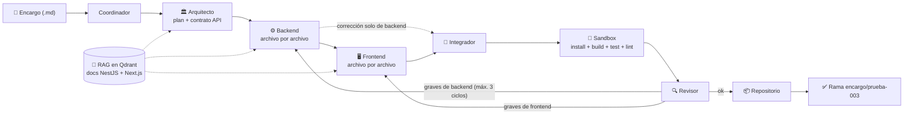

# Guía paso a paso — Fase 3: Estrategia de código y RAG (Fábrica de Desarrollo con Agentes IA)

Categoría: Proyectos
Fecha: 5 de agosto de 2026
Etiquetas: Código, Importante, Proyecto
ítem principal: Plan de Implementación — Fábrica de Desarrollo con Agentes IA (local / validación de grafo) (https://app.notion.com/p/Plan-de-Implementaci-n-F-brica-de-Desarrollo-con-Agentes-IA-local-validaci-n-de-grafo-3878229d6b0d48c28e5590c8f65c6c56?pvs=21)

<aside>
🧩

**Qué es este documento.** Guía de ejecución paso a paso, pensada para principiantes, de la **Fase 3 — Estrategia de código y RAG** del plan [Plan de Implementación — Fábrica de Desarrollo con Agentes IA (local / validación de grafo)](https://app.notion.com/p/Plan-de-Implementaci-n-F-brica-de-Desarrollo-con-Agentes-IA-local-validaci-n-de-grafo-3878229d6b0d48c28e5590c8f65c6c56?pvs=21). Es la continuación directa de [Guía paso a paso — Fase 2: Frontend, Integrador y sandbox real (Fábrica de Desarrollo con Agentes IA)](https://app.notion.com/p/Gu-a-paso-a-paso-Fase-2-Frontend-Integrador-y-sandbox-real-F-brica-de-Desarrollo-con-Agentes-IA-3541f830c59b4e53a7ce69f476c5f11f?pvs=21) y asume que su checklist final está 100% completo. Incluye todos los comandos y todo el código, en el orden exacto en que se ejecutan.

</aside>

<aside>
⚠️

**Nota sobre copiar y pegar código.** Sigue vigente la lección de las Fases 0–2: la terminal usada daña la indentación al pegar código de varias líneas. Para crear o reemplazar cada archivo de esta guía tienes dos opciones seguras: (1) escribirlo con `nano` cuidando la indentación de 4 espacios **y verificando después con** `cat` **que el archivo termina exactamente donde debe**, o (2) **pedirle a Notion AI el comando en Base64** para ese archivo (`echo '...' | base64 -d > archivo`), que es inmune a ambos problemas. El código mostrado en esta guía es la referencia oficial de lo que debe quedar en cada archivo.

</aside>

<aside>
🎓

**Lecciones de la Fase 2 ya incorporadas en esta guía.** (1) El modelo alucinó una versión de npm que nunca se publicó (`tsconfig-paths@^4.2.1`, error `ETARGET`): ahora los prompts de los programadores exigen **rangos amplios de versiones publicadas** y el RAG les acerca los patrones reales de la documentación oficial. (2) El `npm install --silent` encadenado con `&&` escondía la causa raíz de los fallos del sandbox: ahora cada paso (`install`, `build`, `test`, `lint`) **se ejecuta y reporta por separado**, así el Revisor ve exactamente qué paso falló y con qué salida. (3) Sigue vigente la regla operativa: los cambios en `.env` solo se aplican recreando el contenedor (`docker compose up -d --force-recreate orquestador`).

</aside>

## Qué se construye en esta fase

La Fase 3 del plan (§12) ataca tres frentes. El grafo **no cambia de forma** — mismos 8 nodos y mismas aristas, así que `graph.py` y `state.py` quedan intactos —; lo que cambia es **lo que pasa dentro de los nodos**:

1. **RAG operativo (§7 del plan).** Qdrant deja de estar en espera: se carga con la documentación pública oficial de **NestJS** y **Next.js**, y los nodos Arquitecto, Backend y Frontend consultan fragmentos relevantes antes de diseñar y escribir. Los embeddings se generan **localmente y gratis** con FastEmbed — sin nueva API key y sin gastar créditos de OpenRouter.
2. **Patrón «plan por archivo» (§6 del plan).** Los programadores dejan de devolver el proyecto completo en una sola respuesta gigante: ahora escriben **archivo por archivo**, con una llamada al modelo por archivo y contexto acotado (contrato API + rutas del plan + documentación del RAG + hallazgos de ese archivo). Esto valida la estrategia de working copy con encargos de muchos archivos y elimina de raíz el riesgo de JSON truncado de la Fase 2.
3. **Verificación ampliada en el sandbox.** Además de compilar, el sandbox corre **pruebas unitarias (`npm test`) y lint (`npm run lint`) reales** cuando el proyecto define esos scripts, y reporta cada paso por separado. Un test fallido es hallazgo de severidad **alta** obligatorio; un lint fallido es severidad **media**.



Qué queda **fuera** de esta fase, a propósito:

- **Sin checkpoints humanos**: el plan del Arquitecto se sigue aprobando automáticamente. Llegan en la Fase 4 (el `stdin_open: true` del compose ya está listo desde la Fase 0).
- **Sin convenciones internas de ADN en el RAG**: todavía no existen documentadas (§7 y §15 del plan). Cuando existan, se agregan como una colección más en Qdrant sin cambiar este diseño.
- **Sin edición incremental de repos con código previo**: cada encargo sigue creando su proyecto desde cero en su repo de prueba. Trabajar sobre repositorios existentes se evalúa al cierre del piloto (Fase 5).

<aside>
💰

**Costos de esta fase.** El patrón por archivo hace **más llamadas** al LLM (15–20 en una corrida limpia contra ~6 de la Fase 2) pero cada una es **mucho más pequeña**, y las correcciones ahora reescriben solo los archivos señalados. El RAG no gasta créditos (embeddings locales). Recomendación: entra a esta fase con **al menos $5 de saldo** en OpenRouter, y si el saldo aprieta puedes bajar `MAX_TOKENS_SALIDA=4096` en `.env` sin riesgo — con una respuesta por archivo, ese tope sobra.

</aside>

## 0. Antes de empezar

- [x]  Checklist final de la Fase 2 completo (la rama `encargo/prueba-002` existe en GitHub y backend + frontend compilan en el sandbox).
- [ ]  Créditos de OpenRouter recargados.
- [ ]  Espacio en disco disponible: la carga del RAG descarga documentación (~200 MB temporales que se borran solos) y el modelo de embeddings (~130 MB, una sola vez).

Estructura de archivos al terminar esta fase (lo que cambia está marcado):

```jsx
fabrica-desarrollo-ia/
├── docker-compose.yml          (sin cambios)
├── .env                        (sin cambios; opcional MAX_TOKENS_SALIDA=4096)
├── orquestador/
│   ├── Dockerfile              (sin cambios)
│   ├── requirements.txt        ← se actualiza (qdrant-client con FastEmbed)
│   └── src/
│       ├── state.py            (sin cambios)
│       ├── models.py           (sin cambios)
│       ├── rag.py              ← NUEVO: consulta de documentación en Qdrant
│       ├── cargar_rag.py       ← NUEVO: carga las colecciones de docs
│       ├── probar_rag.py       ← NUEVO: prueba rápida del RAG
│       ├── agentes.py          ← se reemplaza (RAG + archivo por archivo + test/lint)
│       ├── graph.py            (sin cambios)
│       ├── main.py             ← se reemplaza
│       └── encargos/
│           ├── prueba-002.md
│           └── prueba-003.md   ← NUEVO: encargo multi-archivo con pruebas
└── sandbox/
    └── Dockerfile              (sin cambios)
```

## 1. Crear el repositorio de prueba en GitHub

Igual que en las fases anteriores: el repo destino debe existir antes (siempre llega indicado en el encargo, nunca se infiere).

1. Entra a la organización **ADN Fábrica Lab** en GitHub y haz clic en **New repository**.
2. Configúralo así:
    - **Owner**: `adn-fabrica-lab`
    - **Name**: `fabrica-prueba-003`
    - Visibilidad: **Private** está bien.
    - ✅ Marca **Add a README file** (crea la rama `main`, sin la cual el clone inicial falla).
3. Clic en **Create repository**.

## 2. Actualizar `requirements.txt` y reconstruir el orquestador

La única dependencia nueva de la fase es el cliente de Qdrant con FastEmbed incluido. Como es **agregar una línea al final**, no hace falta editar el archivo a mano:

```bash
cd ~/Documentos/fabrica-desarrollo-ia
echo 'qdrant-client[fastembed]' >> orquestador/requirements.txt
cat orquestador/requirements.txt
```

El `cat` debe mostrar la línea `qdrant-client[fastembed]` **una sola vez y al final** (si la ves duplicada porque corriste el `echo` dos veces, borra la repetida con `nano`). Como `requirements.txt` solo se instala al construir la imagen, hay que reconstruir:

```bash
docker compose build orquestador
docker compose up -d orquestador
docker compose exec orquestador python -c "import qdrant_client; print('qdrant-client OK')"
```

El último comando debe imprimir `qdrant-client OK`.

<aside>
💡

**Qué es FastEmbed y por qué se usa aquí.** Para buscar por significado en Qdrant hay que convertir cada texto en un vector (embedding). FastEmbed lo hace **localmente en tu CPU** con un modelo pequeño en formato ONNX (por defecto `BAAI/bge-small-en-v1.5`): sin API key nueva, sin costo por consulta, sin depender de OpenRouter (que no ofrece embeddings). La primera vez que se use descargará el modelo (~130 MB, una sola vez). El modelo es de inglés y la documentación cargada también: las consultas que hacen los agentes mezclan español con términos técnicos en inglés (rutas, nombres de framework), lo cual es suficiente para el piloto. Si en la Fase 5 se nota mala recuperación, se cambia por un modelo multilingüe sin tocar el resto del diseño.

</aside>

## 3. Crear `rag.py`

El módulo que consulta la documentación desde los agentes. Crea `orquestador/src/rag.py`:

```python
# orquestador/src/rag.py
import os

from qdrant_client import QdrantClient

COLECCION_POR_AREA = {
    "backend": "docs_nestjs",
    "frontend": "docs_nextjs",
}

_cliente = None

def _obtener_cliente() -> QdrantClient:
    global _cliente
    if _cliente is None:
        _cliente = QdrantClient(
            host=os.environ.get("QDRANT_HOST", "qdrant"),
            port=int(os.environ.get("QDRANT_PORT", "6333")),
        )
    return _cliente

def consultar_rag(consulta: str, area: str, limite: int = 3) -> list[str]:
    """Devuelve fragmentos de documentacion oficial relevantes a la consulta.

    area: "backend" (NestJS), "frontend" (Next.js) o "ambas".
    Si la coleccion no existe o Qdrant no responde, devuelve una lista vacia:
    el grafo sigue funcionando igual que en la Fase 2, solo sin contexto extra.
    """
    if area == "ambas":
        colecciones = list(COLECCION_POR_AREA.values())
    else:
        colecciones = [COLECCION_POR_AREA[area]]
    fragmentos = []
    for coleccion in colecciones:
        try:
            resultados = _obtener_cliente().query(
                collection_name=coleccion,
                query_text=consulta,
                limit=limite,
            )
        except Exception:
            continue
        for r in resultados:
            if r.document:
                fragmentos.append(r.document[:1200])
    return fragmentos
```

Dos decisiones de diseño para entender bien este archivo:

- **Una colección por framework** (`docs_nestjs`, `docs_nextjs`): así el Programador Backend solo recibe documentación de NestJS y el Frontend solo de Next.js; el Arquitecto consulta ambas. Cada fragmento se recorta a 1.200 caracteres para no inflar los prompts.
- **Degradación elegante**: cualquier error de Qdrant (colección sin cargar, contenedor caído) se traduce en «cero fragmentos», nunca en una excepción. Si Qdrant está vacío o apagado, `consultar_rag` devuelve una lista vacía y el grafo funciona igual que en la Fase 2 — el RAG nunca puede tumbar una corrida.

## 4. Crear `cargar_rag.py`

El script que descarga la documentación oficial y la carga en Qdrant. Se corre **una sola vez** (y cuando quieras refrescar la documentación). Crea `orquestador/src/cargar_rag.py`:

```python
# orquestador/src/cargar_rag.py
"""Carga la documentacion publica de NestJS y Next.js en Qdrant (S7 del plan).

Uso (desde la raiz del proyecto):
    docker compose exec orquestador python src/cargar_rag.py          # ambas
    docker compose exec orquestador python src/cargar_rag.py nestjs   # solo una
Idempotente: cada corrida borra y recrea la coleccion correspondiente.
"""
import os
import subprocess
import sys
import tempfile

from qdrant_client import QdrantClient

FUENTES = {
    "nestjs": {
        "coleccion": "docs_nestjs",
        "repo": "https://github.com/nestjs/docs.nestjs.com.git",
        "carpeta_docs": "content",
        "extensiones": (".md",),
    },
    "nextjs": {
        "coleccion": "docs_nextjs",
        "repo": "https://github.com/vercel/next.js.git",
        "carpeta_docs": "docs",
        "extensiones": (".md", ".mdx"),
    },
}

TAMANO_FRAGMENTO = 1500
SOLAPAMIENTO = 200

def fragmentar(texto: str) -> list[str]:
    fragmentos = []
    inicio = 0
    while inicio < len(texto):
        fragmentos.append(texto[inicio : inicio + TAMANO_FRAGMENTO])
        inicio += TAMANO_FRAGMENTO - SOLAPAMIENTO
    return [f for f in fragmentos if len(f.strip()) > 100]

def descargar_docs(fuente: dict, destino: str) -> str:
    # Clone superficial y disperso: descarga solo la carpeta de documentacion,
    # no todo el repositorio (el monorepo de Next.js pesa cientos de MB).
    subprocess.run(
        ["git", "clone", "--depth", "1", "--filter=blob:none", "--sparse",
         fuente["repo"], destino],
        check=True,
    )
    subprocess.run(
        ["git", "-C", destino, "sparse-checkout", "set", fuente["carpeta_docs"]],
        check=True,
    )
    return os.path.join(destino, fuente["carpeta_docs"])

def cargar_fuente(cliente: QdrantClient, nombre: str) -> None:
    fuente = FUENTES[nombre]
    print("Descargando documentacion de " + nombre + "...")
    documentos, metadatos = [], []
    with tempfile.TemporaryDirectory() as tmp:
        raiz = descargar_docs(fuente, tmp)
        for carpeta, _, archivos in os.walk(raiz):
            for archivo in archivos:
                if not archivo.endswith(fuente["extensiones"]):
                    continue
                ruta = os.path.join(carpeta, archivo)
                with open(ruta, "r", encoding="utf-8", errors="ignore") as f:
                    texto = f.read()
                relativa = os.path.relpath(ruta, raiz)
                for fragmento in fragmentar(texto):
                    documentos.append(fragmento)
                    metadatos.append({"fuente": nombre, "archivo": relativa})
    print("   " + str(len(documentos)) + " fragmentos extraidos.")
    if cliente.collection_exists(fuente["coleccion"]):
        cliente.delete_collection(fuente["coleccion"])
    print("   Generando embeddings y cargando en Qdrant (varios minutos)...")
    cliente.add(
        collection_name=fuente["coleccion"],
        documents=documentos,
        metadata=metadatos,
    )
    print("   Coleccion " + fuente["coleccion"] + " lista.")

if __name__ == "__main__":
    objetivo = sys.argv[1] if len(sys.argv) > 1 else "todo"
    cliente = QdrantClient(
        host=os.environ.get("QDRANT_HOST", "qdrant"),
        port=int(os.environ.get("QDRANT_PORT", "6333")),
    )
    for nombre in FUENTES:
        if objetivo in ("todo", nombre):
            cargar_fuente(cliente, nombre)
    print("Carga de RAG terminada.")
```

Cómo funciona, en tres ideas:

- **Descarga dispersa**: `git clone --depth 1 --filter=blob:none --sparse` + `sparse-checkout` trae **solo la carpeta de documentación** de cada repo oficial (no el código del framework). Se borra sola al terminar (`TemporaryDirectory`).
- **Fragmentación con solapamiento**: cada documento se corta en trozos de 1.500 caracteres con 200 de solapamiento, para que una idea que quede partida entre dos trozos siga apareciendo completa en al menos uno.
- **`cliente.add(...)`** hace todo el trabajo vectorial: genera los embeddings con FastEmbed y los sube a la colección. Es idempotente porque la colección se borra y recrea en cada corrida.

## 5. Cargar y probar el RAG

Primero la carga (paciencia: descarga de docs + descarga del modelo de embeddings la primera vez + generación de embeddings en CPU — cuenta con **10–25 minutos** en total):

```bash
docker compose exec orquestador python src/cargar_rag.py
```

Salida esperada (los números exactos varían con las versiones de la documentación):

```jsx
Descargando documentacion de nestjs...
   ~2000-4000 fragmentos extraidos.
   Generando embeddings y cargando en Qdrant (varios minutos)...
   Coleccion docs_nestjs lista.
Descargando documentacion de nextjs...
   ~3000-6000 fragmentos extraidos.
   Generando embeddings y cargando en Qdrant (varios minutos)...
   Coleccion docs_nextjs lista.
Carga de RAG terminada.
```

Ahora crea `orquestador/src/probar_rag.py` para verificar que la recuperación funciona:

```python
# orquestador/src/probar_rag.py
from rag import consultar_rag

PRUEBAS = [
    ("backend", "How to enable CORS in a NestJS application"),
    ("frontend", "How to fetch data in a Next.js App Router page"),
]

for area, consulta in PRUEBAS:
    fragmentos = consultar_rag(consulta, area, limite=2)
    print(area + ": " + str(len(fragmentos)) + " fragmentos recuperados")
    if fragmentos:
        print("   Muestra: " + fragmentos[0][:200].replace("\n", " ") + "...")
```

Y córrelo:

```bash
docker compose exec orquestador python src/probar_rag.py
```

Debe imprimir `backend: 2 fragmentos recuperados` y `frontend: 2 fragmentos recuperados`, cada uno con una muestra de texto que efectivamente hable de CORS (NestJS) y de fetch de datos (Next.js). Verificación extra opcional desde el host: `curl -s http://localhost:6333/collections` debe listar `docs_nestjs` y `docs_nextjs`. Con las dos colecciones cargadas y respondiendo, el RAG quedó listo — nada de esta sección se repite salvo que quieras refrescar la documentación.

## 6. Crear el encargo de prueba

El encargo de esta fase es deliberadamente **multi-archivo y multi-módulo**, y exige **pruebas unitarias**: es lo que valida el patrón «plan por archivo» y el sandbox ampliado. Crea `orquestador/src/encargos/prueba-003.md` (texto plano, `nano` es seguro aquí):

```markdown
# Encargo prueba-003

- encargo_id: prueba-003
- repositorio: fabrica-prueba-003

## Descripcion

Construir una mini aplicacion de "registro de tareas" con dos partes:

1. Backend NestJS (carpeta backend/) con un modulo de tareas:
   - GET /tareas: lista las tareas (almacenadas en memoria, sin base de datos).
   - POST /tareas: crea una tarea con {"titulo": "..."}; responde la tarea
     creada {"id": 1, "titulo": "...", "completada": false}.
   - PATCH /tareas/:id/completar: marca la tarea como completada.
   - GET /tareas/resumen: responde {"total": n, "completadas": n,
     "pendientes": n}.
2. Frontend Next.js (carpeta frontend/) con una unica pagina que:
   - Lista las tareas y muestra el resumen.
   - Permite crear una tarea con un formulario simple.
   - Permite marcar una tarea como completada con un boton.

## Criterios de aceptacion

- El backend es NestJS con TypeScript, corre en el puerto 3001 y habilita
  CORS.
- La logica de tareas vive en un servicio separado del controlador.
- El servicio de tareas tiene pruebas unitarias con Jest (archivo .spec.ts)
  que cubren crear, completar y el resumen; "npm test" pasa sin fallos.
- El frontend es Next.js (App Router) con TypeScript y usa la variable de
  entorno NEXT_PUBLIC_API_URL (con default http://localhost:3001).
- backend/ y frontend/ son proyectos npm independientes: cada uno tiene su
  package.json con script "build" y compila sin errores.
- Usar solo versiones de dependencias publicadas y estables en package.json.
- No se necesita base de datos ni autenticacion.
```

Fíjate en las tres novedades respecto a `prueba-002`: hay **cuatro endpoints** (más superficie de contrato para el Integrador), se exige **servicio separado del controlador con pruebas Jest** (lo que obliga al Arquitecto a planificar un `.spec.ts` y al sandbox a correrlo), y el criterio de **versiones publicadas y estables** lleva la lección `ETARGET` de la Fase 2 hasta el encargo mismo.

## 7. Reemplazar `agentes.py`

El corazón de la fase. Reemplaza todo el contenido de `orquestador/src/agentes.py`:

```python
# orquestador/src/agentes.py
import json
import os
import shutil
import subprocess

from models import obtener_modelo
from rag import consultar_rag
from state import EstadoFabricaDesarrollo

RUTA_TRABAJO = "/app/workspace"
RUTA_SANDBOX = "/sandbox-workspace"  # mismo volumen que /workspace del sandbox
CONTENEDOR_SANDBOX = "fabrica_sandbox"
TOPE_CICLOS = 3

def _limpiar_json(texto: str) -> str:
    # El modelo a veces envuelve el JSON en texto o en un bloque de codigo.
    inicio = texto.find("{")
    fin = texto.rfind("}")
    if inicio == -1 or fin == -1:
        raise ValueError("El modelo no devolvio JSON. Respuesta: " + texto[:300])
    return texto[inicio : fin + 1]

def _pedir_json(rol: str, instrucciones: str, contenido: str) -> dict:
    modelo = obtener_modelo(rol)
    respuesta = modelo.invoke([
        (
            "system",
            instrucciones
            + " Responde UNICAMENTE con un objeto JSON valido, sin explicaciones.",
        ),
        ("user", contenido),
    ])
    return json.loads(_limpiar_json(respuesta.content))

def _graves(hallazgos, area=None):
    # Filtra hallazgos de severidad alta, opcionalmente por area.
    resultado = []
    for h in hallazgos or []:
        if h.get("severidad") != "alta":
            continue
        if area is None or h.get("area") == area:
            resultado.append(h)
    return resultado

def _rutas_afectadas(hallazgos) -> set:
    # NUEVO Fase 3: rutas de archivo senaladas por los hallazgos (si las traen).
    rutas = set()
    for h in hallazgos or []:
        if h.get("ruta"):
            rutas.add(h["ruta"])
    return rutas

def nodo_coordinador(estado: EstadoFabricaDesarrollo) -> dict:
    print("1. Coordinador: interpretando el encargo...")
    datos = _pedir_json(
        "coordinador",
        "Eres el Coordinador de una fabrica de desarrollo de software. "
        "Extrae del encargo un JSON con esta forma exacta: "
        '{"encargo_id": "...", "repositorio": "...", "titulo": "...", '
        '"descripcion": "...", "criterios": ["..."]}. '
        "El repositorio viene indicado en el encargo; nunca lo inventes.",
        estado["encargo"]["texto_original"],
    )
    encargo = dict(estado["encargo"])
    encargo.update(datos)
    return {"encargo": encargo, "encargo_id": datos["encargo_id"]}

def nodo_arquitecto(estado: EstadoFabricaDesarrollo) -> dict:
    print("2. Arquitecto: disenando el plan tecnico (backend + frontend)...")
    consulta = (
        (estado["encargo"].get("titulo") or "")
        + " "
        + (estado["encargo"].get("descripcion") or "")
    )
    contexto = {
        "encargo": estado["encargo"],
        # NUEVO Fase 3: fragmentos de la documentacion oficial de ambos
        # frameworks, recuperados de Qdrant.
        "documentacion": consultar_rag(consulta, "ambas", limite=2),
    }
    plan = _pedir_json(
        "arquitecto",
        "Eres el Arquitecto de Software de una fabrica de desarrollo. "
        "El proyecto tiene un backend NestJS (TypeScript) en la carpeta "
        "backend/ y un frontend Next.js (TypeScript, App Router) en la "
        "carpeta frontend/. A partir del encargo, produce un plan tecnico "
        "JSON con esta forma exacta: "
        '{"resumen": "...", '
        '"contrato_api": [{"metodo": "GET", "ruta": "/...", '
        '"respuesta_ejemplo": {}}], '
        '"archivos_backend": [{"ruta": "backend/...", "accion": "crear", '
        '"descripcion": "..."}], '
        '"archivos_frontend": [{"ruta": "frontend/...", "accion": "crear", '
        '"descripcion": "..."}]}. '
        "El contrato_api es la unica fuente de verdad de los endpoints: "
        "backend y frontend deben implementarlo tal cual. Incluye TODOS los "
        "archivos necesarios para que cada proyecto sea completo e instalable "
        "(package.json con script build, tsconfig.json, src/..., app/...). "
        "Si los criterios piden pruebas unitarias, incluye los archivos "
        ".spec.ts correspondientes en archivos_backend. Escribe cada "
        "descripcion de archivo de forma especifica y completa: sera la "
        "unica guia que tendra el programador al escribir ese archivo. "
        "documentacion trae fragmentos de la documentacion oficial: apoyate "
        "en ella. Manten el plan lo mas pequeno posible cumpliendo el "
        "encargo.",
        json.dumps(contexto, ensure_ascii=False),
    )
    # Igual que en las Fases 1-2: sin checkpoint humano (llega en la Fase 4).
    return {"plan_tecnico": plan, "plan_aprobado": True}

def _programar_por_archivos(area: str, estado: EstadoFabricaDesarrollo) -> list[dict]:
    # NUEVO Fase 3 - patron "plan por archivo" (S6 del plan): una llamada al
    # modelo POR ARCHIVO con contexto acotado, en vez de pedir el proyecto
    # completo en una sola respuesta gigante (que en la Fase 2 rozaba el tope
    # de tokens y podia truncar el JSON).
    plan = estado["plan_tecnico"]
    archivos_del_plan = plan.get("archivos_" + area) or []
    actuales = {
        a["ruta"]: a["contenido"] for a in (estado.get("archivos_" + area) or [])
    }
    graves = _graves(estado.get("hallazgos_revision"), area)
    correccion = bool(actuales) and bool(graves)
    rutas_a_corregir = _rutas_afectadas(graves)

    if area == "backend":
        rol_descripcion = "Programador Backend (NestJS + TypeScript)"
    else:
        rol_descripcion = "Programador Frontend (Next.js + TypeScript, App Router)"

    resultado = []
    for archivo in archivos_del_plan:
        ruta = archivo["ruta"]
        # En una correccion solo se reescriben los archivos senalados por los
        # hallazgos; si ningun hallazgo trae ruta, se reescribe todo el area.
        if correccion and rutas_a_corregir and ruta not in rutas_a_corregir:
            if ruta in actuales:
                resultado.append({"ruta": ruta, "contenido": actuales[ruta]})
                continue
        print("   Escribiendo " + ruta + "...")
        contexto = {
            "criterios_del_encargo": estado["encargo"].get("criterios"),
            "resumen_plan": plan.get("resumen"),
            "contrato_api": plan.get("contrato_api"),
            "rutas_de_todo_el_plan": [a.get("ruta") for a in archivos_del_plan],
            "archivo_a_escribir": archivo,
            "contenido_actual": actuales.get(ruta),
            "hallazgos_a_corregir": [
                h for h in graves if h.get("ruta") in (None, "", ruta)
            ],
            # NUEVO Fase 3: documentacion oficial relevante a ESTE archivo.
            "documentacion": consultar_rag(
                (archivo.get("descripcion") or "") + " " + ruta, area, limite=2
            ),
        }
        datos = _pedir_json(
            area,
            "Eres el " + rol_descripcion + ". Escribe el contenido COMPLETO "
            "de UN SOLO archivo: el indicado en archivo_a_escribir. Debe ser "
            "coherente con contrato_api y con rutas_de_todo_el_plan (los "
            "imports entre archivos deben corresponder a esas rutas). "
            "documentacion trae fragmentos de la documentacion oficial del "
            "framework: sigue sus patrones y convenciones. Si "
            "hallazgos_a_corregir tiene elementos, corrige esos problemas "
            "partiendo de contenido_actual. En package.json usa solo "
            "versiones de dependencias publicadas y estables; ante la duda "
            "usa un rango amplio (por ejemplo ^10.0.0) en vez de inventar un "
            "parche exacto. Responde JSON con esta forma exacta: "
            '{"contenido": "..."}.',
            json.dumps(contexto, ensure_ascii=False),
        )
        resultado.append({"ruta": ruta, "contenido": datos["contenido"]})
    return resultado

def nodo_programador_backend(estado: EstadoFabricaDesarrollo) -> dict:
    print("3. Programador Backend: escribiendo NestJS archivo por archivo...")
    return {"archivos_backend": _programar_por_archivos("backend", estado)}

def decidir_despues_de_backend(estado: EstadoFabricaDesarrollo) -> str:
    if not (estado.get("archivos_frontend") or []):
        # Primera pasada: el frontend aun no existe.
        return "frontend"
    if _graves(estado.get("hallazgos_revision"), "frontend"):
        # Tambien hay correcciones de frontend pendientes en este ciclo.
        return "frontend"
    # Correccion solo de backend: pasar directo a re-verificar contratos,
    # sin re-ejecutar (ni re-pagar) el nodo Frontend.
    return "integrador"

def nodo_programador_frontend(estado: EstadoFabricaDesarrollo) -> dict:
    print("4. Programador Frontend: escribiendo Next.js archivo por archivo...")
    return {"archivos_frontend": _programar_por_archivos("frontend", estado)}

def nodo_integrador(estado: EstadoFabricaDesarrollo) -> dict:
    print("5. Integrador: verificando contratos entre backend y frontend...")
    contexto = {
        "contrato_api": estado["plan_tecnico"].get("contrato_api"),
        "archivos_backend": estado["archivos_backend"],
        "archivos_frontend": estado["archivos_frontend"],
    }
    datos = _pedir_json(
        "integrador",
        "Eres el Integrador. Verifica que el backend implemente el "
        "contrato_api tal cual (metodos, rutas, forma del JSON, puerto) y que "
        "el frontend consuma exactamente esos mismos endpoints y formas. "
        "Responde JSON con esta forma exacta: "
        '{"hallazgos": [{"area": "backend", "ruta": "...", "detalle": "...", '
        '"severidad": "alta"}]}. '
        'area es "backend" o "frontend" segun donde deba corregirse. Usa una '
        "lista vacia si los contratos coinciden. Reporta solo "
        "incompatibilidades reales, no mejoras opcionales.",
        json.dumps(contexto, ensure_ascii=False),
    )
    return {"hallazgos_integracion": datos["hallazgos"]}

def _correr_paso(carpeta: str, comando: str) -> dict:
    try:
        proceso = subprocess.run(
            [
                "docker", "exec", CONTENEDOR_SANDBOX, "sh", "-lc",
                "cd /workspace/" + carpeta + " && " + comando,
            ],
            capture_output=True,
            text=True,
            timeout=900,
        )
    except subprocess.TimeoutExpired:
        return {"ok": False, "salida_final": "Timeout: el paso supero los 15 minutos."}
    salida = (proceso.stdout + "\n" + proceso.stderr).strip()
    # Solo se conserva el final de la salida: ahi esta el error si lo hay.
    return {"ok": proceso.returncode == 0, "salida_final": salida[-2000:]}

def _scripts_npm(carpeta: str) -> dict:
    # Lee los scripts del package.json directo del volumen compartido.
    ruta = os.path.join(RUTA_SANDBOX, carpeta, "package.json")
    try:
        with open(ruta, "r", encoding="utf-8") as f:
            return json.load(f).get("scripts") or {}
    except (OSError, ValueError):
        return {}

def _correr_en_sandbox(carpeta: str) -> dict:
    # NUEVO Fase 3: cada paso se corre y reporta POR SEPARADO (leccion de la
    # Fase 2: el install encadenado con --silent escondia la causa real).
    # test y lint solo corren si el proyecto define esos scripts.
    resultado = {
        "install": _correr_paso(carpeta, "npm install --no-audit --no-fund --silent")
    }
    if not resultado["install"]["ok"]:
        return resultado
    resultado["build"] = _correr_paso(carpeta, "npm run build")
    scripts = _scripts_npm(carpeta)
    if "test" in scripts:
        resultado["test"] = _correr_paso(carpeta, "npm test -- --passWithNoTests")
    if "lint" in scripts:
        resultado["lint"] = _correr_paso(carpeta, "npm run lint")
    return resultado

def nodo_sandbox(estado: EstadoFabricaDesarrollo) -> dict:
    print("6. Sandbox: install + build + test + lint reales (puede tardar)...")
    raiz = os.path.join(RUTA_SANDBOX, estado["encargo_id"])
    # Igual que en la Fase 2: no se borra la carpeta (node_modules en cache);
    # los archivos fuente se sobreescriben con la version mas reciente.
    for archivo in (estado["archivos_backend"] or []) + (
        estado.get("archivos_frontend") or []
    ):
        ruta = os.path.join(raiz, archivo["ruta"])
        os.makedirs(os.path.dirname(ruta), exist_ok=True)
        with open(ruta, "w", encoding="utf-8") as f:
            f.write(archivo["contenido"])

    resultado = {}
    for area in ("backend", "frontend"):
        if os.path.isdir(os.path.join(raiz, area)):
            print("   Verificando " + area + "...")
            pasos = _correr_en_sandbox(estado["encargo_id"] + "/" + area)
            resultado[area] = pasos
            for paso, res in pasos.items():
                print("   " + area + " " + paso + ": " + ("OK" if res["ok"] else "FALLO"))
    return {"resultado_sandbox": resultado}

def nodo_revisor(estado: EstadoFabricaDesarrollo) -> dict:
    ciclo = estado.get("ciclo", 0) + 1
    print("7. Revisor: consolidando la revision (ciclo " + str(ciclo) + ")...")
    contexto = {
        "encargo": estado["encargo"],
        "plan_tecnico": estado["plan_tecnico"],
        "archivos_backend": estado["archivos_backend"],
        "archivos_frontend": estado.get("archivos_frontend") or [],
        "hallazgos_integracion": estado.get("hallazgos_integracion") or [],
        "resultado_sandbox": estado.get("resultado_sandbox") or {},
    }
    datos = _pedir_json(
        "revisor",
        "Eres el Revisor de Codigo. Consolida la revision final con tres "
        "insumos: (1) el codigo debe cumplir el encargo y el plan tecnico; "
        "(2) hallazgos_integracion trae incompatibilidades de contrato ya "
        "detectadas por el Integrador; (3) resultado_sandbox trae por "
        "proyecto el resultado REAL de install, build, test y lint. Si "
        "install, build o test tienen ok en false, ese fallo es "
        "obligatoriamente un hallazgo de severidad alta (usa salida_final "
        "para diagnosticar la causa e indica en ruta el archivo exacto a "
        "corregir). Si lint tiene ok en false, registralo como severidad "
        "media. Responde JSON con esta forma exacta: "
        '{"hallazgos": [{"area": "backend", "ruta": "...", "detalle": "...", '
        '"severidad": "alta"}]}. area es "backend" o "frontend". La '
        'severidad es "alta", "media" o "baja". Usa una lista vacia si todo '
        "esta bien. Reporta solo problemas reales que impidan cumplir el "
        "encargo.",
        json.dumps(contexto, ensure_ascii=False),
    )
    return {"hallazgos_revision": datos["hallazgos"], "ciclo": ciclo}

def decidir_despues_de_revision(estado: EstadoFabricaDesarrollo) -> str:
    graves_back = _graves(estado.get("hallazgos_revision"), "backend")
    graves_front = _graves(estado.get("hallazgos_revision"), "frontend")
    if (graves_back or graves_front) and estado.get("ciclo", 0) < TOPE_CICLOS:
        if graves_back:
            print(
                "   Revisor: "
                + str(len(graves_back))
                + " hallazgos graves de backend. Vuelve al Backend."
            )
            return "backend"
        print(
            "   Revisor: "
            + str(len(graves_front))
            + " hallazgos graves de frontend. Vuelve al Frontend."
        )
        return "frontend"
    if graves_back or graves_front:
        print("   Revisor: aun hay hallazgos, pero se alcanzo el tope de ciclos.")
    return "repositorio"

def nodo_repositorio(estado: EstadoFabricaDesarrollo) -> dict:
    print("8. Agente de Repositorio: publicando el codigo en una rama...")
    org = os.environ["GITHUB_ORG"]
    usuario = os.environ["GITHUB_USER"]
    token = os.environ["GITHUB_TOKEN"]
    repo = estado["encargo"]["repositorio"]
    rama = "encargo/" + estado["encargo_id"]
    url = "https://" + usuario + ":" + token + "@github.com/" + org + "/" + repo + ".git"
    destino = os.path.join(RUTA_TRABAJO, repo)

    if os.path.exists(destino):
        shutil.rmtree(destino)
    os.makedirs(RUTA_TRABAJO, exist_ok=True)
    subprocess.run(["git", "clone", url, destino], check=True)
    subprocess.run(["git", "checkout", "-b", rama], cwd=destino, check=True)

    archivos = (estado["archivos_backend"] or []) + (
        estado.get("archivos_frontend") or []
    )
    for archivo in archivos:
        ruta = os.path.join(destino, archivo["ruta"])
        os.makedirs(os.path.dirname(ruta), exist_ok=True)
        with open(ruta, "w", encoding="utf-8") as f:
            f.write(archivo["contenido"])

    mensaje = "Encargo " + estado["encargo_id"] + ": " + estado["encargo"].get("titulo", "")
    subprocess.run(["git", "add", "."], cwd=destino, check=True)
    subprocess.run(
        [
            "git",
            "-c", "user.name=Fabrica de Desarrollo",
            "-c", "user.email=fabrica@adn.local",
            "commit", "-m", mensaje,
        ],
        cwd=destino,
        check=True,
    )
    subprocess.run(["git", "push", "-u", "origin", rama], cwd=destino, check=True)
    print("   Rama publicada: " + rama)
    return {"rama_git": rama}
```

Qué hace cada pieza **nueva o cambiada** respecto a la Fase 2:

| Pieza | Qué cambia |
| --- | --- |
| `_rutas_afectadas` | Helper nuevo: extrae las rutas de archivo que los hallazgos señalan, para que una corrección reescriba **solo esos archivos** |
| `nodo_arquitecto` | Consulta el RAG (ambas colecciones) antes de diseñar; debe planificar los `.spec.ts` si el encargo pide pruebas; sus descripciones de archivo ahora son la guía única de cada llamada por archivo |
| `_programar_por_archivos` | **El cambio central de la fase.** Reemplaza las respuestas «proyecto completo» de ambos programadores: una llamada al modelo por archivo, con contrato + rutas del plan + documentación del RAG específica de ese archivo + hallazgos de ese archivo. En correcciones, los archivos no señalados se conservan tal cual (sin costo) |
| `_correr_paso` / `_scripts_npm` / `_correr_en_sandbox` | El sandbox ahora ejecuta y reporta **cada paso por separado**: `install` (sin esconder su error tras el `&&`), `build`, y `test`/`lint` solo si el `package.json` define esos scripts |
| `nodo_sandbox` | Imprime el resultado de cada paso por proyecto; `resultado_sandbox[area]` ahora es un diccionario de pasos, no un solo `ok` |
| `nodo_revisor` | Regla actualizada: `install`/`build`/`test` fallidos → hallazgo de severidad **alta** obligatorio con la ruta del archivo a corregir; `lint` fallido → severidad **media** (no bloquea la publicación) |

Las piezas que no cambian (`nodo_coordinador`, `nodo_integrador`, las dos aristas condicionales, `nodo_repositorio`, y todo `graph.py` y `state.py`) mantienen el comportamiento ya validado en la Fase 2.

## 8. Reemplazar `main.py`

Reemplaza todo el contenido de `orquestador/src/main.py`:

```python
# orquestador/src/main.py
import sys
from datetime import datetime

from dotenv import load_dotenv
from langgraph.checkpoint.postgres import PostgresSaver

from graph import construir_grafo, obtener_db_uri

load_dotenv()

if __name__ == "__main__":
    ruta_encargo = sys.argv[1] if len(sys.argv) > 1 else "src/encargos/prueba-003.md"
    with open(ruta_encargo, "r", encoding="utf-8") as f:
        texto = f.read()

    # Un thread_id nuevo por corrida: si se reutiliza uno viejo, LangGraph
    # reanuda desde el checkpoint anterior en vez de empezar de cero.
    thread_id = "fase3-" + datetime.now().strftime("%Y%m%d-%H%M%S")
    print("Thread:", thread_id)

    db_uri = obtener_db_uri()

    # El "with" mantiene la conexion a Postgres abierta durante toda la
    # ejecucion del grafo (leccion de la Fase 0).
    with PostgresSaver.from_conn_string(db_uri) as checkpointer:
        checkpointer.setup()
        grafo = construir_grafo(checkpointer)
        resultado = grafo.invoke(
            {"encargo": {"texto_original": texto}, "ciclo": 0},
            config={
                "configurable": {"thread_id": thread_id},
                "recursion_limit": 40,
            },
        )

    print()
    print("=== Resultado final ===")
    print("Encargo:           ", resultado.get("encargo_id"))
    print("Rama publicada:    ", resultado.get("rama_git"))
    print("Ciclos usados:     ", resultado.get("ciclo"))
    print("Hallazgos finales: ", len(resultado.get("hallazgos_revision") or []))
    for area, pasos in (resultado.get("resultado_sandbox") or {}).items():
        for paso, res in pasos.items():
            print("Sandbox " + area + " " + paso + ":", "OK" if res.get("ok") else "FALLO")
```

Cambios respecto a la Fase 2: el encargo por defecto es `prueba-003.md`, el prefijo del `thread_id` es `fase3-`, y el resultado final desglosa el sandbox **por paso** (`install`/`build`/`test`/`lint`) en vez de un solo OK/FALLO por proyecto.

## 9. Verificación rápida antes de gastar créditos

Como `orquestador/src` está montado como volumen, los archivos `.py` nuevos no requieren reconstruir nada (la imagen ya se reconstruyó en el paso 2). Antes de correr, valida sintaxis e imports de todo lo nuevo:

```bash
docker compose exec orquestador sh -lc "cd src && python -c 'import agentes, graph, rag' && echo 'Sintaxis OK'"
```

Debe imprimir `Sintaxis OK`. Si sale un `SyntaxError` o `IndentationError`, revisa el archivo señalado (o pídele a Notion AI el comando Base64 de ese archivo). Verifica también que el RAG sigue respondiendo (paso 5): `docker compose exec orquestador python src/probar_rag.py`.

## 10. Ejecutar el encargo de punta a punta

El momento de la verdad de la Fase 3:

```bash
docker compose exec orquestador python src/main.py
```

La corrida tarda más que en la Fase 2 en la parte de LLM (una llamada por archivo) pero el sandbox reutiliza patrones ya conocidos. Deberías ver algo como esto (las rutas exactas dependen del plan del Arquitecto):

```jsx
Thread: fase3-20260805-170000
1. Coordinador: interpretando el encargo...
2. Arquitecto: disenando el plan tecnico (backend + frontend)...
3. Programador Backend: escribiendo NestJS archivo por archivo...
   Escribiendo backend/package.json...
   Escribiendo backend/tsconfig.json...
   Escribiendo backend/nest-cli.json...
   Escribiendo backend/src/main.ts...
   Escribiendo backend/src/app.module.ts...
   Escribiendo backend/src/tareas/tareas.module.ts...
   Escribiendo backend/src/tareas/tareas.controller.ts...
   Escribiendo backend/src/tareas/tareas.service.ts...
   Escribiendo backend/src/tareas/tareas.service.spec.ts...
4. Programador Frontend: escribiendo Next.js archivo por archivo...
   Escribiendo frontend/package.json...
   Escribiendo frontend/tsconfig.json...
   Escribiendo frontend/next.config.js...
   Escribiendo frontend/.env.local...
   Escribiendo frontend/app/layout.tsx...
   Escribiendo frontend/app/page.tsx...
5. Integrador: verificando contratos entre backend y frontend...
6. Sandbox: install + build + test + lint reales (puede tardar)...
   Verificando backend...
   backend install: OK
   backend build: OK
   backend test: OK
   Verificando frontend...
   frontend install: OK
   frontend build: OK
7. Revisor: consolidando la revision (ciclo 1)...
8. Agente de Repositorio: publicando el codigo en una rama...
   Rama publicada: encargo/prueba-003

=== Resultado final ===
Encargo:            prueba-003
Rama publicada:     encargo/prueba-003
Ciclos usados:      1
Hallazgos finales:  0
Sandbox backend install: OK
Sandbox backend build: OK
Sandbox backend test: OK
Sandbox frontend install: OK
Sandbox frontend build: OK
```

Si algún paso del sandbox sale `FALLO`, el Revisor lo convierte en hallazgo (grave si es `install`/`build`/`test`) y el grafo devuelve el trabajo al programador correcto, que ahora reescribe **solo los archivos señalados** — esta vez con la evidencia de las pruebas reales sobre la mesa.

## 11. Verificar el resultado y medir el efecto del RAG

En GitHub, revisa la rama `encargo/prueba-003` del repo `fabrica-prueba-003`:

- Deben existir `backend/` y `frontend/` completos, incluido al menos un `tareas.service.spec.ts` con pruebas de crear, completar y resumen.
- Verificación manual opcional del backend (igual que el paso 12 de la Fase 2):

```bash
docker compose exec sandbox sh -lc "cd /workspace/prueba-003/backend && npm run start"
# en otra terminal:
curl -s http://localhost:3001/tareas
curl -s -X POST http://localhost:3001/tareas -H 'Content-Type: application/json' -d '{"titulo": "probar la fabrica"}'
curl -s -X PATCH http://localhost:3001/tareas/1/completar
curl -s http://localhost:3001/tareas/resumen
```

El resumen debe responder `{"total":1,"completadas":1,"pendientes":0}`.

Para **medir el efecto del RAG y del plan por archivo**, compara contra tu corrida de la Fase 2 (que usó 3 ciclos y terminó con backend en FALLO por una versión inventada):

| Métrica | Fase 2 (real) | Fase 3 (esperado) |
| --- | --- | --- |
| Ciclos usados | 3 (tope) | 1–2 |
| Hallazgos finales | 1 | 0 |
| Sandbox backend | FALLO (install oculto) | install/build/test OK, cada paso visible |
| Causa de fallo típica | Versión npm inventada, JSON gigante al borde del tope de tokens | Mitigadas: RAG + regla de versiones + una llamada por archivo |

No esperes perfección: el valor de la fase es que ahora los fallos son **vis­ibles, localizados por archivo y con evidencia real** (la `salida_final` de cada paso), no que desaparezcan por completo.

## 12. Problemas comunes

| Síntoma | Causa probable | Solución |
| --- | --- | --- |
| `cargar_rag.py` falla en `git clone` o `sparse-checkout` | Sin salida a internet desde el contenedor, o git muy viejo en la imagen | Prueba `docker compose exec orquestador git --version` y `ping github.com`; si git no está, agrega `git` al `apt-get install` del Dockerfile del orquestador y reconstruye |
| La primera corrida de `cargar_rag.py` o `probar_rag.py` se queda «colgada» varios minutos | FastEmbed descarga el modelo (~130 MB) la primera vez y genera embeddings en CPU | Es normal. Solo pasa una vez; el modelo queda cacheado en el contenedor |
| `probar_rag.py` imprime `0 fragmentos recuperados` | Colecciones vacías o Qdrant caído | `curl -s http://localhost:6333/collections` para verificar; si faltan colecciones, corre `cargar_rag.py`; si Qdrant no responde, `docker compose up -d qdrant` |
| `install: FALLO` con `ETARGET / notarget` en `salida_final` | Versión de dependencia inexistente (la lección de la Fase 2) | Ahora el Revisor lo ve directo en `salida_final` y debe corregirlo solo. Si persiste al tope de ciclos, aplica el arreglo manual con `sed` documentado en la guía de la Fase 2, §13 |
| `ValueError: El modelo no devolvio JSON` | Respuesta envuelta en texto o truncada | Reintenta la corrida (thread nuevo). Con el patrón por archivo las respuestas son cortas, así que esto debería ser raro; si se repite, revisa el saldo de OpenRouter |
| `test: FALLO` persistente ciclo tras ciclo | Pruebas y servicio evolucionan por separado entre correcciones | Diagnostica a mano: `docker compose exec sandbox sh -lc "cd /workspace/prueba-003/backend && npm test"` y mira qué prueba falla; corrige el archivo señalado a mano si se agotó el tope |
| Error `402` de OpenRouter | Créditos insuficientes para reservar `MAX_TOKENS_SALIDA` | Con el patrón por archivo puedes bajar `MAX_TOKENS_SALIDA=4096` en `.env` sin riesgo de truncar (cada respuesta es un solo archivo) |
| La corrida hace muchas llamadas al LLM (15–20) | Es el diseño: una llamada por archivo del plan | Normal. El costo total es similar al de la Fase 2 (mismos tokens repartidos en más llamadas pequeñas) y el resultado es más confiable |
| `IndentationError` / `SyntaxError` al importar | Copiado y pegado de Python por `nano` dañó la indentación | Pide a Notion AI el comando Base64 del archivo afectado (método validado en las Fases 1–2) |

## 13. Checklist de cierre de la Fase 3

- [x]  Repo `fabrica-prueba-003` creado en `adn-fabrica-lab` con README
- [x]  `qdrant-client[fastembed]` agregado a requirements e imagen reconstruida
- [x]  `rag.py`, `cargar_rag.py` y `probar_rag.py` creados
- [x]  Colecciones `docs_nestjs` y `docs_nextjs` cargadas en Qdrant
- [x]  `probar_rag.py` recupera fragmentos relevantes en ambas áreas
- [x]  `encargos/prueba-003.md` creado
- [x]  `agentes.py` y `main.py` reemplazados; `import agentes, graph, rag` pasa
- [x]  Corrida completa: rama `encargo/prueba-003` publicada
- [x]  Sandbox: `install`, `build` y `test` en OK para backend; `install` y `build` en OK para frontend
- [x]  El código en GitHub incluye pruebas `.spec.ts` y los 4 endpoints del contrato
- [ ]  Verificación manual con `curl` (opcional) responde el resumen correcto

<aside>
✅

Si todos los puntos están marcados, la Fase 3 está completa: tu fábrica ya escribe código consultando documentación oficial, archivo por archivo, y lo somete a pruebas reales antes de publicarlo.

</aside>

## 14. Lo que viene en la Fase 4

La fábrica ya produce código verificado, pero decide todo sola. La Fase 4 agrega los **checkpoints humanos**: el grafo se pausará con las interrupciones nativas de LangGraph (`interrupt`), apoyadas en el checkpointer de Postgres que ya tienes funcionando desde la Fase 0, para que tú apruebes por terminal (1) el plan del Arquitecto antes de gastar créditos en programar, y (2) el resultado final antes de publicar la rama. El `stdin_open`/`tty` que dejamos configurados en el compose desde la Fase 1 existen exactamente para esto. Cuando termines esta fase, pídele a Notion AI la guía de la Fase 4.