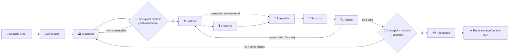

# Guía paso a paso — Fase 4: Checkpoints humanos por terminal (Fábrica de Desarrollo con Agentes IA)

Categoría: Proyectos
Fecha: 6 de agosto de 2026
Etiquetas: Código, Importante, Proyecto
ítem principal: Plan de Implementación — Fábrica de Desarrollo con Agentes IA (local / validación de grafo) (https://app.notion.com/p/Plan-de-Implementaci-n-F-brica-de-Desarrollo-con-Agentes-IA-local-validaci-n-de-grafo-3878229d6b0d48c28e5590c8f65c6c56?pvs=21)

<aside>
🧩

**Qué es este documento.** Guía de ejecución paso a paso, pensada para principiantes, de la **Fase 4 — Checkpoints e intervención humana** del plan [Plan de Implementación — Fábrica de Desarrollo con Agentes IA (local / validación de grafo)](https://app.notion.com/p/Plan-de-Implementaci-n-F-brica-de-Desarrollo-con-Agentes-IA-local-validaci-n-de-grafo-3878229d6b0d48c28e5590c8f65c6c56?pvs=21). Es la continuación directa de [Guía paso a paso — Fase 3: Estrategia de código y RAG (Fábrica de Desarrollo con Agentes IA)](https://app.notion.com/p/Gu-a-paso-a-paso-Fase-3-Estrategia-de-c-digo-y-RAG-F-brica-de-Desarrollo-con-Agentes-IA-8c4518685b1945958a13bb973e63aab6?pvs=21) y asume que su checklist final está completo. Incluye todos los comandos y todo el código, en el orden exacto en que se ejecutan.

</aside>

<aside>
⚠️

**Nota sobre copiar y pegar código.** Sigue vigente la lección de las Fases 0–3: la terminal usada daña la indentación al pegar código de varias líneas en `nano`. Los métodos seguros validados hasta ahora son: (1) pedirle a Notion AI el archivo como **descarga `.txt`** (el método que funcionó para `agentes.py` en la Fase 3), (2) pegar un **heredoc con delimitador citado** (`cat > archivo <<"EOF"` … `EOF`), que pasó las pruebas de la Fase 3 sin dañar nada, o (3) `nano` con verificación posterior con `cat`. El código mostrado en esta guía es la referencia oficial de lo que debe quedar en cada archivo.

</aside>

<aside>
🎓

**Lecciones de la Fase 3 ya incorporadas en esta guía.** (1) Los errores `402` de OpenRouter tenían dos causas: el **límite de gasto configurado en la propia API key** (se corrige en `openrouter.ai/settings/keys`, no recargando saldo) y los **modelos Claude caros** por defecto — los 6 roles ahora corren con DeepSeek vía `MODELO_<ROL>` en `.env`; esas líneas siguen vigentes y no se tocan en esta fase. (2) El backend generado pasaba `build` pero fallaba `test` porque su `package.json` **no traía el bloque de configuración de `jest`** (`rootDir: src` + `ts-jest`); el encargo de esta fase lo exige explícitamente. (3) El `next lint` de la versión actual de Next.js es **incompatible con ESLint 9** (el asistente interactivo además bloquea al sandbox esperando teclado); el lint del frontend queda **fuera del encargo** hasta que se resuelva río arriba — recuerda que un lint fallido es severidad media y nunca bloqueó la publicación.

</aside>

## Qué se construye en esta fase

La Fase 4 del plan (§10 y §12) agrega los **checkpoints humanos por terminal**: el grafo se pausa con las **interrupciones nativas de LangGraph** (`interrupt`), apoyadas en el checkpointer de Postgres que funciona desde la Fase 0, y se reanuda exactamente donde quedó con la respuesta del humano. El `stdin_open: true` y `tty: true` que el compose trae desde la Fase 0 existen exactamente para esto.

Los dos checkpoints mínimos del plan:

1. **Aprobar el plan del Arquitecto** antes de que los programadores gasten créditos escribiendo código. Si lo rechazas, tus comentarios vuelven al Arquitecto y rediseña.
2. **Aprobar el resultado final** (hallazgos + resultados reales del sandbox) antes de publicar la rama. Si lo rechazas, tus comentarios vuelven al Arquitecto y el ciclo completo se repite.



Las novedades conceptuales:

- **`interrupt()` dentro de un nodo dedicado.** Cada checkpoint es un nodo propio (`checkpoint_plan`, `checkpoint_final`) cuya única tarea es armar un resumen legible y pausar el grafo. Cuando el humano responde, LangGraph **re-ejecuta ese nodo desde el inicio** — por eso los nodos checkpoint no hacen llamadas al LLM ni tienen efectos secundarios: solo resumen y preguntan.
- **Reanudación con `Command(resume=...)`.** `main.py` detecta la pausa (la clave `__interrupt__` en el resultado), pregunta por terminal con `input()`, y reanuda el mismo *thread* con la respuesta. El estado completo vive en Postgres entre pausa y reanudación.
- **El rechazo viaja como contexto.** Tus comentarios se guardan en el campo nuevo `comentarios_humanos` del estado y el Arquitecto los recibe junto con su plan anterior para corregirlo, no para empezar de cero.
- **El grafo pasa de 8 a 10 nodos** y de 2 a **4 aristas condicionales**. `graph.py` y `state.py` cambian por primera vez desde la Fase 2.

<aside>
💰

**Costos de esta fase.** El checkpoint del plan está **antes** de la parte cara (programadores archivo por archivo): rechazar un plan malo cuesta solo una llamada más al Arquitecto, mucho más barato que corregir código ya escrito. En cambio, rechazar en el **checkpoint final** repite todo el ciclo de programación — úsalo cuando el resultado realmente no sirva. Con los modelos DeepSeek configurados en la Fase 3, una corrida completa cuesta centavos.

</aside>

## 0. Antes de empezar

- [ ]  Checklist de cierre de la Fase 3 completo (rama `encargo/prueba-003` publicada, backend con `install`/`build`/`test` en OK).
- [ ]  Saldo disponible en OpenRouter y límite de la key holgado (lección de la Fase 3).
- [ ]  Las líneas `MODELO_<ROL>=deepseek/...` siguen en `.env` (verifica con `grep MODELO_ .env` — deben ser 6).

Estructura de archivos al terminar esta fase (lo que cambia está marcado):

```jsx
fabrica-desarrollo-ia/
├── docker-compose.yml          (sin cambios — stdin_open/tty listos desde la Fase 0)
├── .env                        (sin cambios)
├── orquestador/
│   ├── Dockerfile              (sin cambios)
│   ├── requirements.txt        (sin cambios, salvo que el paso 2 falle)
│   └── src/
│       ├── state.py            ← se actualiza (campo comentarios_humanos)
│       ├── models.py           (sin cambios)
│       ├── rag.py              (sin cambios)
│       ├── cargar_rag.py       (sin cambios)
│       ├── agentes.py          ← se actualiza (2 nodos checkpoint + 2 aristas + Arquitecto)
│       ├── graph.py            ← se reemplaza (checkpoints en el grafo)
│       ├── main.py             ← se reemplaza (bucle de interrupciones por terminal)
│       └── encargos/
│           ├── prueba-003.md
│           └── prueba-004.md   ← NUEVO
└── sandbox/                    (sin cambios)
```

## 1. Crear el repositorio de prueba en GitHub

Igual que en las fases anteriores: el repo destino debe existir antes (siempre llega indicado en el encargo, nunca se infiere).

1. Entra a la organización **ADN Fábrica Lab** en GitHub y haz clic en **New repository**.
2. Configúralo así:
    - **Owner**: `adn-fabrica-lab`
    - **Name**: `fabrica-prueba-004`
    - Visibilidad: **Private** está bien.
    - ✅ Marca **Add a README file** (crea la rama `main`, sin la cual el clone inicial falla).
3. Clic en **Create repository**.

## 2. Verificar que LangGraph soporta interrupciones dinámicas

Antes de tocar código, confirma que la versión instalada de LangGraph trae `interrupt` y `Command`:

```bash
cd ~/Documentos/fabrica-desarrollo-ia
docker compose exec orquestador python -c "from langgraph.types import interrupt, Command; print('interrupt OK')"
```

Debe imprimir `interrupt OK`. Si sale un `ImportError`, la versión de LangGraph es demasiado vieja: edita `orquestador/requirements.txt` para exigir una versión reciente en la línea de langgraph (por ejemplo `langgraph>=0.4`), y reconstruye:

```bash
docker compose build orquestador && docker compose up -d orquestador
```

Luego repite la verificación.

## 3. Actualizar `state.py`

Un solo campo nuevo: los comentarios que escribe el humano al rechazar. Reemplaza el contenido de `orquestador/src/state.py`:

```python
# orquestador/src/state.py
from typing import TypedDict

class EstadoFabricaDesarrollo(TypedDict):
    encargo_id: str
    encargo: dict
    plan_tecnico: dict
    plan_aprobado: bool
    archivos_backend: list[dict]
    archivos_frontend: list[dict]
    hallazgos_revision: list[dict]
    hallazgos_integracion: list[dict]
    resultado_sandbox: dict
    rama_git: str
    aprobacion_final: bool
    ciclo: int
    trazas: list[str]
    comentarios_humanos: str  # NUEVO Fase 4: comentarios del humano al rechazar
```

## 4. Actualizar `agentes.py`

Esta vez **no se reemplaza el archivo completo**: son tres cambios acotados sobre el `agentes.py` de la Fase 3. Si prefieres no editar a mano, pide a Notion AI el archivo completo ya actualizado como descarga.

### 4a. Agregar el import de `interrupt`

Al inicio del archivo, junto a los demás imports, agrega:

```python
from langgraph.types import interrupt
```

### 4b. Reemplazar la función `nodo_arquitecto`

El Arquitecto ahora recibe los comentarios del humano y su plan anterior cuando algo fue rechazado, y **ya no aprueba su propio plan** (eso ahora lo decide el humano). Reemplaza la función completa por esta:

```python
def nodo_arquitecto(estado: EstadoFabricaDesarrollo) -> dict:
    print("2. Arquitecto: disenando el plan tecnico (backend + frontend)...")
    consulta = (
        (estado["encargo"].get("titulo") or "")
        + " "
        + (estado["encargo"].get("descripcion") or "")
    )
    contexto = {
        "encargo": estado["encargo"],
        "documentacion": consultar_rag(consulta, "ambas", limite=2),
        # NUEVO Fase 4: si un humano rechazo el plan o el resultado final,
        # sus comentarios y el plan anterior viajan como contexto.
        "comentarios_de_revision_humana": estado.get("comentarios_humanos") or "",
        "plan_anterior": estado.get("plan_tecnico") or {},
    }
    plan = _pedir_json(
        "arquitecto",
        "Eres el Arquitecto de Software de una fabrica de desarrollo. "
        "El proyecto tiene un backend NestJS (TypeScript) en la carpeta "
        "backend/ y un frontend Next.js (TypeScript, App Router) en la "
        "carpeta frontend/. A partir del encargo, produce un plan tecnico "
        "JSON con esta forma exacta: "
        '{"resumen": "...", '
        '"contrato_api": [{"metodo": "GET", "ruta": "/...", '
        '"respuesta_ejemplo": {}}], '
        '"archivos_backend": [{"ruta": "backend/...", "accion": "crear", '
        '"descripcion": "..."}], '
        '"archivos_frontend": [{"ruta": "frontend/...", "accion": "crear", '
        '"descripcion": "..."}]}. '
        "El contrato_api es la unica fuente de verdad de los endpoints: "
        "backend y frontend deben implementarlo tal cual. Incluye TODOS los "
        "archivos necesarios para que cada proyecto sea completo e instalable "
        "(package.json con script build, tsconfig.json, src/..., app/...). "
        "Si los criterios piden pruebas unitarias, incluye los archivos "
        ".spec.ts correspondientes en archivos_backend. Escribe cada "
        "descripcion de archivo de forma especifica y completa: sera la "
        "unica guia que tendra el programador al escribir ese archivo. "
        "documentacion trae fragmentos de la documentacion oficial: apoyate "
        "en ella. Manten el plan lo mas pequeno posible cumpliendo el "
        "encargo. Si comentarios_de_revision_humana no esta vacio, un "
        "humano rechazo la propuesta anterior (plan_anterior): produce un "
        "plan corregido que atienda esos comentarios al pie de la letra.",
        json.dumps(contexto, ensure_ascii=False),
    )
    # Fase 4: la aprobacion ya no es automatica; la decide el humano en el
    # nodo checkpoint_plan.
    return {"plan_tecnico": plan}
```

### 4c. Agregar los nodos checkpoint al final del archivo

Agrega este bloque completo **al final** de `agentes.py`:

```python
# --- NUEVO Fase 4: checkpoints humanos por terminal (S10 del plan) ---
# Nota importante: cuando el humano responde, LangGraph RE-EJECUTA el nodo
# que contiene interrupt() desde su inicio. Por eso estos nodos solo arman
# un resumen y preguntan: sin llamadas al LLM ni efectos secundarios.

def _resumen_plan_para_humano(estado: EstadoFabricaDesarrollo) -> str:
    plan = estado["plan_tecnico"]
    lineas = ["Resumen: " + str(plan.get("resumen", ""))]
    lineas.append("Contrato API:")
    for e in plan.get("contrato_api") or []:
        lineas.append("  - " + str(e.get("metodo")) + " " + str(e.get("ruta")))
    lineas.append("Archivos backend:")
    for a in plan.get("archivos_backend") or []:
        lineas.append("  - " + str(a.get("ruta")))
    lineas.append("Archivos frontend:")
    for a in plan.get("archivos_frontend") or []:
        lineas.append("  - " + str(a.get("ruta")))
    return "\n".join(lineas)

def nodo_checkpoint_plan(estado: EstadoFabricaDesarrollo) -> dict:
    respuesta = interrupt({
        "titulo": "Aprobar el plan del Arquitecto",
        "detalle": _resumen_plan_para_humano(estado),
    })
    aprobado = bool(respuesta.get("aprobado"))
    return {
        "plan_aprobado": aprobado,
        "comentarios_humanos": respuesta.get("comentarios") or "",
    }

def decidir_despues_de_checkpoint_plan(estado: EstadoFabricaDesarrollo) -> str:
    if estado.get("plan_aprobado"):
        print("   Plan aprobado por el humano. A programar.")
        return "backend"
    print("   Plan rechazado. Vuelve al Arquitecto con tus comentarios.")
    return "arquitecto"

def _resumen_final_para_humano(estado: EstadoFabricaDesarrollo) -> str:
    lineas = ["Ciclos usados: " + str(estado.get("ciclo"))]
    hallazgos = estado.get("hallazgos_revision") or []
    lineas.append("Hallazgos pendientes: " + str(len(hallazgos)))
    for h in hallazgos:
        lineas.append(
            "  - [" + str(h.get("severidad")) + "] " + str(h.get("area"))
            + " " + str(h.get("ruta") or "") + ": " + str(h.get("detalle"))[:200]
        )
    for area, pasos in (estado.get("resultado_sandbox") or {}).items():
        for paso, res in pasos.items():
            lineas.append(
                "Sandbox " + area + " " + paso + ": "
                + ("OK" if res.get("ok") else "FALLO")
            )
    return "\n".join(lineas)

def nodo_checkpoint_final(estado: EstadoFabricaDesarrollo) -> dict:
    respuesta = interrupt({
        "titulo": "Aprobar el resultado antes de publicar la rama",
        "detalle": _resumen_final_para_humano(estado),
    })
    aprobado = bool(respuesta.get("aprobado"))
    if aprobado:
        return {"aprobacion_final": True, "comentarios_humanos": ""}
    # Rechazo: los comentarios van al Arquitecto; se limpian los hallazgos
    # viejos (ya no describen el proximo intento) y el contador de ciclos
    # vuelve a cero para que el nuevo intento tenga su presupuesto completo
    # de correcciones.
    return {
        "aprobacion_final": False,
        "comentarios_humanos": respuesta.get("comentarios") or "",
        "hallazgos_revision": [],
        "ciclo": 0,
    }

def decidir_despues_de_checkpoint_final(estado: EstadoFabricaDesarrollo) -> str:
    if estado.get("aprobacion_final"):
        print("   Resultado aprobado por el humano. Publicando.")
        return "repositorio"
    print("   Resultado rechazado. Vuelve al Arquitecto con tus comentarios.")
    return "arquitecto"
```

## 5. Reemplazar `graph.py`

Primera modificación de este archivo desde la Fase 2. Reemplaza todo el contenido de `orquestador/src/graph.py`:

```python
# orquestador/src/graph.py
import os

from langgraph.graph import StateGraph, END

from state import EstadoFabricaDesarrollo
from agentes import (
    nodo_coordinador,
    nodo_arquitecto,
    nodo_checkpoint_plan,
    nodo_programador_backend,
    nodo_programador_frontend,
    nodo_integrador,
    nodo_sandbox,
    nodo_revisor,
    nodo_checkpoint_final,
    nodo_repositorio,
    decidir_despues_de_checkpoint_plan,
    decidir_despues_de_backend,
    decidir_despues_de_revision,
    decidir_despues_de_checkpoint_final,
)

def obtener_db_uri():
    pg_user = os.environ["POSTGRES_USER"]
    pg_password = os.environ["POSTGRES_PASSWORD"]
    pg_host = os.environ["POSTGRES_HOST"]
    pg_port = os.environ["POSTGRES_PORT"]
    pg_db = os.environ["POSTGRES_DB"]
    return f"postgresql://{pg_user}:{pg_password}@{pg_host}:{pg_port}/{pg_db}"

def construir_grafo(checkpointer):
    # checkpointer debe venir ya abierto (ver main.py): su conexion a Postgres
    # debe seguir viva mientras el grafo se ejecuta. En esta fase tambien
    # sostiene las pausas de los checkpoints humanos.
    builder = StateGraph(EstadoFabricaDesarrollo)

    builder.add_node("coordinador", nodo_coordinador)
    builder.add_node("arquitecto", nodo_arquitecto)
    builder.add_node("checkpoint_plan", nodo_checkpoint_plan)
    builder.add_node("backend", nodo_programador_backend)
    builder.add_node("frontend", nodo_programador_frontend)
    builder.add_node("integrador", nodo_integrador)
    builder.add_node("sandbox", nodo_sandbox)
    builder.add_node("revisor", nodo_revisor)
    builder.add_node("checkpoint_final", nodo_checkpoint_final)
    builder.add_node("repositorio", nodo_repositorio)

    builder.set_entry_point("coordinador")
    builder.add_edge("coordinador", "arquitecto")
    builder.add_edge("arquitecto", "checkpoint_plan")
    builder.add_conditional_edges(
        "checkpoint_plan",
        decidir_despues_de_checkpoint_plan,
        {"backend": "backend", "arquitecto": "arquitecto"},
    )
    builder.add_conditional_edges(
        "backend",
        decidir_despues_de_backend,
        {"frontend": "frontend", "integrador": "integrador"},
    )
    builder.add_edge("frontend", "integrador")
    builder.add_edge("integrador", "sandbox")
    builder.add_edge("sandbox", "revisor")
    builder.add_conditional_edges(
        "revisor",
        decidir_despues_de_revision,
        {
            "backend": "backend",
            "frontend": "frontend",
            # Fase 4: cuando el Revisor da el visto bueno (o se agota el
            # tope de ciclos), ya no se publica directo: primero pasa por
            # el checkpoint humano final.
            "repositorio": "checkpoint_final",
        },
    )
    builder.add_conditional_edges(
        "checkpoint_final",
        decidir_despues_de_checkpoint_final,
        {"repositorio": "repositorio", "arquitecto": "arquitecto"},
    )
    builder.add_edge("repositorio", END)

    return builder.compile(checkpointer=checkpointer)
```

Fíjate que `decidir_despues_de_revision` **no cambió**: sigue devolviendo `"repositorio"`, pero el mapa de la arista condicional ahora dirige ese valor al nodo `checkpoint_final`. El grafo queda con **10 nodos y 4 aristas condicionales**.

## 6. Reemplazar `main.py`

Reemplaza todo el contenido de `orquestador/src/main.py`:

```python
# orquestador/src/main.py
import sys
from datetime import datetime

from dotenv import load_dotenv
from langgraph.checkpoint.postgres import PostgresSaver
from langgraph.types import Command

from graph import construir_grafo, obtener_db_uri

load_dotenv()

def preguntar_al_humano(peticion: dict) -> dict:
    print()
    print("=" * 60)
    print("CHECKPOINT HUMANO: " + peticion.get("titulo", ""))
    print("=" * 60)
    print(peticion.get("detalle", ""))
    print()
    respuesta = ""
    while respuesta not in ("s", "n"):
        respuesta = input("Apruebas? (s/n): ").strip().lower()
    if respuesta == "s":
        return {"aprobado": True, "comentarios": ""}
    comentarios = input("Comentarios para la correccion: ").strip()
    return {"aprobado": False, "comentarios": comentarios}

if __name__ == "__main__":
    ruta_encargo = sys.argv[1] if len(sys.argv) > 1 else "src/encargos/prueba-004.md"
    with open(ruta_encargo, "r", encoding="utf-8") as f:
        texto = f.read()

    # Un thread_id nuevo por corrida: si se reutiliza uno viejo, LangGraph
    # reanuda desde el checkpoint anterior en vez de empezar de cero.
    thread_id = "fase4-" + datetime.now().strftime("%Y%m%d-%H%M%S")
    print("Thread:", thread_id)

    db_uri = obtener_db_uri()

    # El "with" mantiene la conexion a Postgres abierta durante toda la
    # ejecucion del grafo, incluidas las pausas de los checkpoints.
    with PostgresSaver.from_conn_string(db_uri) as checkpointer:
        checkpointer.setup()
        grafo = construir_grafo(checkpointer)
        config = {
            "configurable": {"thread_id": thread_id},
            "recursion_limit": 60,
        }
        resultado = grafo.invoke(
            {"encargo": {"texto_original": texto}, "ciclo": 0},
            config=config,
        )
        # Mientras el grafo este pausado en un checkpoint humano, preguntar
        # por terminal y reanudar el mismo thread exactamente donde quedo.
        while resultado.get("__interrupt__"):
            peticion = resultado["__interrupt__"][0].value
            datos = preguntar_al_humano(peticion)
            resultado = grafo.invoke(Command(resume=datos), config=config)

    print()
    print("=== Resultado final ===")
    print("Encargo:           ", resultado.get("encargo_id"))
    print("Rama publicada:    ", resultado.get("rama_git"))
    print("Ciclos usados:     ", resultado.get("ciclo"))
    print("Hallazgos finales: ", len(resultado.get("hallazgos_revision") or []))
    for area, pasos in (resultado.get("resultado_sandbox") or {}).items():
        for paso, res in pasos.items():
            print("Sandbox " + area + " " + paso + ":", "OK" if res.get("ok") else "FALLO")
```

Cambios respecto a la Fase 3: el encargo por defecto es `prueba-004.md`, el prefijo del `thread_id` es `fase4-`, se importa `Command`, aparece `preguntar_al_humano` (la interfaz de terminal de los checkpoints), el `recursion_limit` sube a 60 (cada rechazo agrega vueltas al grafo), y el bucle `while` que detecta `__interrupt__` es el corazón nuevo: sin él, el programa terminaría silenciosamente en la primera pausa.

## 7. Crear el encargo de prueba

El encargo es deliberadamente **pequeño** (lo que se valida aquí son los checkpoints, no la complejidad del código) e incorpora las lecciones de la Fase 3 como criterios explícitos. Crea `orquestador/src/encargos/prueba-004.md` (texto plano, `nano` es seguro aquí):

```markdown
# Encargo prueba-004

- encargo_id: prueba-004
- repositorio: fabrica-prueba-004

## Descripcion

Construir una mini aplicacion de "notas rapidas" con dos partes:

1. Backend NestJS (carpeta backend/) con un modulo de notas:
   - GET /notas: lista las notas (almacenadas en memoria, sin base de datos).
   - POST /notas: crea una nota con {"texto": "..."}; responde la nota
     creada {"id": 1, "texto": "..."}.
   - DELETE /notas/:id: elimina la nota.
2. Frontend Next.js (carpeta frontend/) con una unica pagina que lista,
   crea y elimina notas.

## Criterios de aceptacion

- El backend es NestJS con TypeScript, corre en el puerto 3001 y habilita
  CORS.
- La logica de notas vive en un servicio separado del controlador.
- El servicio de notas tiene pruebas unitarias con Jest (archivo .spec.ts)
  que cubren crear, listar y eliminar; "npm test" pasa sin fallos.
- El package.json del backend define la configuracion de jest con
  "rootDir": "src" y transformacion con ts-jest (sin ese bloque, jest no
  entiende TypeScript y las pruebas fallan).
- El frontend es Next.js (App Router) con TypeScript y usa la variable de
  entorno NEXT_PUBLIC_API_URL (con default http://localhost:3001).
- backend/ y frontend/ son proyectos npm independientes: cada uno tiene su
  package.json con script "build" y compila sin errores.
- El frontend NO define script "lint" (el lint queda fuera de este encargo).
- Usar solo versiones de dependencias publicadas y estables en package.json.
- No se necesita base de datos ni autenticacion.
```

Las dos novedades respecto a `prueba-003` salen directo de las lecciones de la Fase 3: el bloque de **configuración de jest en el `package.json`** ahora es un criterio del encargo (fue el arreglo manual del cierre de la fase anterior), y el **lint queda explícitamente fuera** mientras `next lint` sea incompatible con ESLint 9.

## 8. Verificación rápida antes de gastar créditos

Como `orquestador/src` está montado como volumen, no hay que reconstruir nada. Valida sintaxis e imports:

```bash
docker compose exec orquestador sh -lc "cd src && python -c 'import agentes, graph, rag' && echo 'Sintaxis OK'"
```

Debe imprimir `Sintaxis OK`. Si sale `SyntaxError`, `IndentationError` o `ImportError`, revisa el archivo señalado (o pide a Notion AI el archivo corregido como descarga).

## 9. Ejecutar el encargo con checkpoints (aprobando todo)

El momento de la verdad de la Fase 4. **Importante:** corre el comando en una terminal interactiva normal (sin `-T`, sin redirigir la entrada), porque el grafo va a pedirte respuestas por teclado:

```bash
docker compose exec orquestador python src/main.py
```

Deberías ver algo como esto (primera pausa):

```jsx
Thread: fase4-20260806-170000
1. Coordinador: interpretando el encargo...
2. Arquitecto: disenando el plan tecnico (backend + frontend)...

============================================================
CHECKPOINT HUMANO: Aprobar el plan del Arquitecto
============================================================
Resumen: Mini aplicacion de notas rapidas con backend NestJS y frontend Next.js
Contrato API:
  - GET /notas
  - POST /notas
  - DELETE /notas/:id
Archivos backend:
  - backend/package.json
  - backend/tsconfig.json
  - backend/src/main.ts
  - ...
Archivos frontend:
  - frontend/package.json
  - ...

Apruebas? (s/n):
```

Revisa el contrato y la lista de archivos. Si el plan se ve bien, responde `s`: el grafo se reanuda solo y sigue con los programadores, el Integrador, el sandbox y el Revisor, exactamente como en la Fase 3. Cuando el Revisor termina, llega la segunda pausa:

```jsx
============================================================
CHECKPOINT HUMANO: Aprobar el resultado antes de publicar la rama
============================================================
Ciclos usados: 1
Hallazgos pendientes: 0
Sandbox backend install: OK
Sandbox backend build: OK
Sandbox backend test: OK
Sandbox frontend install: OK
Sandbox frontend build: OK

Apruebas? (s/n):
```

Responde `s` y el Agente de Repositorio publica la rama:

```jsx
8. Agente de Repositorio: publicando el codigo en una rama...
   Rama publicada: encargo/prueba-004

=== Resultado final ===
Encargo:            prueba-004
Rama publicada:     encargo/prueba-004
Ciclos usados:      1
Hallazgos finales:  0
Sandbox backend install: OK
Sandbox backend build: OK
Sandbox backend test: OK
Sandbox frontend install: OK
Sandbox frontend build: OK
```

Mientras el grafo está pausado no se gasta ni un crédito: el estado completo espera en Postgres. Puedes tomarte el tiempo que quieras para responder.

## 10. Probar el ciclo de rechazo (la otra mitad de la fase)

La fase no queda validada hasta comprobar que el **rechazo** también funciona. Corre otra vez el encargo y esta vez **rechaza el plan** con un comentario concreto:

```jsx
Apruebas? (s/n): n
Comentarios para la correccion: Agrega tambien un endpoint GET /notas/resumen que responda {"total": n}
```

Deberías ver:

```jsx
   Plan rechazado. Vuelve al Arquitecto con tus comentarios.
2. Arquitecto: disenando el plan tecnico (backend + frontend)...

============================================================
CHECKPOINT HUMANO: Aprobar el plan del Arquitecto
============================================================
...
Contrato API:
  - GET /notas
  - POST /notas
  - DELETE /notas/:id
  - GET /notas/resumen
...
```

El plan nuevo debe incorporar tu comentario (en el ejemplo: el endpoint extra en el contrato). Apruébalo y deja correr el resto. Con esto quedan probados los dos sentidos del checkpoint: aprobar → avanza, rechazar → corrige con tus comentarios.

No hace falta probar también el rechazo del checkpoint final en esta corrida (repite todo el ciclo de programación y gasta créditos) — pero si quieres verlo, el flujo es idéntico: tus comentarios vuelven al Arquitecto, el contador de ciclos se reinicia, y el grafo recorre todo de nuevo antes de volver a preguntarte.

## 11. Problemas comunes

| Síntoma | Causa probable | Solución |
| --- | --- | --- |
| `ImportError: cannot import name 'interrupt'` | Versión vieja de LangGraph | Paso 2: exigir versión reciente en `requirements.txt` y reconstruir el orquestador |
| `EOFError` en `input()` o la pregunta nunca aparece | La terminal no es interactiva (se usó `-T`, un pipe, o un runner sin TTY) | Corre `docker compose exec orquestador python src/main.py` directo en una terminal normal; `stdin_open`/`tty` ya están en el compose desde la Fase 0 |
| El programa termina silencioso después del Arquitecto, sin preguntar nada | Falta el bucle `while resultado.get("__interrupt__")` en `main.py` (quedó la versión de la Fase 3) | Verifica que `main.py` sea el del paso 6 |
| La cabecera del checkpoint se imprime dos veces | LangGraph re-ejecuta el nodo `interrupt()` desde el inicio al reanudar — por diseño | Normal e inofensivo mientras los nodos checkpoint no tengan efectos secundarios (por eso no llaman al LLM) |
| Rechacé el plan y el nuevo es casi idéntico | Comentario demasiado vago ("no me gusta") | Escribe comentarios concretos y accionables: qué endpoint falta, qué archivo sobra, qué criterio no se cumple |
| Cerré la terminal con el grafo pausado | El thread queda pausado en Postgres | No se pierde nada, pero `main.py` siempre arranca un thread nuevo: la corrida vieja queda huérfana. Retomar threads pausados por id queda para la Fase 5 / versión productiva |
| `GraphRecursionError` | Muchos rechazos encadenados en la misma corrida agotaron el `recursion_limit` | Sube `recursion_limit` en `main.py` (p. ej. a 80) o aprueba/ajusta el encargo en vez de rechazar en bucle |
| Error `402` de OpenRouter | Saldo o límite de la key agotado (lección de la Fase 3) | Revisa `openrouter.ai/settings/credits` **y** el límite de la key en `openrouter.ai/settings/keys` |
| `git push` falla porque la rama ya existe | Se re-corrió un encargo cuya rama ya fue publicada | Usa un encargo nuevo, o borra la rama remota en GitHub antes de re-correr |
| `backend test: FALLO` con `Missing semicolon` en un `.spec.ts` | El `package.json` generado no trae el bloque de configuración de jest (lección de la Fase 3) | El criterio del encargo debería prevenirlo; si pasa, rechaza en el checkpoint final con ese comentario, o aplica a mano el bloque `jest` documentado en el cierre de la Fase 3 |
| `ValueError: El modelo no devolvio JSON` y el proceso muere con traceback durante el Revisor | El LLM devolvió una respuesta vacía o no-JSON (falla transitoria del proveedor); `main.py` no captura la excepción | No hay forma de retomar el thread (cada corrida crea uno nuevo): hay que re-ejecutar `main.py` desde cero. Si se repite seguido, revisa rate limiting en el dashboard de OpenRouter |
| `backend install: FALLO` en el sandbox de forma persistente, pero `npm install` funciona sin problemas al clonar la rama en tu máquina | Caché de `node_modules` corrupta en el volumen del sandbox, acumulada al reescribir `package.json` muchas veces para el mismo `encargo_id` a lo largo de varios rechazos | Limpia el volumen de ese encargo y reintenta: `docker compose exec sandbox rm -rf /workspace/<encargo_id>` (mismo remedio que la Fase 2 documentó para "caché corrupta", aplicado aquí a un `install`, no solo a un `build`) |
| `next build` falla con `page.tsx doesn't have a root layout` | El Programador Frontend incluyó `app/layout.tsx` en su lista de archivos "escritos" pero nunca generó el archivo de verdad | Verifica con `ls -la app/` (o la carpeta que corresponda) que todos los archivos del plan existen realmente antes de confiar en el log de "Escribiendo …"; si falta alguno, créalo a mano con el contenido mínimo que exige el framework |
| El checkpoint final reporta un hallazgo que no existe en el código real (p. ej. dice que falta usar `NEXT_PUBLIC_API_URL` cuando el archivo ya lo usa correctamente) | Alucinación del Revisor al resumir el diagnóstico, o el hallazgo corresponde a una versión anterior del archivo de un ciclo previo | Antes de rechazar (o de dar por bueno) un hallazgo del checkpoint final, verifica el archivo real clonando la rama publicada — no confíes ciegamente en el resumen del Revisor |

<aside>
🎓

Lección operativa de esta corrida (paso 9, prueba-004). Cuando el sandbox automatizado y tu entorno local no coinciden — o cuando el Revisor reporta algo raro — clonar la rama publicada y verificar a mano (`npm install`/`build`/`test` reales, `ls -la` de los archivos declarados) es más rápido y confiable que seguir iterando a ciegas con más rechazos por terminal. El pipeline automático es excelente para el primer 80%; el último tramo a veces conviene cerrarlo a mano.

</aside>

## 12. Checklist de cierre de la Fase 4

- [x]  Repo `fabrica-prueba-004` creado en `adn-fabrica-lab` con README
- [x]  `from langgraph.types import interrupt, Command` pasa en el orquestador
- [x]  `state.py`, `agentes.py`, `graph.py` y `main.py` actualizados; `import agentes, graph, rag` pasa
- [x]  `encargos/prueba-004.md` creado
- [x]  El grafo se pausa en el checkpoint del plan y muestra contrato + archivos
- [x]  Prueba de rechazo: plan rechazado con comentarios → el Arquitecto rediseña incorporándolos → nuevo checkpoint
- [x]  El checkpoint final muestra hallazgos y resultados reales del sandbox antes de publicar
- [x]  Con la aprobación final, la rama `encargo/prueba-004` queda publicada en GitHub
- [x]  El resultado final muestra `install`/`build`/`test` OK para backend e `install`/`build` OK para frontend (el sandbox automatizado reportó `install: FALLO` por la caché corrupta documentada en §11; se verificó `install`/`build`/`test` reales clonando la rama en local)

<aside>
✅

Fase 4 completa (validada el 8 de agosto de 2026, encargo prueba-004): tu fábrica ya no decide sola — pide tu aprobación en los dos puntos que importan (antes de gastar créditos programando y antes de publicar), y tus rechazos se convierten en instrucciones concretas para el Arquitecto. Esto completa el flujo del §4 del plan.

</aside>

## 13. Lo que viene en la Fase 5

La última fase del piloto es la **validación del grafo**: correr 2–3 encargos representativos (uno pequeño, uno con back+front, uno de varios archivos — los `prueba-002`, `prueba-003` y `prueba-004` ya cuentan como base), registrar qué funcionó, qué agente sobra o falta y dónde se traba el flujo, y **documentar el grafo final afinado con sus aprendizajes** como insumo directo para la versión de producción (§12, Fase 5 del plan). Cuando termines esta fase, pídele a Notion AI la guía de la Fase 5.