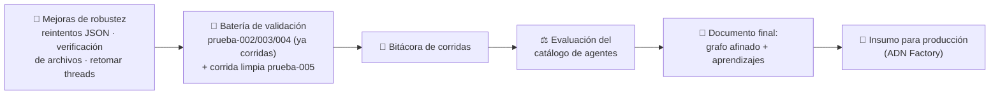

# Guía paso a paso — Fase 5: Validación del grafo (Fábrica de Desarrollo con Agentes IA)

Categoría: Proyectos
Fecha: 8 de agosto de 2026
Etiquetas: Código, Importante, Proyecto
ítem principal: Plan de Implementación — Fábrica de Desarrollo con Agentes IA (local / validación de grafo) (https://app.notion.com/p/Plan-de-Implementaci-n-F-brica-de-Desarrollo-con-Agentes-IA-local-validaci-n-de-grafo-3878229d6b0d48c28e5590c8f65c6c56?pvs=21)

<aside>
🧩

**Qué es este documento.** Guía de ejecución paso a paso, pensada para principiantes, de la **Fase 5 — Validación del grafo** del plan [Plan de Implementación — Fábrica de Desarrollo con Agentes IA (local / validación de grafo)](https://app.notion.com/p/Plan-de-Implementaci-n-F-brica-de-Desarrollo-con-Agentes-IA-local-validaci-n-de-grafo-3878229d6b0d48c28e5590c8f65c6c56?pvs=21). Es la continuación directa de [Guía paso a paso — Fase 4: Checkpoints humanos por terminal (Fábrica de Desarrollo con Agentes IA)](https://app.notion.com/p/Gu-a-paso-a-paso-Fase-4-Checkpoints-humanos-por-terminal-F-brica-de-Desarrollo-con-Agentes-IA-ac836cf2674441519c216f28ab44931d?pvs=21) y asume que su checklist final está completo. Es la **última fase del piloto**: aquí casi no se agregan piezas nuevas al grafo — se blinda lo que ya existe con tres mejoras de robustez nacidas de fallos reales, se corre una **batería de encargos representativos**, y se produce el entregable de valor de todo el piloto: el **documento del grafo final afinado**, insumo directo para la versión de producción.

</aside>

<aside>
⚠️

**Nota sobre copiar y pegar código.** Sigue vigente la lección de las Fases 0–4: la terminal usada daña la indentación al pegar código de varias líneas en `nano`. Los métodos seguros validados hasta ahora son: (1) pedirle a Notion AI el archivo como **descarga `.txt`**, (2) pegar un **heredoc con delimitador citado** (`cat > archivo <<"EOF"` … `EOF`), o (3) `nano` con verificación posterior con `cat`. El código mostrado en esta guía es la referencia oficial de lo que debe quedar en cada archivo.

</aside>

<aside>
🎓

**Lecciones de la Fase 4 ya incorporadas en esta guía.** (1) El **Revisor puede alucinar**: en `prueba-004` reportó un hallazgo inexistente (dijo que faltaba `NEXT_PUBLIC_API_URL` cuando el código ya lo usaba) y a la vez **no detectó el defecto real** (el Programador Frontend declaró `app/layout.tsx` como escrito pero nunca lo generó, y la rama publicada no compilaba) — por eso el paso 2 agrega una **verificación de archivos contra el disco** al checkpoint final: hechos, no opiniones del LLM. (2) La **caché persistente del sandbox se corrompe** tras muchas reescrituras de `package.json` sobre el mismo `encargo_id` y produce falsos `FALLO` de `install` — por eso la corrida limpia del paso 9 empieza limpiando el workspace del encargo. (3) Un `ValueError: El modelo no devolvio JSON` transitorio **mataba la corrida completa** sin forma de retomarla — por eso el paso 1 agrega reintentos y el paso 3 permite **retomar threads pausados por id** (la deuda que la Fase 4 dejó explícitamente para esta fase).

</aside>

## Qué se construye en esta fase

La Fase 5 del plan (§12) cierra el piloto validando el grafo con casos reales y documentando el resultado. El plan lo define en dos actividades: (1) correr **2–3 encargos representativos** — uno pequeño, uno con back+front, uno de varios archivos; `prueba-002`, `prueba-003` y `prueba-004` **ya cuentan como base** — registrando qué funcionó, qué agente sobra o falta y dónde se traba el flujo; y (2) **documentar el grafo final afinado** con sus aprendizajes como insumo directo para producción.



Las novedades conceptuales:

- **Primero blindar, después medir.** Validar el grafo con herramientas que sabemos defectuosas (crashes por JSON, resúmenes de checkpoint no confiables) contaminaría los resultados: no sabríamos si una corrida falló por el diseño del grafo o por un bug de infraestructura. Por eso las tres mejoras van **antes** de la batería.
- **Hechos vs. opiniones en los checkpoints.** El resumen del checkpoint final ahora separa dos tipos de información: los `resultado_sandbox` y la verificación de archivos son **hechos** (comandos reales, disco real); los `hallazgos_revision` son **opiniones de un LLM** que pueden ser falsas en ambas direcciones. El humano decide sabiendo cuál es cuál.
- **La bitácora es el instrumento de medición.** Cada corrida deja un registro con el mismo formato; el documento final se escribe a partir de la bitácora, no de memoria.

<aside>
💰

**Costos de esta fase.** Es la fase más barata en LLM si aprovechas lo ya corrido: `prueba-002`, `prueba-003` y `prueba-004` ya cuentan como parte de la batería (el plan lo dice explícitamente), así que solo la **corrida limpia de `prueba-005`** gasta créditos nuevos. Con los modelos DeepSeek configurados desde la Fase 3, una corrida completa cuesta centavos. El resto de la fase es observación y escritura.

</aside>

## 0. Antes de empezar

- [ ]  Checklist de cierre de la Fase 4 completo (rama `encargo/prueba-004` publicada y verificada en local).
- [ ]  Saldo disponible en OpenRouter y límite de la key holgado.
- [ ]  Las líneas `MODELO_<ROL>=deepseek/...` siguen en `.env` (verifica con `grep MODELO_ .env` — deben ser 6).
- [ ]  Tienes a mano la tabla de **Problemas comunes** de la Fase 4 (§11 de esa guía): consolidarla es parte del entregable final.

Estructura de archivos al terminar esta fase (lo que cambia está marcado):

```jsx
fabrica-desarrollo-ia/
├── docker-compose.yml          (sin cambios)
├── .env                        (sin cambios)
├── orquestador/
│   ├── Dockerfile              (sin cambios)
│   ├── requirements.txt        (sin cambios)
│   └── src/
│       ├── state.py            (sin cambios)
│       ├── models.py           (sin cambios)
│       ├── rag.py              (sin cambios)
│       ├── cargar_rag.py       (sin cambios)
│       ├── agentes.py          ← se actualiza (reintentos JSON + verificación de archivos)
│       ├── graph.py            (sin cambios)
│       ├── main.py             ← se reemplaza (retomar threads pausados con --thread)
│       └── encargos/
│           ├── prueba-004.md
│           └── prueba-005.md   ← NUEVO
└── sandbox/                    (sin cambios)
```

## 1. Mejora 1 — Reintentos cuando el modelo no devuelve JSON

En la Fase 4, una respuesta vacía del modelo del Revisor mató la corrida entera con `ValueError: El modelo no devolvio JSON`. El arreglo es un patrón clásico: **reintentar** las fallas transitorias antes de rendirse. Son dos cambios pequeños en `orquestador/src/agentes.py`:

### 1a. Renombrar la función actual

Busca la línea donde se define `_pedir_json` y cámbiale **solo el nombre**:

```python
# ANTES:
def _pedir_json(
# DESPUÉS:
def _pedir_json_una_vez(
```

No toques nada más de esa función: su cuerpo (la llamada al modelo, `_limpiar_json`, el `json.loads`) queda idéntico.

### 1b. Agregar la nueva `_pedir_json` con reintentos

Justo **debajo** de la función recién renombrada, agrega:

```python
def _pedir_json(rol, instruccion, contexto):
    # NUEVO Fase 5: tolera respuestas no-JSON transitorias del proveedor.
    # Toda llamada existente a _pedir_json pasa ahora por aqui sin cambios
    # en los llamadores.
    intentos = 3
    ultimo_error = None
    for intento in range(1, intentos + 1):
        try:
            return _pedir_json_una_vez(rol, instruccion, contexto)
        except ValueError as e:
            ultimo_error = e
            print(
                "   Aviso: respuesta no-JSON del modelo de " + rol
                + " (intento " + str(intento) + " de " + str(intentos)
                + "). Reintentando..."
            )
    raise ultimo_error
```

La gracia de este diseño: **ningún llamador cambia** — todos los nodos que ya llaman `_pedir_json("arquitecto", ...)`, `_pedir_json("revisor", ...)`, etc. obtienen los reintentos gratis. Un fallo transitorio ahora cuesta un reintento; solo tres fallos seguidos del mismo rol tumban la corrida (y eso ya no es transitorio: es señal de revisar el modelo o el rate limiting en OpenRouter).

## 2. Mejora 2 — Verificación de archivos del plan en el checkpoint final

La lección más importante de la Fase 4: el Programador puede **declarar** un archivo como escrito sin haberlo generado, y el Revisor puede no darse cuenta. La defensa es barata: antes de preguntarte si apruebas, el checkpoint final **mira el disco** y compara los archivos del plan contra lo que realmente existe en el workspace del encargo.

En `orquestador/src/agentes.py`:

1. Verifica que `import os` esté entre los imports del inicio del archivo (si no está, agrégalo).
2. Reemplaza la función `_resumen_final_para_humano` completa por esta versión (y agrega la función auxiliar nueva justo antes):

```python
def _archivos_faltantes_del_plan(estado: EstadoFabricaDesarrollo) -> list[str]:
    # NUEVO Fase 5: compara los archivos del plan contra el disco real.
    # RUTA_SANDBOX es la misma constante que usa nodo_sandbox desde la Fase 2.
    plan = estado.get("plan_tecnico") or {}
    base = os.path.join(RUTA_SANDBOX, str(estado.get("encargo_id") or ""))
    faltantes = []
    for clave in ("archivos_backend", "archivos_frontend"):
        for archivo in plan.get(clave) or []:
            ruta = str(archivo.get("ruta") or "")
            if ruta and not os.path.exists(os.path.join(base, ruta)):
                faltantes.append(ruta)
    return faltantes

def _resumen_final_para_humano(estado: EstadoFabricaDesarrollo) -> str:
    lineas = ["Ciclos usados: " + str(estado.get("ciclo"))]
    hallazgos = estado.get("hallazgos_revision") or []
    lineas.append("Hallazgos pendientes (opiniones del Revisor): " + str(len(hallazgos)))
    for h in hallazgos:
        lineas.append(
            "  - [" + str(h.get("severidad")) + "] " + str(h.get("area"))
            + " " + str(h.get("ruta") or "") + ": " + str(h.get("detalle"))[:200]
        )
    for area, pasos in (estado.get("resultado_sandbox") or {}).items():
        for paso, res in pasos.items():
            lineas.append(
                "Sandbox " + area + " " + paso + ": "
                + ("OK" if res.get("ok") else "FALLO")
            )
    # NUEVO Fase 5: verificacion contra el disco. A diferencia de los
    # hallazgos del Revisor (opiniones de un LLM), esta lista es un hecho.
    faltantes = _archivos_faltantes_del_plan(estado)
    if faltantes:
        lineas.append("ATENCION - archivos del plan que NO existen en el workspace:")
        for ruta in faltantes:
            lineas.append("  - " + ruta)
    else:
        lineas.append("Verificacion de archivos: todos los archivos del plan existen.")
    return "\n".join(lineas)
```

Con esto, el caso exacto de la Fase 4 (`app/layout.tsx` declarado pero nunca escrito) aparecería en el checkpoint final como una línea `ATENCION` imposible de pasar por alto — y tu decisión de aprobar o rechazar se apoya en un hecho verificado, no en el resumen del Revisor.

<aside>
💡

La verificación vive en el **resumen** del checkpoint (solo lectura de disco, sin efectos secundarios), respetando la regla de la Fase 4: los nodos checkpoint no llaman al LLM ni modifican nada, porque LangGraph los re-ejecuta desde el inicio al reanudar.

</aside>

## 3. Mejora 3 — Retomar corridas pausadas (`--thread`)

La deuda explícita de la Fase 4: si cerrabas la terminal (o el proceso moría) con el grafo pausado, el thread quedaba huérfano en Postgres sin forma de retomarlo. Reemplaza todo el contenido de `orquestador/src/main.py`:

```python
# orquestador/src/main.py
import sys
from datetime import datetime

from dotenv import load_dotenv
from langgraph.checkpoint.postgres import PostgresSaver
from langgraph.types import Command

from graph import construir_grafo, obtener_db_uri

load_dotenv()

def preguntar_al_humano(peticion: dict) -> dict:
    print()
    print("=" * 60)
    print("CHECKPOINT HUMANO: " + peticion.get("titulo", ""))
    print("=" * 60)
    print(peticion.get("detalle", ""))
    print()
    respuesta = ""
    while respuesta not in ("s", "n"):
        respuesta = input("Apruebas? (s/n): ").strip().lower()
    if respuesta == "s":
        return {"aprobado": True, "comentarios": ""}
    comentarios = input("Comentarios para la correccion: ").strip()
    return {"aprobado": False, "comentarios": comentarios}

if __name__ == "__main__":
    # Uso:
    #   python src/main.py [ruta_encargo]        -> corrida nueva
    #   python src/main.py --thread <thread_id>  -> retomar una corrida pausada
    args = sys.argv[1:]
    thread_a_retomar = None
    ruta_encargo = "src/encargos/prueba-005.md"
    if len(args) >= 2 and args[0] == "--thread":
        thread_a_retomar = args[1]
    elif len(args) >= 1:
        ruta_encargo = args[0]

    db_uri = obtener_db_uri()

    with PostgresSaver.from_conn_string(db_uri) as checkpointer:
        checkpointer.setup()
        grafo = construir_grafo(checkpointer)

        if thread_a_retomar:
            # NUEVO Fase 5: retomar un thread pausado exactamente donde quedo.
            thread_id = thread_a_retomar
            print("Retomando thread:", thread_id)
            config = {
                "configurable": {"thread_id": thread_id},
                "recursion_limit": 60,
            }
            estado = grafo.get_state(config)
            if not estado.next:
                print("Ese thread no tiene pasos pendientes (ya termino o no existe).")
                sys.exit(1)
            interrupciones = [
                i for t in estado.tasks for i in (t.interrupts or [])
            ]
            if not interrupciones:
                print("El thread esta pausado pero no en un checkpoint humano.")
                sys.exit(1)
            datos = preguntar_al_humano(interrupciones[0].value)
            resultado = grafo.invoke(Command(resume=datos), config=config)
        else:
            with open(ruta_encargo, "r", encoding="utf-8") as f:
                texto = f.read()
            # Un thread_id nuevo por corrida (anotalo en la bitacora: es la
            # llave para retomar la corrida si algo la interrumpe).
            thread_id = "fase5-" + datetime.now().strftime("%Y%m%d-%H%M%S")
            print("Thread:", thread_id)
            config = {
                "configurable": {"thread_id": thread_id},
                "recursion_limit": 60,
            }
            resultado = grafo.invoke(
                {"encargo": {"texto_original": texto}, "ciclo": 0},
                config=config,
            )

        while resultado.get("__interrupt__"):
            peticion = resultado["__interrupt__"][0].value
            datos = preguntar_al_humano(peticion)
            resultado = grafo.invoke(Command(resume=datos), config=config)

    print()
    print("=== Resultado final ===")
    print("Encargo:           ", resultado.get("encargo_id"))
    print("Rama publicada:    ", resultado.get("rama_git"))
    print("Ciclos usados:     ", resultado.get("ciclo"))
    print("Hallazgos finales: ", len(resultado.get("hallazgos_revision") or []))
    for area, pasos in (resultado.get("resultado_sandbox") or {}).items():
        for paso, res in pasos.items():
            print("Sandbox " + area + " " + paso + ":", "OK" if res.get("ok") else "FALLO")
```

Cambios respecto a la Fase 4: el prefijo del `thread_id` es `fase5-`, el encargo por defecto es `prueba-005.md`, y aparece el modo `--thread`: `python src/main.py --thread fase5-20260808-113000` recupera el estado del thread desde Postgres, muestra el checkpoint pendiente y continúa exactamente donde quedó. **Anota siempre el `thread_id` en la bitácora** (paso 8): es la llave de recuperación.

<aside>
⚠️

`--thread` solo retoma corridas pausadas **en un checkpoint humano**. Si la corrida murió a mitad de un nodo (por ejemplo el crash del Revisor de la Fase 4, ya mitigado con los reintentos del paso 1), el estado guardado es el del último nodo completado y LangGraph no ofrece un "continuar desde media ejecución" simple — en ese caso, corrida nueva.

</aside>

## 4. Verificación rápida antes de gastar créditos

Como `orquestador/src` está montado como volumen, no hay que reconstruir nada. Valida sintaxis e imports:

```bash
cd ~/Documentos/fabrica-desarrollo-ia
docker compose exec orquestador sh -lc "cd src && python -c 'import agentes, graph, rag' && echo 'Sintaxis OK'"
```

Debe imprimir `Sintaxis OK`. Si sale `SyntaxError`, `IndentationError` o `ImportError`, revisa el archivo señalado (o pide a Notion AI el archivo corregido como descarga).

## 5. Crear el repositorio de prueba en GitHub

Igual que en las fases anteriores:

1. Entra a la organización **ADN Fábrica Lab** en GitHub y haz clic en **New repository**.
2. Configúralo así:
    - **Owner**: `adn-fabrica-lab`
    - **Name**: `fabrica-prueba-005`
    - Visibilidad: **Private** está bien.
    - ✅ Marca **Add a README file**.
3. Clic en **Create repository**.

## 6. Crear el encargo de validación

`prueba-005` es el encargo de la **corrida limpia**: algo más grande que `prueba-004` (más endpoints, más interacción en el frontend) y con **todas las lecciones del piloto ya convertidas en criterios explícitos** — incluida la nueva sobre el root layout. Crea `orquestador/src/encargos/prueba-005.md` (texto plano, `nano` es seguro aquí):

```markdown
# Encargo prueba-005

- encargo_id: prueba-005
- repositorio: fabrica-prueba-005

## Descripcion

Construir una aplicacion de "lista de tareas" con dos partes:

1. Backend NestJS (carpeta backend/) con un modulo de tareas:
   - GET /tareas: lista las tareas; acepta el filtro opcional
     ?prioridad=alta|media|baja.
   - POST /tareas: crea una tarea con {"titulo": "...", "prioridad": "media"};
     responde la tarea creada {"id": 1, "titulo": "...",
     "prioridad": "media", "completada": false}.
   - PATCH /tareas/:id/completar: marca la tarea como completada.
   - DELETE /tareas/:id: elimina la tarea.
   - Almacenamiento en memoria, sin base de datos.
2. Frontend Next.js (carpeta frontend/) con una unica pagina que lista las
   tareas (mostrando su prioridad y si estan completadas), permite crearlas,
   marcarlas como completadas, eliminarlas y filtrarlas por prioridad.

## Criterios de aceptacion

- El backend es NestJS con TypeScript, corre en el puerto 3001 y habilita
  CORS.
- La logica de tareas vive en un servicio separado del controlador.
- El servicio de tareas tiene pruebas unitarias con Jest (archivo .spec.ts)
  que cubren crear, listar (con y sin filtro), completar y eliminar;
  "npm test" pasa sin fallos.
- El package.json del backend define la configuracion de jest con
  "rootDir": "src" y transformacion con ts-jest.
- En el backend usar exactamente estas versiones (verificadas en la Fase 4):
  "@types/node": "^20.11.0", "@types/express": "^4.17.21",
  "jest": "^29.7.0", "@nestjs/schematics": "^10.1.0".
- El frontend es Next.js (App Router) con TypeScript y usa la variable de
  entorno NEXT_PUBLIC_API_URL (con default http://localhost:3001).
- El plan y el codigo del frontend DEBEN incluir frontend/app/layout.tsx
  (root layout que exporta un componente con <html> y <body>): sin ese
  archivo, "next build" falla.
- backend/ y frontend/ son proyectos npm independientes: cada uno tiene su
  package.json con script "build" y compila sin errores.
- El frontend NO define script "lint" (el lint queda fuera de este encargo).
- Usar solo versiones de dependencias publicadas y estables en package.json.
- No se necesita base de datos ni autenticacion.
```

Las dos novedades respecto a `prueba-004` salen directo de las lecciones de la Fase 4: el **root layout es ahora un criterio explícito** (fue el defecto real que nadie detectó) y las **versiones de dependencias verificadas quedan fijadas** (fueron la solución a los `install` fallidos por versiones inventadas).

## 7. La batería de validación

El plan pide 2–3 encargos representativos y reconoce los ya corridos como base. La batería queda así:

| Corrida | Encargo | Perfil | Estado |
| --- | --- | --- | --- |
| 1 | `prueba-002` (Fase 2) | Pequeño, backend + frontend mínimos, sin checkpoints humanos | ✅ Ya corrida — recuperar datos para la bitácora |
| 2 | `prueba-003` (Fase 3) | Back + front con RAG cargado, varios archivos | ✅ Ya corrida — recuperar datos para la bitácora |
| 3 | `prueba-004` (Fase 4) | Back + front con checkpoints humanos, ciclos de rechazo reales | ✅ Ya corrida — la mejor documentada (guía Fase 4 §11) |
| 4 | `prueba-005` (esta fase) | Varios archivos, más endpoints, **grafo ya blindado** con las 3 mejoras | 🔜 La corrida limpia del paso 9 |

La corrida 4 es la única que gasta créditos nuevos y la única que valida el grafo **con las mejoras puestas**: si termina end-to-end sin intervención manual fuera de los checkpoints, el piloto cumple su criterio de aceptación principal.

## 8. La bitácora de validación

Antes de correr, prepara la bitácora: una entrada por corrida, todas con el mismo formato. Puedes llevarla en una página de Notion (pídele a Notion AI que la cree a partir de esta plantilla) o como texto plano — lo importante es completarla **inmediatamente después** de cada corrida, no de memoria días después. Plantilla por corrida:

```markdown
## Corrida N — <encargo_id>

- Fecha y thread_id:
- Encargo y repositorio:
- ¿Termino end-to-end? (si / no — en que nodo se detuvo):
- Ciclos usados / rechazos en checkpoint del plan / rechazos en checkpoint final:
- Intervenciones manuales FUERA de los checkpoints (cuales y por que):
- Falsos positivos del Revisor (hallazgos que no existian):
- Falsos negativos del Revisor (defectos reales no detectados):
- Resultado real verificado en local (backend install/build/test, frontend install/build):
- Costo aproximado (dashboard de OpenRouter):
- Fricciones del grafo observadas (nodo, arista o estado donde se trabo):
- Veredicto de la corrida (1 linea):
```

Para las corridas 1–3 (ya hechas), completa las entradas con lo que quedó registrado en las guías de las Fases 2–4 y en los cierres de cada fase — en particular la corrida 3 (`prueba-004`) tiene el mejor material: la tabla de problemas comunes de la Fase 4 §11 documenta la caché corrupta, las alucinaciones del Revisor y el archivo nunca escrito.

## 9. Ejecutar la corrida limpia

El momento de la verdad de la Fase 5. Primero, **limpia la caché del sandbox** para que la corrida arranque sin estado heredado (lección de la Fase 4 — y hazlo también si en el futuro re-corres cualquier encargo ya intentado):

```bash
cd ~/Documentos/fabrica-desarrollo-ia
docker compose exec sandbox rm -rf /workspace/prueba-005
```

(Si el directorio no existe todavía, el comando no hace nada y no da error.) Luego corre el encargo en una terminal interactiva normal:

```bash
docker compose exec orquestador python src/main.py
```

**Anota el `thread_id` que imprime al arrancar.** Durante la corrida, observa con ojo de validador (esto es lo que alimenta la bitácora):

1. **Checkpoint del plan**: ¿el contrato API cubre los 4 endpoints? ¿`frontend/app/layout.tsx` está en la lista de archivos? ¿Las versiones fijadas aparecen respetadas? Si algo falta, **rechaza con un comentario concreto** — eso también es validar (el ciclo de rechazo es parte del grafo).
2. **Checkpoint final**: revisa las tres secciones del resumen por separado — hallazgos (opiniones), sandbox (hechos) y la **verificación de archivos nueva** (hechos). La línea `Verificacion de archivos: todos los archivos del plan existen.` debe estar presente; si aparece `ATENCION`, rechaza citando los archivos faltantes.
3. Con la aprobación final, la rama `encargo/prueba-005` queda publicada.

Después de publicar, **verificación local obligatoria** (la lección central de la Fase 4: la rama publicada es la única verdad):

```bash
cd ~/Documentos
git clone git@github.com:adn-fabrica-lab/fabrica-prueba-005.git
cd fabrica-prueba-005
git checkout encargo/prueba-005
cd backend && npm install && npm run build && npm test
cd ../frontend && npm install && npm run build
```

Los cinco comandos npm deben terminar sin errores. Completa la entrada de la corrida 4 en la bitácora con todo lo observado.

<aside>
💡

Si la corrida se interrumpe por cualquier motivo con el grafo pausado (cerraste la terminal, se cortó la sesión SSH), ahora sí puedes retomarla: `docker compose exec orquestador python src/main.py --thread <thread_id>` — exactamente la situación que en la Fase 4 obligaba a empezar de cero.

</aside>

## 10. Evaluar el catálogo de agentes

Con la bitácora completa, responde las tres preguntas que el plan hace explícitas: **¿qué funcionó?, ¿qué agente sobra o falta?, ¿dónde se traba el flujo?** Borrador inicial con la evidencia acumulada hasta la Fase 4 — ajústalo con lo que veas en la corrida limpia:

| Agente / pieza | Evidencia del piloto (4 corridas) | Veredicto final |
| --- | --- | --- |
| Coordinador | Interpretó los 4 encargos sin fricción; nunca infirió el repo (siempre vino en el contrato) | **Mantener** tal cual |
| Arquitecto | Incorpora bien los comentarios humanos de rechazo (en prueba-005 corrigió nombres de métodos, un tipo de dato y la ubicación de la config de Jest tras 2 rechazos distintos); sigue sin respetar siempre criterios explícitos y literales del encargo (propuso `jest.config.js` aparte cuando el encargo pedía la config dentro de `package.json`) | **Mantener**; el checkpoint del plan sigue siendo imprescindible como red de seguridad |
| Programador Backend | Código instalable y con tests en verde cuando el encargo fija versiones y config de jest (prueba-005 cumplió ambos tras 1 corrección); los defectos reales que sí escribió (métodos de controller desalineados del servicio, tipo mal declarado, falta de `@nestjs/testing`) fueron los que forzó a corregir el checkpoint final; no declaró `@nestjs/cli` como devDependency pese a necesitarlo para compilar en un entorno limpio | **Mantener con una verificación adicional**: agregar chequeo de "build tooling" declarado (CLIs como `@nestjs/cli`) como hecho del checkpoint, no solo el resultado del sandbox |
| Programador Frontend | En prueba-005 sí generó `frontend/app/layout.tsx` (a diferencia de prueba-004) y no reincidió con el script `lint` prohibido; la verificación de archivos (Mejora 2) no encontró faltantes | **Mantener**; la verificación de archivos del paso 2 queda validada como remedio efectivo al hueco de la Fase 4 |
| Integrador | Sin fricciones nuevas observadas; sigue sin un caso positivo concreto y documentado donde haya atrapado por sí solo una desalineación real | **Mantener**, pero su aporte real todavía no está confirmado con evidencia positiva directa; revisar en producción si el patrón se repite |
| Revisor | En prueba-004 tuvo falsos positivos y falsos negativos en la misma corrida; en prueba-005 sus hallazgos fueron reales y consistentes con los `FALLO` del sandbox (0 hallazgos falsos en la ronda aprobada) — mejora notable, pero no detectó la falta de `@nestjs/cli` porque esa brecha no se manifiesta como error dentro del propio sandbox | **Afinar**: mejoró mucho respecto a la Fase 4, pero sigue dependiendo de que el sandbox sea fiel; candidato a reforzarse con más verificaciones de hechos (como la de archivos) en vez de solo opinión de LLM |
| Sandbox (nodo + contenedor) | Los resultados `OK`/`FALLO` fueron confiables en general, pero **la corrida limpia de prueba-005 reveló un falso `OK` estructural**: reportó "backend build: OK" para una rama que no compila en una instalación local limpia, porque el contenedor tiene el CLI de Nest instalado globalmente y no como dependencia declarada — más grave que la caché corrupta de la Fase 4 (que al menos era un falso `FALLO`, nunca un falso `OK`) | **Afinar** (cambia respecto al borrador previo "Mantener"): reconstruir la imagen del sandbox sin herramientas globales no declaradas en los `package.json`, o agregar una verificación explícita de esas dependencias, antes de confiar en sus hechos sin verificación local |
| Agente de Repositorio | Publicó las 4 ramas sin fricción | **Mantener** tal cual |
| Checkpoints humanos | Ambos sentidos siguen funcionando; en prueba-005 hubo 2 rechazos de plan y 1 de resultado, todos con comentarios que el Arquitecto incorporó correctamente; la verificación de archivos (Mejora 2) mostró la confirmación esperada sin necesidad de más rechazos por archivos faltantes | **Mantener**; en producción migran de terminal a Slack sin tocar la lógica del grafo |

## 11. El entregable final: documento del grafo afinado

Este documento es **el activo real de todo el piloto** (§1 del plan: el entregable no es el software, es el grafo). Escríbelo a partir de la bitácora — o pídele a Notion AI que lo genere desde la bitácora y esta guía, y revísalo. Estructura recomendada:

1. **Diagrama final del grafo** (los 10 nodos y 4 aristas condicionales de la Fase 4, con cualquier ajuste que haya salido de la corrida limpia).
2. **Estado tipado final** (`EstadoFabricaDesarrollo` con los 13 campos, incluido `comentarios_humanos`).
3. **Catálogo de agentes con veredictos** (la tabla del paso 10, ya ajustada).
4. **Modelos por rol y costos reales** (las 6 líneas `MODELO_<ROL>` y el gasto observado por corrida).
5. **Mecanismos validados**: checkpointer de Postgres, `interrupt()`/`Command(resume=...)`, sandbox con caché por encargo, RAG con documentación pública.
6. **Tabla consolidada de fallos conocidos y remedios** (unión de las tablas de problemas comunes de las Fases 0–5 — este es el manual de operación).
7. **Brechas para producción**: checkpoints por Slack en vez de terminal, multi-tenant, retomar threads de forma robusta (incluida media ejecución), observabilidad (el campo `trazas` sigue sin usarse), endurecimiento del Revisor, limpieza automática de caché del sandbox, y la pregunta pendiente del §15 del plan (versión/patrones exactos de LangGraph de la Fábrica de Encargos en producción).
8. **Veredicto contra los criterios de aceptación del piloto** (§13 del plan): criterio por criterio, cumplido o no, con evidencia de la bitácora.

## 12. Cerrar los criterios de aceptación del piloto

Con el documento listo, abre [Plan de Implementación — Fábrica de Desarrollo con Agentes IA (local / validación de grafo)](https://app.notion.com/p/Plan-de-Implementaci-n-F-brica-de-Desarrollo-con-Agentes-IA-local-validaci-n-de-grafo-3878229d6b0d48c28e5590c8f65c6c56?pvs=21) y marca los criterios del §13 que la evidencia respalde. Recuerda la nota que dejamos en esa sección tras la Fase 4: dos criterios no se cumplieron **de forma automática** en `prueba-004` — la corrida limpia de `prueba-005`, con la verificación de archivos activa, es la oportunidad de cumplirlos sin asterisco. Si vuelven a fallar, no los marques: documenta la brecha en el punto 7 del entregable — eso también es un resultado válido del piloto.

## 13. Problemas comunes

| Síntoma | Causa probable | Solución |
| --- | --- | --- |
| `--thread` dice "no tiene pasos pendientes" para un thread que sí existe | El thread terminó, o el `thread_id` está mal escrito (un carácter de diferencia crea otro thread) | Copia el `thread_id` exacto de la bitácora; si la corrida ya terminó, no hay nada que retomar |
| `--thread` dice "pausado pero no en un checkpoint humano" | La corrida murió a mitad de un nodo (no en un `interrupt()`) | No es retomable de forma simple: corrida nueva. Los reintentos del paso 1 hacen este caso mucho menos frecuente |
| Los reintentos de `_pedir_json` fallan 3 de 3 para el mismo rol | Ya no es transitorio: rate limiting del proveedor o modelo caído | Revisa el dashboard de OpenRouter; cambia temporalmente el `MODELO_<ROL>` afectado en `.env` (la capa de abstracción existe para esto) |
| La verificación de archivos reporta faltantes que sí existen en la rama publicada | Las rutas del plan no coinciden con la estructura real del workspace (p. ej. el plan dice `app/layout.tsx` sin el prefijo `frontend/`) | Es un hallazgo sobre el Arquitecto, no un bug de la verificación: rechaza el plan pidiendo rutas completas desde la raíz del repo (`backend/...`, `frontend/...`) |
| `backend install: FALLO` persistente en la corrida limpia | Se saltó la limpieza de caché del paso 9, o el encargo no fijó versiones | `docker compose exec sandbox rm -rf /workspace/prueba-005` y revisa que el plan respete las versiones fijadas del encargo |
| `git push` falla porque la rama ya existe | Se re-corrió un encargo cuya rama ya fue publicada | Borra la rama remota en GitHub antes de re-correr, o usa un encargo nuevo |
| La corrida limpia gasta más de lo esperado | Muchos rechazos encadenados (cada rechazo del checkpoint final repite todo el ciclo de programación) | Rechaza en el checkpoint del plan (barato) todo lo que puedas detectar ahí; reserva el rechazo del checkpoint final para defectos que solo aparecen con el código escrito |

## 14. Checklist de cierre de la Fase 5 (y del piloto)

- [x]  `_pedir_json` con reintentos aplicado; `import agentes, graph, rag` pasa
- [x]  El checkpoint final muestra la línea de **verificación de archivos** (hechos del disco)
- [x]  `main.py` acepta `--thread <thread_id>` y retoma una corrida pausada en checkpoint
- [x]  Repo `fabrica-prueba-005` creado en `adn-fabrica-lab` con README
- [x]  `encargos/prueba-005.md` creado con todas las lecciones del piloto como criterios
- [x]  Caché del sandbox limpiada antes de la corrida limpia
- [x]  Corrida limpia de `prueba-005` terminada end-to-end *(con matiz: hubo una intervención manual adicional DESPUÉS de publicar la rama, fuera de los checkpoints definidos — agregar `@nestjs/cli` como devDependency; ver documento del grafo afinado, sección de brechas)*
- [x]  Rama `encargo/prueba-005` verificada en local: backend `install`/`build`/`test` OK, frontend `install`/`build` OK
- [x]  Bitácora completa para las 4 corridas de la batería
- [x]  Catálogo de agentes evaluado con veredictos (tabla del paso 10 ajustada)
- [x]  Documento del grafo afinado creado y enlazado desde el plan
- [x]  Criterios de aceptación del piloto (§13 del plan) revisados y marcados con evidencia

<aside>
✅

Si todos los puntos están marcados, **el piloto completo está cerrado**: el grafo de 10 nodos quedó probado con 4 encargos reales, sus fallos conocidos están documentados con remedios, y el documento del grafo afinado es el insumo directo para construir la versión de producción. El objetivo del §1 del plan — validar el grafo, no producir software — está cumplido.

</aside>

## 15. Lo que viene después

Con el piloto cerrado, el siguiente paso ya no es una fase: es **la versión de producción**. El documento del grafo afinado alimenta directamente el [Plan de implementación integral — De la Fábrica de Encargos a ADN Factory](https://app.notion.com/p/Plan-de-implementaci-n-integral-De-la-F-brica-de-Encargos-a-ADN-Factory-d3159a12d6264c4dabf003453ca06d9f?pvs=21), y el patrón de referencia sigue siendo la [Plan de implementación (producción) — Fábrica de Encargos · v2](https://app.notion.com/p/Plan-de-implementaci-n-producci-n-F-brica-de-Encargos-v2-9eb4165927ca46789d4fbd04969a0d38?pvs=21). Antes de arrancar producción, cierra con Andrés la **pregunta pendiente del §15 del plan** (versión de LangGraph y patrones exactos de la Fábrica de Encargos a replicar) — la respuesta define cuánto del código del piloto se traslada tal cual y cuánto se adapta.

[Bitácora de validación — Fase 5 (Fábrica de Desarrollo con Agentes IA)](https://app.notion.com/p/Bit-cora-de-validaci-n-Fase-5-F-brica-de-Desarrollo-con-Agentes-IA-59aaf0ded94c4c79a46e971dbf56266d?pvs=21)

[Documento del grafo afinado — Fábrica de Desarrollo con Agentes IA](https://app.notion.com/p/Documento-del-grafo-afinado-F-brica-de-Desarrollo-con-Agentes-IA-c384795bb2bc494ea6971e843154cf2a?pvs=21)