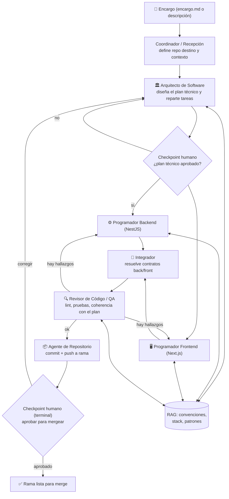

# Plan de Implementación — Fábrica de Desarrollo con Agentes IA (local / validación de grafo)

Categoría: Proyectos
Fecha: 3 de agosto de 2026
Etiquetas: Código, Importante, Proyecto
Subítem: Guía paso a paso — Fase 0: Fundaciones locales (Fábrica de Desarrollo con Agentes IA) (https://app.notion.com/p/Gu-a-paso-a-paso-Fase-0-Fundaciones-locales-F-brica-de-Desarrollo-con-Agentes-IA-83960acbbec7409bb12e720981a3b3ce?pvs=21), Guía paso a paso — Fase 1: Grafo mínimo (Fábrica de Desarrollo con Agentes IA) (https://app.notion.com/p/Gu-a-paso-a-paso-Fase-1-Grafo-m-nimo-F-brica-de-Desarrollo-con-Agentes-IA-f249c894a9304302b89c170b295c3d4d?pvs=21), Guía paso a paso — Fase 2: Frontend, Integrador y sandbox real (Fábrica de Desarrollo con Agentes IA) (https://app.notion.com/p/Gu-a-paso-a-paso-Fase-2-Frontend-Integrador-y-sandbox-real-F-brica-de-Desarrollo-con-Agentes-IA-3541f830c59b4e53a7ce69f476c5f11f?pvs=21), Guía paso a paso — Fase 3: Estrategia de código y RAG (Fábrica de Desarrollo con Agentes IA) (https://app.notion.com/p/Gu-a-paso-a-paso-Fase-3-Estrategia-de-c-digo-y-RAG-F-brica-de-Desarrollo-con-Agentes-IA-8c4518685b1945958a13bb973e63aab6?pvs=21), Guía paso a paso — Fase 4: Checkpoints humanos por terminal (Fábrica de Desarrollo con Agentes IA) (https://app.notion.com/p/Gu-a-paso-a-paso-Fase-4-Checkpoints-humanos-por-terminal-F-brica-de-Desarrollo-con-Agentes-IA-ac836cf2674441519c216f28ab44931d?pvs=21), Guía paso a paso — Fase 5: Validación del grafo (Fábrica de Desarrollo con Agentes IA) (https://app.notion.com/p/Gu-a-paso-a-paso-Fase-5-Validaci-n-del-grafo-F-brica-de-Desarrollo-con-Agentes-IA-a83b66e1ff29441f8e6194330a830da3?pvs=21)
ítem principal: Planificación de Fábrica de Desarrollo con Agentes IA (https://app.notion.com/p/Planificaci-n-de-F-brica-de-Desarrollo-con-Agentes-IA-3b17bb33a7168084b330d7269d8a0b4e?pvs=21)

<aside>
🎯

**Propósito.** Plan de implementación para que Sol construya, **de forma local**, una **Fábrica de Desarrollo** con agentes IA: la evolución genérica de la [Plan de implementación (producción) — Fábrica de Encargos · v2](https://app.notion.com/p/Plan-de-implementaci-n-producci-n-F-brica-de-Encargos-v2-9eb4165927ca46789d4fbd04969a0d38?pvs=21) aplicada ahora a la escritura de código. **El objetivo no es producción**: es **validar el grafo de agentes** (qué agentes hacen falta, cómo se comunican, cómo fluye el trabajo) para luego extraer ese grafo y su código hacia la versión productiva. Basado en la reunión [**Planificación de Fábrica de Desarrollo con Agentes IA**](https://app.notion.com/p/Planificaci-n-de-F-brica-de-Desarrollo-con-Agentes-IA-3b17bb33a7168084b330d7269d8a0b4e?pvs=21) (3 ago 2026).

</aside>

## 1. Resumen ejecutivo

Sol construye, en su máquina, una fábrica de desarrollo que toma un **encargo** (una funcionalidad o un proyecto) y lo lleva hasta código en un repositorio, pasando por agentes especializados (arquitectura, backend, frontend, integración, revisión). **El grafo se implementa con LangGraph**, la misma tecnología de orquestación que usa la Fábrica de Encargos en producción — no es una opción entre varias, es la base sobre la que gira todo este piloto, precisamente para que el grafo validado aquí sea trasladable a producción sin reescribirlo en otra tecnología. **Punto de partida confirmado:** se reutiliza el código del grafo de LangGraph y de los agentes ya construido para la Fábrica de Encargos, adaptándolo a los nuevos nodos de esta fábrica (§4.2); no se arranca en blanco. Todo corre en **contenedores Docker locales**; nada se instala directo en el sistema operativo. El entregable de valor no es el software resultante sino el **grafo afinado en LangGraph**: los nodos (agentes), las aristas, el estado compartido y los checkpoints, probado con casos reales hasta que funcione de forma confiable.

<aside>
⚠️

**Principio rector:** empezar por el camino más simple que permita validar el grafo end-to-end (encargo → código en una rama), e iterar. No construir para escala ni para multi-tenant; eso es tarea de la versión productiva. La única pieza no negociable es la tecnología de orquestación: **LangGraph**, porque es la misma que usará la versión productiva y es el activo real que se quiere extraer de este piloto.

</aside>

## 2. Objetivo y alcance

**Qué es:**

- Un piloto local para descubrir y afinar el **grafo de agentes** de una fábrica que escribe código.
- Una prueba de la estrategia de escritura de código, del uso del RAG y de los checkpoints humanos.

**Qué NO es (fuera de alcance por ahora):**

- No es la versión de producción (esa se construye después, reusando el grafo validado aquí — ver [Plan de implementación integral — De la Fábrica de Encargos a ADN Factory](https://app.notion.com/p/Plan-de-implementaci-n-integral-De-la-F-brica-de-Encargos-a-ADN-Factory-d3159a12d6264c4dabf003453ca06d9f?pvs=21)).
- No maneja multi-tenant, ni múltiples usuarios simultáneos.
- No integra Slack para los checkpoints (eso queda para producción); aquí la intervención humana es **por terminal**.

**Entrada:** un encargo (idealmente ya en formato `encargo.md`, como el que produce la Fábrica de Encargos) que indica qué construir y en qué repositorio.

**Salida:** una rama con el código propuesto, lista para revisión humana antes de mergear.

## 3. Decisiones fijas (según la reunión)

| Área | Decisión |
| --- | --- |
| Orquestación del grafo | **LangGraph** (Python) — no negociable: es la misma tecnología que usa la Fábrica de Encargos en producción |
| Punto de partida del código | Se reutiliza el código del grafo de LangGraph y de los agentes de la Fábrica de Encargos como base (§4.2); no se arranca en blanco |
| Backend | **NestJS** |
| Frontend | **Next.js** |
| Base de datos de la fábrica (estado/checkpointing) | **PostgreSQL**, local, en contenedor |
| Vector store (RAG) | **Qdrant**, local, en contenedor |
| Acceso a modelos LLM | **OpenRouter** (token lo provee Andrés); un modelo asignado por agente |
| Infraestructura | Todo en **contenedores Docker** en la máquina de Sol; nada instalado directo en el sistema |
| Control de versiones | Organización de GitHub **ADN Fábrica Lab** (espacio de pruebas, sin repos reales) |
| Intervención humana | **Por terminal** en los checkpoints del grafo (no por Slack) |
| Aprobación de código | El agente sube su trabajo a una **rama**; **aprobación humana obligatoria** antes de mergear |

<aside>
💡

Estas decisiones repiten, a propósito, el patrón ya usado en la [Plan de implementación (producción) — Fábrica de Encargos · v2](https://app.notion.com/p/Plan-de-implementaci-n-producci-n-F-brica-de-Encargos-v2-9eb4165927ca46789d4fbd04969a0d38?pvs=21) (LangGraph + checkpointing en Postgres, Qdrant para RAG, OpenRouter con capa de abstracción). **LangGraph en particular no es una preferencia técnica más: es el eje de todo el piloto.** Todo lo demás (catálogo de agentes, estrategia de escritura de código, checkpoints humanos) se diseña como nodos, aristas y estado de un grafo de LangGraph, precisamente para que el resultado se pueda llevar a producción sin reescribirlo en otra tecnología.

</aside>

## 4. Arquitectura propuesta del grafo

El grafo se implementa como un **`StateGraph` de LangGraph**: cada caja del diagrama es un **nodo** de LangGraph, las flechas son **aristas** (incluyendo aristas condicionales para los checkpoints), y el estado compartido viaja como un único objeto de estado tipado entre nodos (§4.1). El *checkpointing* usa el **checkpointer de PostgreSQL de LangGraph** (`langgraph-checkpoint-postgres`), lo que permite pausar el grafo en cada checkpoint humano y reanudarlo exactamente donde quedó — el mismo mecanismo que ya usa la Fábrica de Encargos en producción.



Esta es una **propuesta inicial para afinar**, no un diseño cerrado. El Integrador queda confirmado como agente necesario desde el piloto (no opcional). El valor del piloto está en probarla con encargos reales y ajustar lo que haga falta: por ejemplo, si conviene dividir el Revisor en "pruebas" y "estilo/convenciones", etc.

### 4.1 Modelo de estado del grafo (LangGraph)

Cada nodo lee y escribe sobre un mismo objeto de estado tipado (`TypedDict`), siguiendo el mismo patrón que la Fábrica de Encargos:

```python
class EstadoFabricaDesarrollo(TypedDict):
    encargo_id: str                # identifica el encargo/proyecto en curso
    encargo: dict                  # encargo.md parseado: qué construir, en qué repo
    plan_tecnico: dict             # salida del Arquitecto: módulos, contratos, orden
    plan_aprobado: bool            # resultado del checkpoint humano sobre el plan
    archivos_backend: list[dict]   # archivos escritos/modificados por el Programador Backend
    archivos_frontend: list[dict]  # archivos escritos/modificados por el Programador Frontend
    hallazgos_revision: list[dict] # observaciones del Revisor de Código/QA
    rama_git: str                  # rama de trabajo del encargo
    aprobacion_final: bool         # checkpoint humano final (por terminal) antes de mergear
    ciclo: int                     # tope duro de iteraciones por si el grafo no cierra
    trazas: list[str]              # IDs de traza si se conecta observabilidad
```

Usar LangGraph con este estado explícito es lo que permite, más adelante, extraer el grafo ya afinado hacia la versión productiva prácticamente sin reescritura: solo cambia la infraestructura alrededor (Slack en vez de terminal, multi-tenant, etc.), no la lógica del grafo.

### 4.2 Reutilización de código de la Fábrica de Encargos

**Confirmado por Andrés:** este piloto no arranca en blanco. Se reutiliza como base el **código del grafo de LangGraph y de los agentes** ya construido para la Fábrica de Encargos (por ejemplo la capa de abstracción de modelos sobre OpenRouter, el patrón de checkpointer en Postgres, y la estructura general de nodos/aristas). Sobre esa base:

- **Se reutiliza:** el esqueleto de `StateGraph`, la conexión al checkpointer de Postgres, la capa de abstracción de OpenRouter, y el patrón general de nodo (entrada/salida, manejo de errores).
- **Se construye nuevo:** los nodos específicos de esta fábrica (Arquitecto, Programador Backend, Programador Frontend, Integrador, Revisor de Código, Agente de Repositorio) y el estado tipado de §4.1, que es distinto al de Encargos porque el trabajo es escribir código, no refinar un requerimiento.

Esto reduce el riesgo de reinventar piezas de infraestructura ya probadas, y mantiene ambas fábricas alineadas en cómo usan LangGraph.

## 5. Catálogo de agentes (borrador)

| Agente | Responsabilidad | Herramientas | Modelo sugerido |
| --- | --- | --- | --- |
| Coordinador / Recepción | Interpreta el encargo, toma el repositorio destino ya indicado en el contrato inicial (nunca lo infiere), arma el contexto inicial | Lectura del encargo, RAG | Razonamiento medio |
| Arquitecto de Software | Diseña el plan técnico (módulos, contratos entre back/front, orden de trabajo) | RAG (convenciones + stack) | Razonamiento alto |
| Programador Backend | Escribe/edita código NestJS según el plan | Git (lectura/escritura), sandbox, RAG | Razonamiento alto |
| Programador Frontend | Escribe/edita código Next.js según el plan | Git (lectura/escritura), sandbox, RAG | Razonamiento alto |
| Integrador | Verifica que los contratos entre back y front coincidan | Git (lectura) | Razonamiento medio |
| Revisor de Código / QA | Corre lint/pruebas, compara contra el plan y las convenciones | Sandbox de ejecución, Git (lectura) | Razonamiento medio-alto |
| Agente de Repositorio | Crea/usa el repo en ADN Fábrica Lab, hace commits y push a rama | GitHub API | Económico (tarea mecánica) |

**Todos los agentes de la tabla se implementan como nodos de LangGraph** (Python); ninguno vive fuera del grafo, para que la comunicación entre ellos, el estado compartido y los checkpoints queden capturados dentro de LangGraph y no en lógica ad-hoc alrededor.

**Confirmado por Andrés:** el repositorio destino (y si hace falta crear uno nuevo) siempre llega indicado en el contrato inicial del encargo; ningún agente lo infiere ni lo pregunta sobre la marcha.

## 6. Estrategia de escritura de código

La reunión dejó abierta esta pregunta explícitamente: ¿los agentes escriben directo al repositorio o mantienen el código en memoria mientras iteran?

| Opción | Ventajas | Riesgos |
| --- | --- | --- |
| **Escribir directo al repo (working copy en disco/contenedor)** | Cada agente ve el estado real y completo del proyecto; fácil de depurar; herramientas estándar (linters, compiladores) funcionan directo | Estados intermedios inconsistentes si dos agentes tocan lo mismo; hay que cuidar el orden |
| **Mantener en memoria (diffs/artefactos) hasta un punto de consolidación** | Permite que varios agentes trabajen en "paralelo" sobre el mismo árbol sin pisarse; más fácil de revertir | Más complejo de implementar; los agentes no ven fácilmente el efecto de cambios de otros hasta consolidar |

**Recomendación para el piloto:** empezar con **working copy en disco (dentro del contenedor)**, con **una rama de trabajo por encargo** y **ejecución secuencial por dependencia** (Arquitecto → Backend → Frontend → Revisor), no en paralelo real. Es el camino más simple para validar el grafo. Si al iterar se nota que backend y frontend chocan o se bloquean entre sí, se evalúa mover a un modelo de artefactos en memoria con consolidación explícita — pero no se construye esa complejidad por adelantado.

Para proyectos con muchos archivos, el patrón sugerido es: el Arquitecto entrega un **plan por archivo/módulo** (qué crear o modificar y por qué), y cada Programador trabaja **archivo por archivo** contra ese plan, no contra "todo el proyecto a la vez", para mantener el contexto de cada llamada al modelo acotado.

## 7. RAG — conocimiento de los agentes

A precargar en Qdrant antes de ejecutar la fábrica:

- **Documentación pública de los frameworks:** guías oficiales de NestJS y Next.js, para reducir errores de los agentes con las versiones/patrones correctos.
- **Ejemplos de código real** de proyectos previos, si existen, como referencia de estilo.

**Confirmado por Andrés:** todavía no existen convenciones internas de ADN documentadas para NestJS/Next.js, así que el piloto arranca cargando **solo documentación pública de los frameworks**. Cuando existan convenciones internas, se agregan como un knowledge pack adicional sin cambiar el diseño del RAG.

No se requiere cargar conocimiento de negocio/dominio del ERP en esta fase — eso lo aporta el `encargo.md` que entrega la Fábrica de Encargos.

## 8. Infraestructura local (Docker)

Todo en contenedores, orquestado con `docker compose`, en la máquina de Sol:

```yaml
services:
  orquestador:      # grafo de agentes en LangGraph (Python) — StateGraph + checkpointer
  postgres:         # estado + checkpointing del grafo (langgraph-checkpoint-postgres)
  qdrant:           # RAG vectorial
  sandbox:          # entorno aislado donde corre/compila el código generado (NestJS + Next.js)
```

- El **sandbox** de ejecución debe estar aislado (sin acceso a secretos ni a la red más allá de lo necesario), porque ejecuta código escrito por IA.
- Nada se instala directo en el sistema operativo de Sol; todo vive y se destruye dentro de los contenedores.

## 9. Integración con GitHub — ADN Fábrica Lab

- La fábrica se conecta a la organización **ADN Fábrica Lab** (espacio de pruebas, sin repos reales).
- **Un repositorio por proyecto/encargo** (a confirmar si aplica igual cuando el encargo es "agregar una funcionalidad" a un repo que ya existe: en ese caso no se crea repo nuevo, se trabaja sobre el existente).
- El repositorio y el contexto de trabajo (a qué proyecto pertenece el encargo) se indican **desde el contrato inicial** que recibe la fábrica, no se decide sobre la marcha.
- Todo commit del agente va a una **rama**; el merge a la rama principal requiere **aprobación humana**.

**Verificar antes de arrancar:** que Sol tenga acceso al espacio ADN Fábrica Lab en GitHub (pendiente de la reunión).

## 10. Intervención humana (checkpoints)

- Los checkpoints del grafo que requieren decisión humana se resuelven **por terminal** (pantalla de comandos), no por Slack — a diferencia de la Fábrica de Encargos.
- Técnicamente, cada checkpoint es una **interrupción nativa de LangGraph** (pausa del grafo con su checkpointer en Postgres): el grafo se detiene, el humano responde en terminal, y LangGraph reanuda el mismo *thread* exactamente donde quedó.
- Checkpoints mínimos propuestos:
    1. Aprobar el **plan técnico** del Arquitecto antes de que empiecen a escribir código Backend/Frontend.
    2. Aprobar el **resultado final** (rama) antes de mergear.
- Si el flujo necesita más checkpoints al iterar (p. ej. tras hallazgos del Revisor), se agregan sobre la marcha; no se sobre-diseña esto de entrada.

## 11. Modelos IA (OpenRouter) y plan de contingencia

- Acceso a modelos vía **OpenRouter** (Andrés comparte el token); **cada agente tiene su modelo asignado** según la complejidad de su tarea (ver columna "Modelo sugerido" en §5).
- **Riesgo activo:** Claude está empezando a limitar uso desde el día de esta reunión. Si se agotan los créditos, **alternativas de respaldo: GPT-4.5/4o o Gemini 2.5**, sin cambiar la lógica de los agentes (solo el modelo configurado por rol) — mismo principio de capa de abstracción usado en la Fábrica de Encargos.

## 12. Plan de fases (sin fechas)

### Fase 0 — Fundaciones locales

1. Levantar `docker compose` con orquestador, Postgres y Qdrant.
2. Partir del código del grafo de LangGraph y de los agentes de la Fábrica de Encargos (§4.2): copiarlo/referenciarlo como base en vez de empezar en blanco.
3. Adaptar ese esqueleto al nuevo estado (§4.1): `StateGraph` con el checkpointer de Postgres (`langgraph-checkpoint-postgres`) conectado.
4. Configurar acceso a OpenRouter (token) y la capa de abstracción de modelos por agente (reutilizada de Encargos).
5. Confirmar acceso de Sol a **ADN Fábrica Lab** en GitHub.

### Fase 1 — Grafo mínimo (Arquitecto → un programador → Revisor → repo)

1. Implementar Coordinador, Arquitecto y **un solo** programador (por ejemplo Backend) para probar el flujo completo con el caso más simple.
2. Probar de punta a punta con un encargo pequeño: encargo → plan → código → rama.

### Fase 2 — Agregar Frontend y afinar el grafo

1. Sumar el Programador Frontend y decidir si hace falta el Integrador (§5).
2. Afinar el Revisor de Código (lint, pruebas mínimas, coherencia con el plan).

### Fase 3 — Estrategia de código y RAG

1. Validar el patrón "working copy + rama por encargo" (§6) con un proyecto de varios archivos.
2. Cargar el RAG con convenciones y documentación de NestJS/Next.js (§7); medir si reduce errores de los agentes.

### Fase 4 — Checkpoints e intervención humana

1. Implementar los checkpoints por terminal (§10).
2. Probar el ciclo de corrección: humano rechaza → vuelve al Arquitecto o al programador correspondiente.

### Fase 5 — Validación del grafo

1. Correr **2–3 encargos representativos** (uno pequeño, uno con back+front, uno con varios archivos) y registrar qué funcionó, qué agente sobra o falta, y dónde se traba el flujo.
2. Documentar el grafo final afinado y los aprendizajes, como insumo directo para la versión de producción.

## 13. Criterios de aceptación del piloto

- [x]  Un encargo simple recorre el grafo completo hasta llegar a una rama con código, sin intervención manual salvo los checkpoints definidos. *(Cumplido con matiz: prueba-005 necesitó una intervención manual adicional tras publicar — ver el documento del grafo afinado, §6–§8.)*
- [x]  El plan técnico del Arquitecto es revisable y aprobable/corregible antes de que se escriba código.
- [x]  Backend y Frontend producen código que compila/corre dentro del sandbox local. *(Cumplido dentro del sandbox; brecha de fidelidad del sandbox documentada.)*
- [x]  El Revisor detecta al menos los errores obvios (lint, pruebas básicas) antes de llegar al checkpoint final. *(Cumplido en la corrida limpia prueba-005, a diferencia de prueba-004.)*
- [x]  Todo el código generado queda en una rama de un repo de ADN Fábrica Lab, nunca directo en la rama principal.
- [x]  Si Claude alcanza su límite, la fábrica sigue funcionando cambiando el modelo configurado, sin tocar código de los agentes.
- [x]  El grafo está implementado en **LangGraph** (nodos, aristas, estado y checkpointer de Postgres), no en un orquestador ad-hoc, de modo que sea trasladable a producción sin reescritura.
- [x]  Al cierre, existe un catálogo claro de agentes y un diagrama de flujo validado con al menos un caso real de punta a punta.

<aside>
📘

Piloto cerrado (Fase 5, prueba-005, agosto 2026). Veredicto completo criterio por criterio, catálogo de agentes, mecanismos validados, tabla consolidada de fallos y brechas para producción en [Documento del grafo afinado — Fábrica de Desarrollo con Agentes IA](https://app.notion.com/p/Documento-del-grafo-afinado-F-brica-de-Desarrollo-con-Agentes-IA-c384795bb2bc494ea6971e843154cf2a?pvs=21).

</aside>

<aside>
⚠️

**Nota (Fase 4, encargo prueba-004).** En una corrida real, dos criterios de esta lista no se cumplieron de forma automática: "Backend y Frontend producen código que compila/corre dentro del sandbox local" y "El Revisor detecta al menos los errores obvios... antes del checkpoint final". La rama publicada no compilaba (faltó generar `app/layout.tsx`) y el Revisor reportó un hallazgo inexistente sin detectar el real. Se corrigió manualmente; detalle en [Guía paso a paso — Fase 4: Checkpoints humanos por terminal (Fábrica de Desarrollo con Agentes IA)](https://app.notion.com/p/Gu-a-paso-a-paso-Fase-4-Checkpoints-humanos-por-terminal-F-brica-de-Desarrollo-con-Agentes-IA-ac836cf2674441519c216f28ab44931d?pvs=21) §11. Queda como aprendizaje para la Fase 5, no como criterio invalidado.

</aside>

## 14. Riesgos

- **Grafo sobre-diseñado desde el inicio.** *Mitigación:* arrancar con el grafo mínimo (Fase 1) y sumar agentes solo cuando un caso real lo exija.
- **Agentes de backend y frontend pisándose en el mismo working copy.** *Mitigación:* ejecución secuencial por dependencia en esta fase (§6); revisar si hace falta paralelismo real más adelante.
- **Límites de uso de Claude a mitad de la validación.** *Mitigación:* capa de abstracción de modelos + alternativas ya identificadas (GPT-4.5/4o, Gemini 2.5).
- **Código generado con acceso indebido a secretos o red.** *Mitigación:* sandbox aislado (§8), sin credenciales reales (ADN Fábrica Lab es un espacio de pruebas).
- **Confundir el objetivo:** este piloto valida el grafo, no produce software de uso real. *Mitigación:* mantener el criterio de éxito en "grafo probado y documentado", no en "funcionalidad terminada".
- **Implementar el grafo por fuera de LangGraph** (por rapidez) y perder la trasladabilidad a producción. *Mitigación:* LangGraph es una decisión fija desde el día 1 (§3), no algo a evaluar más adelante.
- **Arrastrar supuestos de la Fábrica de Encargos que no aplican a Desarrollo** al reutilizar su código (§4.2) — por ejemplo lógica pensada para refinar preguntas, no para escribir código. *Mitigación:* reutilizar solo el esqueleto de grafo/checkpointer/modelos; los nodos propios de esta fábrica (Arquitecto, Backend, Frontend, Integrador, Revisor, Repositorio) se escriben nuevos.
- **El checkpoint final se aprueba con información del sandbox/Revisor no del todo confiable** (hallazgo real de la Fase 4, encargo prueba-004): el Revisor puede reportar hallazgos que no existen en el código real y a la vez no detectar un defecto real (p. ej. un archivo que el Programador declaró como "escrito" pero nunca generó). *Mitigación:* no dar por buena la aprobación automática de un checkpoint sin una verificación manual puntual cuando el resultado del sandbox sea ambiguo o inconsistente; ver [Guía paso a paso — Fase 4: Checkpoints humanos por terminal (Fábrica de Desarrollo con Agentes IA)](https://app.notion.com/p/Gu-a-paso-a-paso-Fase-4-Checkpoints-humanos-por-terminal-F-brica-de-Desarrollo-con-Agentes-IA-ac836cf2674441519c216f28ab44931d?pvs=21) §11.
- **Caché persistente del sandbox degradada por reintentos repetidos del mismo encargo** (hallazgo real de la Fase 4, encargo prueba-004): reescribir `package.json` muchas veces sobre el mismo `encargo_id` puede corromper `node_modules`/lockfile cacheados y producir `FALLO` de `install` que no refleja un problema real de código. *Mitigación:* limpiar el volumen del encargo (`rm -rf /workspace/<encargo_id>`) cuando el fallo persiste pese a que el código es correcto.

## 15. Decisiones confirmadas y pregunta pendiente

**Confirmado por Andrés (esta iteración):**

- El Integrador es un agente necesario desde el piloto, no opcional (§4, §5).
- El RAG arranca solo con documentación pública de NestJS/Next.js; todavía no hay convenciones internas de ADN documentadas (§7).
- El repositorio destino siempre llega en el contrato inicial del encargo; ningún agente lo infiere (§5, §9).
- El piloto reutiliza el código del grafo de LangGraph y de los agentes de la Fábrica de Encargos como base (§4.2).

**Pregunta pendiente:**

- ¿Hay una versión de LangGraph, patrones de nodos/estado o convenciones ya fijadas en la Fábrica de Encargos en producción que este piloto deba replicar exactamente, para que el grafo resultante sea un traslado directo y no requiera adaptación?

## 16. Próximos pasos

1. Sol revisa este plan y aporta su propio criterio sobre si responde a lo solicitado en la reunión.
2. Se pasa a Andrés la pregunta pendiente de §15 junto con cualquier duda adicional que surja al revisar.
3. Con la aprobación de Andrés, Sol empieza la implementación siguiendo la metodología del equipo (Fase 0 en adelante, §12).